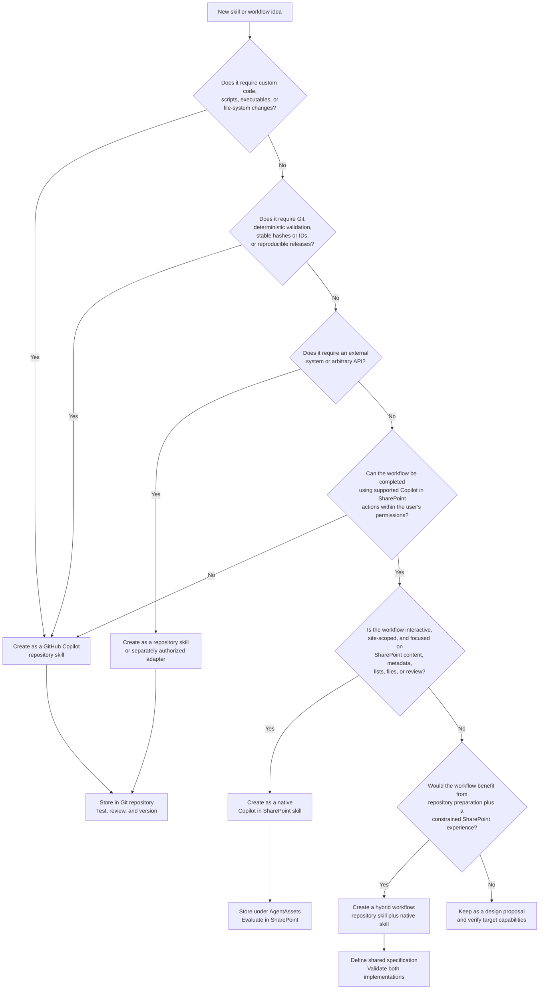

# Skill Runtime Decision Guide — Native SharePoint Skills vs. GitHub Copilot Repository Skills

**Purpose:** Provide a practical decision tree for deciding where a skill should be created, stored, executed, tested, and governed.  
**Scope:** AI-Assisted SharePoint Knowledge Workbench, native Copilot in SharePoint skills, repository-based GitHub Copilot skills, and hybrid workflows.  
**Status:** Architecture and implementation guidance; not authorization to deploy or modify SharePoint.

## 1. Executive Summary

The knowledge workbench has two primary skill runtimes:

```text
GitHub Copilot / VS Code repository runtime
and
Native Copilot in SharePoint runtime
```

They are complementary, not interchangeable.

### Native Copilot in SharePoint skills

Use when the workflow is:

- interactive;
- site-scoped;
- based on content already accessible in SharePoint;
- limited to actions supported by Copilot in SharePoint;
- executed within the current user's SharePoint permissions;
- primarily focused on reading, summarizing, organizing, reviewing, or interacting with SharePoint content and lists.

Native SharePoint skills cannot:

- modify a local or server file system;
- run Python;
- run PowerShell;
- run shell scripts or executables;
- invoke repository scripts;
- run Pandoc or LibreOffice;
- execute Git operations;
- connect directly to external systems;
- call arbitrary APIs;
- execute custom code;
- expand the user's permissions.

### GitHub Copilot repository skills

Use when the workflow requires:

- file-system operations;
- custom scripts or executables;
- deterministic transformations;
- Git operations;
- external tools or approved APIs;
- automated testing;
- stable identifiers and hashes;
- cross-document or cross-system processing;
- reproducible packages;
- release evidence;
- formal validation.

### Hybrid skills

Use both environments when the business workflow has:

- an engineering-heavy preparation, validation, or packaging stage; and
- an interactive SharePoint authoring, review, governance, or consumption stage.

```text
GitHub Copilot studio
→ designs, validates, tests, and packages
→ generates a native-compatible SharePoint skill
→ native skill runs the constrained SharePoint portion
```

## 2. Quick Decision Tree



## 3. Plain-Language Decision Tree

Ask these questions in order.

### Question 1 — Does the workflow need file-system access?

Examples:

- create, rename, move, or delete local files;
- inspect repository folders;
- write generated artifacts to disk;
- manipulate extracted media;
- create a ZIP package;
- compare directory trees.

If **yes**, create a **GitHub Copilot repository skill**.

Native SharePoint skills do not have general file-system access.

### Question 2 — Does the workflow need scripts or custom code?

Examples:

- Python;
- PowerShell;
- shell scripts;
- Pandoc;
- LibreOffice;
- custom validators;
- generated executables;
- repository command-line interfaces.

If **yes**, create a **GitHub Copilot repository skill**.

Native SharePoint skills cannot execute arbitrary custom code or scripts.

### Question 3 — Does the workflow need Git or software-engineering controls?

Examples:

- create a branch or worktree;
- commit changes;
- open or review a pull request;
- compare commits;
- run tests;
- enforce schemas;
- generate release artifacts;
- verify hashes;
- preserve deterministic lineage.

If **yes**, create a **GitHub Copilot repository skill**.

### Question 4 — Does the workflow need another system or arbitrary API?

Examples:

- ServiceNow;
- Jira;
- Azure DevOps;
- an external records system;
- a custom database;
- an arbitrary Microsoft Graph operation;
- a third-party learning platform.

If **yes**, use a **repository skill** or a **separately authorized integration adapter**.

A native SharePoint skill cannot connect directly to an external system or execute arbitrary API calls.

### Question 5 — Can the workflow use only supported SharePoint-native capabilities?

Examples:

- inspect selected SharePoint content;
- summarize accessible content;
- compare content with a checklist;
- identify missing metadata;
- organize selected files or folders where supported;
- interact with SharePoint lists where supported;
- create review items;
- produce a draft or recommendation;
- guide a user through a repeatable site procedure.

If **yes**, the workflow is a **native Copilot in SharePoint skill candidate**.

### Question 6 — Is the workflow mainly interactive and site-scoped?

If the workflow is intended for a business user working within one SharePoint site, library, list, folder, or selected item set, a native skill may be the best operational experience.

Examples:

```text
Review these selected manual topics
Check required metadata
Generate a draft quiz from this document
Apply this content outline
Prepare review-list items
Summarize these approved topics
Identify missing sections
```

### Question 7 — Does the business workflow need both runtimes?

Many workflows should be hybrid.

Example:

```text
Repository skill
→ defines schema, performs deterministic checks, and prepares evidence

Native SharePoint skill
→ guides the user, analyzes selected content, and records review actions
```

If both are useful, define one shared business specification and create two target-specific implementations.

## 4. Runtime Comparison

| Decision factor | Native Copilot in SharePoint skill | GitHub Copilot repository skill |
|---|---|---|
| Primary environment | SharePoint Online | GitHub Copilot app, VS Code, repository agent environment |
| Typical user | Site user, content owner, reviewer | Developer, architect, technical author, automation agent |
| Storage | SharePoint `AgentAssets` library | Git repository |
| Skill file | Native `SKILL.md` | Repository `SKILL.md` plus scripts/references/tests |
| File-system access | No general file-system access | Yes, within the execution environment |
| Custom code | No | Yes |
| Python or PowerShell | No | Yes |
| Git operations | No | Yes |
| External systems | No direct native connection | Possible through approved tools and identities |
| SharePoint actions | Supported native actions within user permissions | Requires approved connector, identity, or deployment adapter |
| Deterministic guarantees | Limited; AI-guided workflow | Can be implemented and tested deterministically |
| Automated tests | Evaluation through controlled scenarios | Unit, integration, contract, regression, and end-to-end tests |
| Best use | Interactive content and review workflows | Engineering, conversion, validation, packaging, and integration |
| Permission boundary | Current SharePoint user's access | Execution identity and tool permissions |
| Deployment | Save or deploy into the target SharePoint site | Commit and distribute through repository/plugin workflow |

## 5. Where Each Skill Is Created and Stored

### Native Copilot in SharePoint skill

Observed target library name in the tested site:

```text
AgentAssets
```

Observed conceptual structure:

```text
SharePoint site
└── AgentAssets
    └── Skills
        └── <skill-name>
            └── SKILL.md
```

Creation pattern:

```text
Open Copilot in SharePoint
→ describe reusable workflow
→ review generated skill
→ revise if required
→ confirm save
→ inspect generated SKILL.md
→ evaluate behaviour
```

Verify the actual library ID, server-relative URL, folder structure, permissions, and file path in every target site.

### GitHub Copilot repository skill

Typical conceptual structure:

```text
repository/
└── plugins/
    └── <plugin>/
        └── skills/
            └── <skill-name>/
                ├── SKILL.md
                ├── scripts/
                ├── references/
                ├── schemas/
                └── tests/
```

Creation pattern:

```text
Define requirement
→ scaffold repository skill
→ implement scripts and contracts
→ add tests
→ run review gates
→ commit and publish through repository workflow
```

## 6. Strong Native SharePoint Skill Candidates

These are suitable candidates when the required actions are supported in the target tenant.

### Content review

```text
review-manual-topics
check-required-metadata
compare-content-to-checklist
identify-missing-sections
prepare-owner-review
prepare-content-review
```

### Interactive authoring

```text
apply-content-outline
generate-frequently-asked-questions
create-training-outline
generate-quiz-from-content
rewrite-content-for-clarity
prepare-release-notes
```

### SharePoint organization

```text
organize-selected-files
identify-stale-content
create-review-list-items
summarize-selected-topics
prepare-publication-inventory
```

### Agent-readiness support

```text
check-source-approval-state
identify-stale-agent-sources
prepare-agent-source-inventory
run-agent-readiness-checklist
```

These skills remain AI-assisted and require evaluation. A plausible result is not automatically an approved result.

## 7. Skills That Belong in GitHub Copilot

### Conversion and extraction

```text
convert-docx-to-structured-content
run-pandoc-extraction
convert-legacy-media
normalize-extracted-content
```

### Structural integrity

```text
reconcile-structural-anchors
prove-content-coverage
generate-stable-topic-identities
validate-source-and-plan-integrity
```

### Validation and testing

```text
validate-links-and-media
run-contract-tests
run-regression-suite
compare-release-hashes
validate-publication-package
```

### Publication and generation

```text
build-publication-map
render-word-pdf-powerpoint
generate-sharepoint-deployment-package
produce-auditable-release-evidence
```

### Integration and synchronization

```text
synchronize-git-and-sharepoint
deploy-modern-pages-through-graph
connect-external-records-system
create-approved-platform-adapter
```

These require capabilities that native SharePoint skills do not provide.

## 8. Hybrid Workflow Examples

### 8.1 Apply a content template

#### GitHub Copilot implementation

```text
Analyze source
→ map content deterministically
→ preserve provenance
→ prove no loss or duplication
→ validate schema, links, media, and identity
→ produce structured package and evidence
```

#### Native SharePoint implementation

```text
Review selected topic
→ compare with approved outline
→ identify missing sections
→ propose reorganized content
→ mark unsupported sections for review
→ create follow-up items
```

### 8.2 Generate a quiz

#### GitHub Copilot implementation

```text
Generate governed quiz bank
→ assign stable IDs
→ verify question coverage
→ detect duplicates and stale questions
→ validate source references
→ produce multiple output formats
→ create release evidence
```

#### Native SharePoint implementation

```text
Read selected approved content
→ generate draft questions
→ cite source topics
→ provide expected answers and explanations
→ flag ambiguity
→ present draft for SME review
```

### 8.3 Review metadata

#### GitHub Copilot implementation

```text
Inspect schema and package metadata
→ apply deterministic validation profile
→ calculate failures and warnings
→ produce machine-readable report
```

#### Native SharePoint implementation

```text
Inspect selected SharePoint items
→ compare visible metadata with approved checklist
→ summarize gaps
→ create review-list items
→ report partial failures
```

## 9. Decision Matrix by Requirement

| Requirement | Recommended runtime |
|---|---|
| Summarize selected SharePoint documents | Native SharePoint skill |
| Check required metadata in selected items | Native SharePoint skill, with approved metadata profile |
| Generate a draft quiz from one approved document | Native SharePoint skill |
| Generate and version a quiz bank for a complete manual | GitHub Copilot skill |
| Apply an outline interactively | Native SharePoint skill |
| Prove a template transformation did not lose content | GitHub Copilot skill |
| Run Python or PowerShell | GitHub Copilot skill |
| Modify repository files | GitHub Copilot skill |
| Run Pandoc or LibreOffice | GitHub Copilot skill |
| Commit changes to Git | GitHub Copilot skill |
| Create review items in a SharePoint list | Native SharePoint skill if supported and authorized |
| Interact with an external system | Repository skill or authorized adapter |
| Create stable content IDs and hashes | GitHub Copilot skill |
| Prepare an interactive content-review checklist | Native SharePoint skill |
| Generate Word, PDF, or PowerPoint deterministically | GitHub Copilot skill |
| Guide a site owner through a review process | Native SharePoint skill |
| Deploy modern pages programmatically | Separately authorized repository adapter |
| Ask questions over approved SharePoint content | SharePoint agent or Copilot in SharePoint |
| Evaluate agent grounding with regression tests | GitHub Copilot skill |

## 10. Native Skill Acceptance Checklist

Before saving or approving a native SharePoint skill, verify:

- the workflow uses only supported Copilot in SharePoint capabilities;
- no file-system, custom-code, shell, Python, PowerShell, Git, or external-API assumption exists;
- the intended site and users are defined;
- required SharePoint permissions are identified;
- inputs and outputs are clear;
- source content is approved and current where required;
- AI-generated information is identified as proposed or draft;
- authoritative values are not invented;
- destructive or high-volume actions require confirmation;
- partial failure is disclosed;
- evaluation cases cover normal, negative, ambiguous, permission, and safety conditions;
- owner, version, status, and review date are recorded;
- the deployed `SKILL.md` matches the reviewed definition.

## 11. Repository Skill Acceptance Checklist

Before accepting a GitHub Copilot repository skill, verify:

- code and scripts are reusable rather than duplicated;
- contracts and schemas are versioned;
- unit and integration tests exist;
- deterministic behaviour is tested where promised;
- source and output identities are preserved;
- external access uses approved tools and identities;
- errors fail safely;
- no silent overwrite occurs;
- evidence and logs are produced;
- rollback or recovery is defined;
- plugin and marketplace metadata are updated where applicable;
- the implementation is reviewed before release.

## 12. Hybrid Skill Design Checklist

When creating both implementations:

1. Define the shared business intent independently of either platform.
2. Define the repository runtime capability profile.
3. Define the native SharePoint runtime capability profile.
4. Identify which guarantees exist only in the repository implementation.
5. Identify which interactive actions exist only in SharePoint.
6. Use distinct names or target labels to prevent confusion.
7. Create separate evaluation suites.
8. Preserve common terminology, metadata, and decision states where practical.
9. Do not copy repository-only instructions into `AgentAssets`.
10. Record how results move between the two environments.

## 13. Workbench Routing Logic

The top-level `knowledge-workbench-agent` or routing skill should classify a request before choosing a runtime.

Suggested routing states:

```text
NATIVE_SHAREPOINT_CANDIDATE
REPOSITORY_SKILL_REQUIRED
AUTHORIZED_ADAPTER_REQUIRED
HYBRID_WORKFLOW_RECOMMENDED
CAPABILITY_NOT_VERIFIED
HUMAN_DECISION_REQUIRED
```

Suggested routing explanation:

```text
Requested outcome:
Generate a quiz from selected approved manual topics.

Recommended runtime:
Native Copilot in SharePoint skill for interactive draft generation.

Repository support:
Optional GitHub Copilot skill for governed quiz-bank generation,
stable IDs, regression testing, and multi-format release packaging.

Reason:
The interactive draft can use supported SharePoint content operations,
but deterministic release controls require repository tooling.
```

## 14. Security Boundary

The runtime distinction is also a security boundary.

```text
Native SharePoint skill
→ Microsoft-managed SharePoint execution surface
→ supported native capabilities
→ current user's permissions

GitHub Copilot repository skill
→ development and automation environment
→ scripts, tools, file system, Git, and approved integrations
→ separately governed execution identity and permissions
```

The narrower native runtime is useful for business-user workflows because it does not grant arbitrary custom-code execution.

The more powerful repository runtime requires stronger engineering, identity, review, and deployment controls.

## 15. Final Decision Rule

```text
Use a native SharePoint skill when the task is an interactive,
site-scoped workflow that can be completed entirely through supported
Copilot in SharePoint actions and the user's current permissions.

Use a GitHub Copilot repository skill when the task requires files,
scripts, custom code, Git, deterministic validation, external systems,
complex testing, or reproducible release artifacts.

Use a hybrid workflow when the repository should prepare, validate,
or package the work and SharePoint should provide the constrained,
business-user-facing interaction.
```
