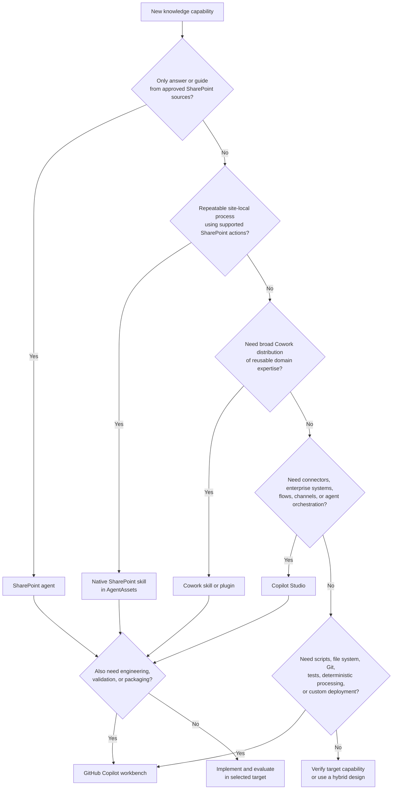

# Capability Layering Across Native SharePoint Skills, Copilot Cowork, Copilot Studio, and GitHub Copilot

**Purpose:** Explain how native Copilot in SharePoint skills stored in `AgentAssets` begin to fill a capability gap between simple SharePoint agents, Copilot Cowork extensibility, Copilot Studio, and the GitHub Copilot knowledge workbench.  
**Status:** Architecture and research note; not implementation or deployment authorization.  
**Audience:** Architects, product owners, SharePoint administrators, agent designers, knowledge managers, and developers.

## 1. Executive Summary

Native Copilot in SharePoint skills introduce a useful middle layer in Microsoft's agent ecosystem.

Before native SharePoint skills, the practical choices were broadly:

```text
SharePoint agent
→ constrained knowledge discovery and conversation

Copilot Studio
→ broader agent design, connectors, actions, workflows,
  environments, governance, and deployment

GitHub Copilot / pro-code
→ source-controlled code, scripts, testing, packaging,
  APIs, deterministic processing, and engineering automation
```

That left a capability gap:

> How can a SharePoint site owner define a reusable, organization-specific process—such as applying a content checklist, finding missing metadata, generating a quiz, organizing selected documents, or creating review follow-ups—without building and operating a full Copilot Studio agent?

Native SharePoint skills address part of that gap.

They allow a repeatable, multi-step workflow to be represented as a site-local Markdown `SKILL.md`, stored in the site's `AgentAssets` library, and executed through Copilot in SharePoint using supported SharePoint capabilities and the current user's permissions.

The emerging capability model is:

```text
SharePoint agent
= find, answer, summarize, and guide

Native SharePoint skill
= apply a repeatable, site-local knowledge procedure

Copilot Cowork skill or plugin
= distribute reusable Copilot domain workflows more broadly

Copilot Studio
= integrate systems and automate richer enterprise processes

GitHub Copilot knowledge workbench
= design, engineer, test, validate, package, and generate all targets
```

Native SharePoint skills do not replace Cowork, Copilot Studio, or GitHub Copilot. They fill the lightweight, site-scoped operational space between simple question-answering and full agent-platform development.

## 2. The Capability Gap Native SharePoint Skills Address

A SharePoint agent is useful for conversational access to approved information, but its builder is deliberately constrained. A SharePoint agent is principally configured through:

- a purpose;
- behaviour instructions;
- selected SharePoint knowledge sources;
- the permissions users already have to those sources.

That supports:

```text
Find
Answer
Summarize
Guide
Navigate
```

It does not, by itself, provide a rich development environment for reusable procedures.

Copilot Studio can implement much broader workflows, but using it for every small SharePoint content-management procedure may introduce unnecessary complexity, including:

- a separate agent project;
- environment and lifecycle management;
- connector configuration;
- topics, tools, actions, or flows;
- capacity and operational monitoring;
- separate deployment and support responsibilities.

Native SharePoint skills create a middle layer for workflows such as:

```text
Review selected manual topics
Check required metadata
Apply a content checklist
Identify missing sections
Generate a draft quiz
Create review follow-up items
Organize selected files
Prepare an owner review
Identify stale content
```

These workflows are more procedural than a simple SharePoint agent conversation, but less integration-heavy than a Copilot Studio solution.

## 3. The Emerging Capability Ladder

## 3.1 Level 1 — SharePoint Agent

Use a SharePoint agent for a bounded conversational knowledge experience.

Typical purposes:

```text
Find approved guidance
Answer questions from selected SharePoint sources
Summarize accessible documents
Guide users to related content
Explain a procedure from approved sources
```

A SharePoint agent is grounded in selected SharePoint content and remains constrained by the user's access to that content.

A SharePoint agent should be treated as a governed knowledge product:

```text
Purpose
+ instructions
+ approved source scope
+ source permissions
+ evaluation set
= SharePoint knowledge agent
```

## 3.2 Level 2 — Native SharePoint Skill in `AgentAssets`

Use a native SharePoint skill for a reusable, site-scoped procedure that can be completed using supported Copilot in SharePoint capabilities.

Typical purposes:

```text
Apply a review checklist
Inspect required metadata
Classify or summarize selected content
Organize selected files or folders where supported
Interact with a SharePoint list where supported
Generate a draft content artifact
Record unresolved review items
```

Observed target library name in the tested environment:

```text
AgentAssets
```

Conceptual storage pattern:

```text
SharePoint site
└── AgentAssets
    └── Skills
        └── <skill-name>
            └── SKILL.md
```

Native skills are intentionally constrained. They cannot execute arbitrary custom code, run local scripts, operate on a general-purpose file system, invoke Git, or connect directly to arbitrary external systems.

This constrained runtime is valuable for business-user workflows because it keeps execution within the SharePoint experience and the user's existing permissions.

## 3.3 Level 3 — Copilot Cowork Skill or Plugin

Use a Copilot Cowork extension when the goal is broader Microsoft 365 distribution of reusable domain workflows.

Microsoft documents Cowork plugin extensibility through:

- skills—prompt-based domain workflows;
- connectors—remote services that provide external data or APIs.

A Cowork plugin is packaged as a Microsoft 365 application package and may contain multiple `SKILL.md` definitions and references.

Conceptual package:

```text
cowork-extension.zip
├── manifest.json
├── color.png
├── outline.png
└── skills/
    ├── skill-one/
    │   ├── SKILL.md
    │   └── references/
    └── skill-two/
        └── SKILL.md
```

Cowork therefore addresses a different problem from `AgentAssets`:

```text
Native SharePoint skill
→ local process for one SharePoint site

Cowork skill or plugin
→ distributable Copilot capability for broader organizational use
```

## 3.4 Level 4 — Copilot Studio

Use Copilot Studio when the solution requires a broader enterprise-agent platform.

Typical reasons include:

- connectors to enterprise systems;
- external or real-time data;
- richer actions and tools;
- agent flows;
- complex input and output handling;
- multiple channels;
- broader lifecycle controls;
- connected-agent or orchestration patterns;
- independently deployed business-process automation.

Examples:

```text
Create a ServiceNow ticket
Update Dataverse
Retrieve current line-of-business data
Route a case through multiple systems
Notify owners and escalate unresolved work
Coordinate several connected agents
```

Copilot Studio remains the appropriate layer when a workflow exceeds the native capabilities and site scope of Copilot in SharePoint.

## 3.5 Level 5 — GitHub Copilot / Pro-Code Knowledge Workbench

Use the GitHub Copilot knowledge workbench when the capability requires engineering controls or custom execution.

Typical requirements:

- file-system access;
- Python, PowerShell, shell scripts, or executables;
- Pandoc or LibreOffice;
- Git branches, commits, worktrees, or pull requests;
- deterministic validation;
- stable IDs and hashes;
- schema enforcement;
- automated tests;
- cross-document or cross-system processing;
- approved API integrations;
- deployment adapters;
- reproducible release packages;
- evidence and rollback.

Examples:

```text
Convert DOCX to canonical Markdown
Reconcile structural anchors
Validate links and media
Build a publication map
Generate Word, PDF, HTML, or PowerPoint
Synchronize Git and SharePoint through an approved adapter
Create and test target-specific skill packages
Run an agent evaluation suite
Produce release evidence
```

## 4. What Native SharePoint Skills Fill—and What They Do Not

### They fill the gap for:

- lightweight, repeatable SharePoint procedures;
- site-specific document and metadata standards;
- interactive review checklists;
- selected-content processing;
- low-code content organization;
- content-maintenance routines;
- business-user workflows that do not justify a Copilot Studio agent;
- governed skill files stored with SharePoint permissions, versioning, retention, sensitivity, and auditing.

### They do not fill the gap for:

- arbitrary custom code;
- local or server file-system changes;
- Python, PowerShell, or shell execution;
- Git operations;
- external system integration;
- deterministic transformation guarantees;
- complex enterprise orchestration;
- broad cross-channel agent deployment;
- custom model hosting;
- formal CI/CD and release engineering.

## 5. Comparison Matrix

| Capability | SharePoint agent | Native SharePoint skill | Cowork plugin skill | Copilot Studio | GitHub Copilot workbench |
|---|---|---|---|---|---|
| Primary purpose | Knowledge conversation | Site-local repeatable procedure | Distributed Copilot domain workflow | Enterprise agent and process automation | Engineering and multi-target generation |
| Typical scope | Selected SharePoint sources | One SharePoint site | Microsoft 365 Copilot/Cowork distribution | Organization processes and systems | Repository, tools, systems, and deployment targets |
| Knowledge grounding | SharePoint sources | Accessible SharePoint content | Packaged knowledge and supported connectors | SharePoint plus broader configured sources | Files, repositories, approved tools, APIs, and data |
| Custom code | No general custom-code runtime | No | Package-dependent; executables are not the skill model | Low-code plus extensibility | Yes |
| External systems | Limited to configured agent capability | No direct external connection | Connectors may provide remote tools | Yes, through connectors and tools | Yes, through approved integrations |
| File system | No general file-system access | No general file-system access | No local repository-style runtime | Not a local development file system | Yes, within the execution environment |
| Git and CI/CD | No | No | Package source may be versioned externally | Solution lifecycle and environment controls | Native fit |
| Best fit | Ask and guide | Review, organize, classify, draft, record | Reusable broadly distributed expertise | Integrated business process | Convert, test, validate, package, deploy |

## 6. Same Business Capability, Multiple Targets

The same business workflow may need more than one implementation.

Example business capability:

```text
Review manual topics against an approved knowledge standard.
```

### GitHub Workbench Implementation

```text
Inspect canonical Markdown
→ validate schema
→ check links and media
→ verify source lineage
→ calculate deterministic findings
→ produce machine-readable evidence
```

### Native SharePoint Implementation

```text
Inspect selected SharePoint topics
→ apply the approved checklist
→ identify metadata or content gaps
→ summarize findings
→ create review-list items
→ request reviewer disposition
```

### Cowork Implementation

```text
Package the method as broadly distributable domain expertise
→ include references and reusable instructions
→ expose the workflow through Cowork
→ optionally use approved connectors
```

### Copilot Studio Implementation

```text
Integrate the review with an enterprise workflow
→ create or update a case
→ notify owners
→ obtain approvals
→ escalate overdue work
→ record completion in another system
```

The implementations serve one business purpose but make different guarantees and use different capabilities.

## 7. The Knowledge Workbench as a Multi-Target Compiler

The workbench can become the design and compilation layer for all supported targets.

```text
Business requirement
+ government standard
+ workflow policy
+ target capability profile
+ permission model
+ evaluation cases
        ↓
AI-Assisted Knowledge Workbench
        ├── GitHub repository skill
        ├── Native SharePoint SKILL.md
        ├── Cowork plugin package
        ├── SharePoint agent definition
        ├── Copilot Studio specification
        ├── Evaluation suite
        └── Deployment and governance evidence
```

Potential repository structure:

```text
capabilities/
  review-manual-topics/
    capability-spec.md
    governance-policy.md
    evaluation-cases/
    targets/
      github/
        SKILL.md
        scripts/
        tests/
      sharepoint/
        SKILL.md
        deployment-manifest.json
      cowork/
        SKILL.md
        references/
        manifest-fragment.json
      copilot-studio/
        agent-specification.md
        flow-contracts/
```

## 8. Preventing Skill Fragmentation

Supporting multiple targets introduces a new risk:

```text
Repository version
SharePoint AgentAssets version
Cowork package version
Copilot Studio version
```

These versions may drift unless the workbench uses a target-neutral capability specification.

The shared specification should define:

- business purpose;
- supported inputs;
- expected outputs;
- policy rules;
- authoritative terminology;
- prohibited actions;
- confirmation and approval points;
- expected evidence;
- owner;
- version;
- review date;
- evaluation cases.

Each target implementation should declare:

- which capabilities it supports;
- which capabilities it omits;
- which permissions it requires;
- which guarantees it can provide;
- how it handles failure;
- how it is deployed;
- how it is monitored.

## 9. Target Selection Decision Tree



## 10. Recommended Target Rules

### Use a SharePoint agent when:

- users need a conversational knowledge experience;
- the source scope is bounded and approved;
- existing SharePoint permissions are the correct access boundary;
- custom code and external integration are unnecessary.

### Use a native SharePoint skill when:

- the task is repeatable and site-specific;
- the workflow uses supported Copilot in SharePoint actions;
- the current user's permissions are sufficient;
- the task focuses on SharePoint content, metadata, lists, or organization;
- custom code and external systems are unnecessary.

### Use a Cowork skill or plugin when:

- reusable domain expertise should be distributed more broadly through Microsoft 365 Copilot;
- a Microsoft 365 application package is the appropriate distribution mechanism;
- supported connectors are needed;
- the capability provides value beyond native Cowork behaviour.

### Use Copilot Studio when:

- an agent must connect to enterprise systems;
- richer actions or flows are required;
- the process spans multiple systems;
- broader channel deployment is needed;
- orchestration or complex agent behaviour is required.

### Use GitHub Copilot when:

- the workflow requires custom code, scripts, or tools;
- deterministic evidence is required;
- Git and CI/CD controls are required;
- multiple deployment targets must be generated;
- the capability must be tested, packaged, versioned, and released reproducibly.

### Use a hybrid design when:

- the repository should design, test, validate, or package the capability;
- SharePoint, Cowork, or Copilot Studio should provide the operational user experience;
- one business specification needs several target-specific implementations.

## 11. Government Architecture Considerations

### 11.1 Recommendation vs. Action

Every target should distinguish:

```text
Explore
Design
Prepare
Execute
Monitor
```

A generated recommendation must not silently become a platform change.

### 11.2 Least Privilege

- SharePoint skills operate under the current user's permissions.
- Cowork connectors require separately reviewed access.
- Copilot Studio connectors and tools require environment and identity governance.
- GitHub workbench integrations require approved credentials, identities, and deployment paths.

### 11.3 Oversharing

Permission trimming does not correct content that is already overshared. AI can increase discoverability of content users are technically permitted to access.

Source readiness should include:

- owner confirmation;
- permission review;
- sensitivity review;
- stale-content review;
- duplicate and contradiction review;
- approval-state verification.

### 11.4 Records and Audit

Determine the records and retention treatment of:

- capability specifications;
- skill definitions;
- agent definitions;
- connector manifests;
- evaluation results;
- deployment packages;
- approval evidence;
- execution outputs;
- superseded versions.

### 11.5 Product Availability and Licensing

Product availability, preview status, licensing, billing, tenant cloud, and sharing constraints must be verified for each target independently.

Do not assume that licensing for:

```text
SharePoint agents
Copilot in SharePoint
Copilot Cowork plugins
Copilot Studio
GitHub Copilot
```

is interchangeable.

## 12. Proposed Workbench Routing States

A routing agent can classify a request before choosing a target.

```text
SHAREPOINT_AGENT_CANDIDATE
NATIVE_SHAREPOINT_SKILL_CANDIDATE
COWORK_PLUGIN_CANDIDATE
COPILOT_STUDIO_REQUIRED
GITHUB_WORKBENCH_REQUIRED
HYBRID_MULTI_TARGET_RECOMMENDED
CAPABILITY_NOT_VERIFIED
HUMAN_GOVERNANCE_DECISION_REQUIRED
```

Example routing decision:

```text
Requested capability:
Review selected manual topics and create follow-up items for missing metadata.

Primary target:
Native SharePoint skill in AgentAssets.

Repository support:
GitHub workbench creates the approved metadata profile,
source specification, evaluation set, and deployment evidence.

Copilot Studio escalation:
Use only if findings must create or update cases in an external system.

Cowork packaging:
Consider only if the same review capability should be distributed
broadly beyond one SharePoint site.
```

## 13. Practical Examples

| Capability | Primary target | Optional supporting target |
|---|---|---|
| Ask questions about an approved manual | SharePoint agent | GitHub evaluation suite |
| Review selected topics for missing metadata | Native SharePoint skill | GitHub metadata profile and tests |
| Generate a draft quiz from selected content | Native SharePoint skill | GitHub quiz-bank generator |
| Distribute a standard review method across Microsoft 365 Copilot | Cowork skill/plugin | GitHub packaging and validation |
| Create a ServiceNow case from a review finding | Copilot Studio | GitHub contract tests and deployment package |
| Convert DOCX to canonical Markdown | GitHub workbench | SharePoint for review and approval |
| Create an enterprise agent using several external systems | Copilot Studio | GitHub source control and test assets |
| Produce skill variants for SharePoint, Cowork, and Studio | GitHub workbench | Target runtimes for execution |

## 14. Key Risks

### Skill proliferation

Too many individually named skills can overwhelm users. Present a small number of journeys and use routing internally.

### Behaviour drift

Target-specific implementations can diverge. Use one shared capability specification and common evaluation cases.

### False equivalence

A similar-looking `SKILL.md` does not imply identical runtime capabilities.

### Accidental privilege assumptions

A skill definition must not assume that the runtime or user has permissions that were never granted.

### Overusing Copilot Studio

Do not introduce a full agent platform for a site-local checklist that a native SharePoint skill can handle.

### Underusing Copilot Studio

Do not force a native SharePoint skill to simulate enterprise integration or orchestration it cannot provide.

### Treating GitHub as only a coding layer

The GitHub workbench is also the versioned design, evaluation, packaging, and evidence layer for non-code deployment targets.

## 15. Recommended Architecture Principle

> Native SharePoint skills fill the lightweight, site-local workflow gap between SharePoint knowledge agents and Copilot Studio. Cowork skills address broader Microsoft 365 distribution of reusable domain workflows. Copilot Studio remains the integration and enterprise-process layer. GitHub Copilot remains the engineering, testing, packaging, and multi-target generation layer. The workbench should define each business capability once and generate target-specific implementations with explicit capability, permission, governance, and evaluation contracts.

## 16. Key Takeaway

The emerging model is not one Microsoft product replacing the others.

```text
SharePoint skills
= local knowledge operations

Cowork skills
= distributable Copilot domain workflows

Copilot Studio
= integrated enterprise-process agents

GitHub Copilot workbench
= design, engineering, testing, packaging, and multi-target generation
```

The presence of `AgentAssets` and native SharePoint `SKILL.md` files confirms an important new deployment surface for knowledge-management procedures. That surface begins to close a genuine product gap while preserving a deliberately constrained runtime.

The broader studio vision remains essential because the studio can:

- define the shared business capability;
- produce each target-specific artifact;
- verify that unsupported assumptions are absent;
- generate evaluation suites;
- preserve versioning and evidence;
- prevent capability drift across SharePoint, Cowork, Copilot Studio, and repository implementations.

## 17. Sources and Verification Notes

This architecture note is informed by current Microsoft documentation and internal working-group evidence available during July 2026, including:

- Microsoft documentation for native Copilot in SharePoint skills;
- Microsoft documentation for SharePoint agents;
- Microsoft documentation for Copilot Cowork plugin skills and connectors;
- Microsoft documentation for Copilot Studio skills and broader agent capabilities;
- internal Microsoft/BC Government working-group discussion of GitHub Copilot skills, routing skills, MCP governance, and Git-based CI/CD.

Product names, preview status, packaging formats, licensing, and supported capabilities may change. Verify each target against current documentation and the intended tenant before implementation.
