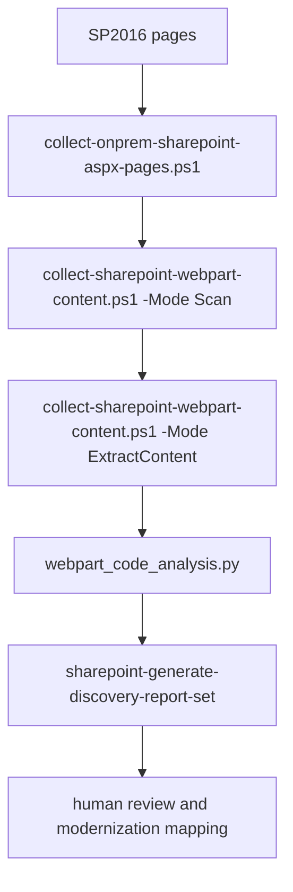

# SharePoint Web-Part Discovery and Analysis Runbook

This runbook preserves the discovery lineage from the CMAT migration
repository while using the generalized `sharepoint-discovery` workbench
capabilities. It is read-only against SharePoint and produces local evidence.

## Pipeline



## 1. Collect source pages

Use the `sharepoint-collect-sharepoint-inventory` skill:

```powershell
pwsh -File scripts/collect-onprem-sharepoint-aspx-pages.ps1 `
  -SiteUrl "<SP2016 site URL>" `
  -OutputDir "<output-root>\all_aspx_pages" `
  -UseDefaultCredentials
```

Expected evidence: downloaded `.aspx` files and a page manifest under
`<output-root>\all_aspx_pages`. Include root and subsite pages.

## 2. Scan web parts

Use the `sharepoint-analyze-webpart-code` collector:

```powershell
pwsh -File scripts/collect-sharepoint-webpart-content.ps1 `
  -SiteUrl "<SP2016 site URL>" `
  -OutputDir "<output-root>\analysis" `
  -Mode Scan `
  -UseDefaultCredentials
```

Expected evidence: a structured scan containing page URL, web-part ID, title,
type, zone, position, and connection metadata.

## 3. Extract payloads

Run extraction against the scan output:

```powershell
pwsh -File scripts/collect-sharepoint-webpart-content.ps1 `
  -SiteUrl "<SP2016 site URL>" `
  -OutputDir "<output-root>\analysis" `
  -Mode ExtractContent `
  -UseDefaultCredentials
```

The collector uses the SP2016 `exportwp.aspx` route for full CEWP/SEWP
payloads. Preserve the raw payload and the normalized JSON; do not classify a
missing payload as empty.

## 4. Group by functional behavior

```powershell
python -c "from webpart_code_analysis import run; print(run(extract_path='<output-root>/analysis/webpart-content.json', output_dir='<output-root>/analysis').status)"
```

Expected evidence:

- functional groups JSON;
- group analysis Markdown;
- per-instance review CSV.

The workbench uses generic, caller-supplied knowledge. Project-specific helper
script names and business rules belong in the caller's analysis configuration,
not in this plugin's defaults.

## 5. Assemble reports

```powershell
pwsh -File scripts/generate-sharepoint-discovery-report-set.ps1 `
  -AnalysisDir "<output-root>\analysis" `
  -SiteName "<site name>"
```

Add `-PermissionsJson` only when a real permissions export is available.
Missing inputs must be reported as unavailable; never replace them with static
conclusions.

## 6. Modernization handoff

The analysis output is evidence for page conversion. For each source page,
record:

1. source page identity and layout;
2. raw web-part type and functional group;
3. target native web part, existing/new SPFx solution, Power Platform
   replacement, manual replacement, or explicit gap;
4. link and asset remediation requirements;
5. validation evidence and reviewer decision.

Every source type or functional group must have a solution disposition before
conversion is approved. A report is not a solution mapping registry.

## Historical evidence and count reconciliation

The originating CMAT runbook reported 38 groups/121 instances for one filtered
population. Other later reports use different populations, including 12 groups
and 642 instances. These figures are retained as historical evidence only.
Reconcile scope, date, source files, and filters before using any count in a
current migration plan.

## Source-to-workbench mapping

| Historical capability | Workbench capability |
| --- | --- |
| `extract-all-aspx-pages.ps1` | `collect-onprem-sharepoint-aspx-pages.ps1` |
| `scan-all-webparts-live.ps1` | `collect-sharepoint-webpart-content.ps1 -Mode Scan` |
| `extract-webpart-content.ps1` | `collect-sharepoint-webpart-content.ps1 -Mode ExtractContent` |
| `analyze-webpart-code.py` | `webpart_code_analysis.py` |
| `generate-discovery-reports.ps1` | `generate-sharepoint-discovery-report-set.ps1` |
| navigation/forms/permissions collectors | corresponding `sharepoint-analyze-*` skills |

Historical CMAT paths, tenant URLs, generated outputs, and report counts are
not valid workbench defaults.
