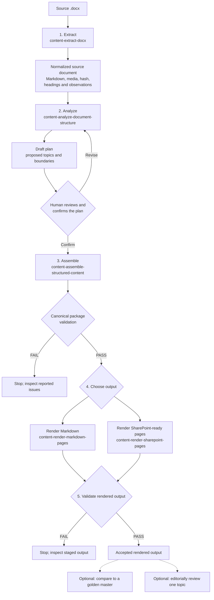

# Document conversion process overview

This guide describes the document-conversion skills from the perspective of
someone converting a Word document into maintainable content. It explains the
order to use the skills, the decisions a person makes, and what each stage
produces.

## At a glance

The conversion has two important human gates: review and confirm the analysis
plan before assembling content, and choose the desired output format before
rendering. A failed validation is a stop-and-investigate result, not an
accepted output.

## Follow these steps

### 1. Extract the Word document

Use [`content-extract-docx`](../skills/content-extract-docx/SKILL.md) with the
source `.docx` and an output directory. It observes the document; it does not
decide topic boundaries or rewrite the content into final pages.

The skill returns a schema-validated `normalized-source-document` containing
Markdown text, extracted media information, a source hash, heading structure,
defect signals, and statistics. It also places temporary Pandoc output under
`<output_dir>/raw/`. The normalized document is returned to the caller; the
skill does not promise to save that returned object as a separate Markdown or
JSON file. If you need to retain it, decide explicitly how and where to save
the returned result.

**Check:** Pandoc must be available. Report extraction observations as
observations; do not make topic or conversion decisions at this step.

### 2. Analyze the structure and confirm a plan

Give the normalized source document to
[`content-analyze-document-structure`](../skills/content-analyze-document-structure/SKILL.md).
It proposes an organization, topic boundaries, and a draft conversion plan.
It does not re-read the Word document, write files, or confirm the plan.

Review the proposed topics, warnings, and boundaries. Confirm or revise the
plan as a human. Assembly requires a confirmed plan, and checks that the source
document still matches the fingerprint recorded in that plan.

### 3. Assemble and validate the canonical content package

Use [`content-assemble-structured-content`](../skills/content-assemble-structured-content/SKILL.md)
with the confirmed plan, the source document, and a package output directory.
This step creates the maintainable content package, including its pages or
chunks, media, manifest, and lineage information.

Assembly validates the package before promoting it. Treat it as accepted only
when the result reports `promoted: true` and validation `PASS`. On failure,
review the reported issues; the failed staging area is retained for diagnosis.

### 4. Choose and render an output format

Choose one or both destinations from the accepted package:

| Destination | Skill | What it produces |
|---|---|---|
| Markdown | [`content-render-markdown-pages`](../skills/content-render-markdown-pages/SKILL.md) | A page per chunk, a path-aware index, and media with rewritten relative links. |
| SharePoint modern pages | [`content-render-sharepoint-pages`](../skills/content-render-sharepoint-pages/SKILL.md) | An ordered page manifest, an HTML fragment per chunk, and media. These are ready for a separate publication step; this skill does not write to SharePoint. |

The SharePoint output is **not** a raw `.aspx` page for direct upload. Publishing
the generated artifacts is a separate operation outside this conversion flow.

#### About rendering templates

The template skills create and validate page-layout files:

- [`content-create-markdown-rendering-template`](../skills/content-create-markdown-rendering-template/SKILL.md)
- [`content-create-sharepoint-rendering-template`](../skills/content-create-sharepoint-rendering-template/SKILL.md)
- [`content-validate-rendering-template`](../skills/content-validate-rendering-template/SKILL.md)

Use these when you need to create or check a rendering-template file. Template
validation checks the template itself, not the pages eventually rendered.
Although the process diagrams describe choosing a template profile, the
rendering skill instructions do not explain how to pass a created template into
the render step. Do not assume that creating or validating a template
automatically applies it to rendered pages.

### 5. Validate the rendered output

Run [`content-validate-rendered-output`](../skills/content-validate-rendered-output/SKILL.md)
against the staged render and its canonical package. It checks that pages,
links, media, and source traceability are sound, and promotes the staged output
only on `PASS`. A failed render remains staged for investigation; it does not
replace the accepted output.

### Optional follow-up checks

- [`content-compare-rendered-output`](../skills/content-compare-rendered-output/SKILL.md)
  compares a fresh render byte-for-byte with a golden-master baseline. Use this
  to verify fidelity to a known-good render, not as a substitute for rendered
  output validation.
- [`content-review-manual-topic`](../skills/content-review-manual-topic/SKILL.md)
  performs a read-only editorial review of one selected topic. It is not a
  whole-library review or a replacement for automated link and content
  validation.

## Which validation happens when?

These checks cover different artifacts; there is no separate extraction-output
validation skill in this plugin:

1. **Extraction:** `content-extract-docx` validates the returned normalized
   source document against its contract.
2. **Plan:** `content-analyze-document-structure` returns a draft plan for
   human review and confirmation.
3. **Package:** `content-assemble-structured-content` validates the canonical
   package before promotion.
4. **Template (when used):** `content-validate-rendering-template` checks the
   template definition.
5. **Rendered pages:** `content-validate-rendered-output` checks the staged
   Markdown or SharePoint-ready output before promotion.

The plugin's [test suite](../README.md#running-the-tests) checks the plugin
implementation. It is separate from validating the files produced for an
individual document conversion.

## Related process diagrams

- [Analyze and confirm](../../../docs/diagrams/02-analyze-and-confirm.mmd)
- [Create canonical content](../../../docs/diagrams/03-create-canonical-content.mmd)
- [Generate and render](../../../docs/diagrams/04-generate-and-render.mmd)

## Skills covered

The full inventory and namespace-specific test instructions are in the
plugin's [README](../README.md). This overview focuses on the normal
source-document-to-rendered-output path and the optional quality checks that
follow it.
