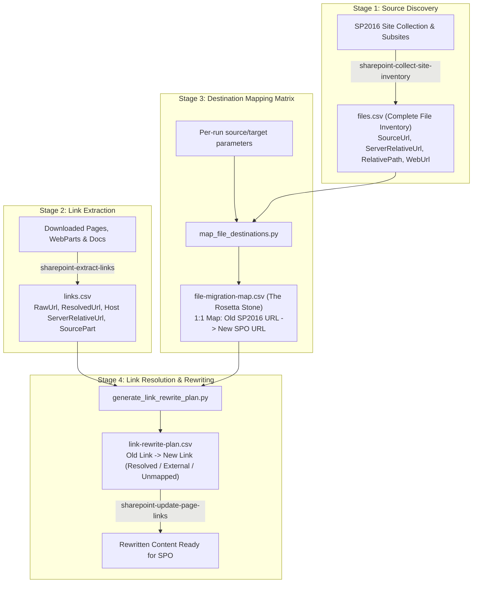

# End-to-End SharePoint Migration: Content Inventory, Link Extraction, Destination Mapping, and URL Rewriting Architecture

**Document Version:** 1.0\
**Layer:** `sharepoint-site-migration` plugin reference hub
**Status:** Active Canonical Architecture Reference

## Contents

- [1. Executive Summary](#1-executive-summary)
- [2. The 4 Pipeline Stages](#2-the-4-pipeline-stages)
  - [Stage 1: Exhaustive File & Asset Inventory](#stage-1-exhaustive-file--asset-inventory)
  - [Stage 2: Deep Link Extraction](#stage-2-deep-link-extraction)
  - [Stage 3: The "Rosetta Stone" Destination Mapping](#stage-3-the-rosetta-stone-destination-mapping)
  - [Stage 4: Automated Link Resolution & Rewriting](#stage-4-automated-link-resolution--rewriting)
  - [Iterative First-Library Workflow](#iterative-first-library-workflow)
- [3. Plugin Architecture Policy Compliance](#3-plugin-architecture-policy-compliance)

---

## 1. Executive Summary

During SharePoint on-premises (e.g. SP2016) migrations to SharePoint Online (SPO), link rot and broken asset references are among the highest failure modes. This occurs because:
1. **Structural Topology Changes**: SP2016 subsites (e.g. `/DepartmentA`, `/DepartmentB`) are collapsed/flattened into SPO document libraries or subfolders within a single modern site collection (`/sites/TargetSite/`).
2. **File Format Conversions**: Legacy classic `.aspx` web part and wiki pages are migrated as `.html` files (or converted to modern Site Pages).
3. **Hidden / Embedded Links**: Links and image references are rarely just simple HTML `<a>` tags; they are embedded inside Content Editor Web Part (CEWP) database payloads, Script Editor Web Parts (SEWP), `.webpart`/`.dwp` XML configurations, Office document relationship files (`.rels`), and SharePoint list item rich-text columns.

To achieve complete link integrity with zero manual trial-and-error, the migration pipeline employs a deterministic, data-driven **4-Stage Pipeline** backed by an authoritative "Rosetta Stone" destination map.



---

## 2. The 4 Pipeline Stages

### Stage 1: Exhaustive File & Asset Inventory
- **Skill**: `sharepoint-collect-site-inventory`
- **Output**: `inventory/files.csv`
- **Core Attributes Captured**:
  - `SourceSiteUrl`, `WebUrl`: Exact on-prem site / subsite origin.
  - `LibraryTitle`, `ContainerType`: Document library, Asset library, or Site Pages.
  - `ServerRelativeUrl`: Authoritative root-relative path on SP2016 (e.g. `/DepartmentA/Documents/Policies/guide.pdf`).
  - `RelativePath`: Library-relative path.
  - `FileName`, `FileExtension`, `SizeBytes`, `Modified`.

### Stage 2: Deep Link Extraction
- **Skill**: `sharepoint-extract-links` (`scripts/link-remediation/export_link_inventory.py`)
- **Coverage**:
  - **Static Pages**: `.html`, `.htm`, `.aspx`, `.txt`.
  - **Classic Web Part Payloads**: `.webpart` and `.dwp` XML, and `webpart-content.json` (exported via `exportwp.aspx` from `sharepoint-analyze-webpart-behavior`).
  - **Modern Page Exports**: Canvas fields and web-part property trees (`*.page.json`).
  - **Office Documents**: OOXML external relationships (`.rels` inside `.docx`, `.xlsx`, `.pptx`).
  - **Encoding Normalization**: Automatically handles SharePoint Unicode escapes (`\u002f`), HTML entities (`&#58;`), and CSS `url(...)` background images.
  - **Custom List Item Fields**: Require a separate list-item export and are not collected by this file/page workflow; do not assume those fields are covered by `files.csv`.
- **Output**: `links.csv`
  - Every row carries the host file's coordinates (`ServerRelativeUrl`, `RelativePath`, `LocalPath`, `SourceUrl`, `SourcePart`) so remediators know *which file* owns the link and its exact position.

### Stage 3: The "Rosetta Stone" Destination Mapping
- **Objective**: Translate one explicitly selected SP2016 web/library/folder to its supplied SPO library/folder. Every run receives its source and target; it never invents a same-name fallback.
- **Inputs**: `files.csv`, exact `--source-web-url` and `--source-library-title`, optional `--source-server-relative-prefix`, `--target-site-url`, `--target-library-title`, exact `--target-library-root-url`, and optional `--target-folder-prefix`.
- **Optional workbook verification**: `--mapping-workbook` performs a read-only exact comparison against one row in a `Destination Mapping` worksheet. It is optional and is not used to derive routing. The worksheet columns are:
  `SourceWebUrl`, `SourceLibraryTitle`, `SourceServerRelativePrefix`, `TargetSiteUrl`,
  `TargetLibraryTitle`, `TargetLibraryRootUrl`, `TargetFolderPrefix`, `RenameAspxToHtml`.
  Duplicate or absent matching rows fail validation. The mapper never edits the workbook.
- **Count guards**: `--expected-source-files` and `--expected-aspx-count` fail before output is written when inventory scope/counts differ from the operator's expectation.
- **Generator Engine (`map_file_destinations.py`)**:
  Maps every inventory file in the selected source container, preserving paths below the source prefix. This lets the later link planner resolve PDFs, images, and other assets referenced by the pages being prioritized.
- **Output (`file-migration-map.csv`)**:
  An exhaustive, 1-to-1 lookup table:
  - `SourceServerRelativeUrl` $\rightarrow$ `TargetServerRelativeUrl`
  - `SourceFileUrl` $\rightarrow$ `TargetFileUrl`
  - Target path segments are percent-encoded; duplicate source or destination paths fail instead of silently overwriting.

Example for one explicitly selected library (offline plan generation only):

```powershell
python scripts/map_file_destinations.py `
  --files-csv "$FilesCsv" `
  --source-web-url "https://source.example/DepartmentA" `
  --source-library-title "Policies" `
  --source-server-relative-prefix "/DepartmentA/Policies/" `
  --target-site-url "https://tenant.example/sites/Target" `
  --target-library-title "Records" `
  --target-library-root-url "/sites/Target/Records" `
  --target-folder-prefix "department-a/policies" `
  --aspx-to-html `
  --expected-source-files "$ExpectedFileCount" `
  --expected-aspx-count "$ExpectedAspxCount" `
  --output-csv "$OutputMap"
```

### Stage 4: Automated Link Resolution & Rewriting
- **Skill**: `sharepoint-update-page-links` (`scripts/link-remediation/generate_link_rewrite_plan.py`)
- **Process**:
  1. Iterates over each extracted link in `links.csv`.
  2. Resolves relative links against the host file's `SourceServerRelativeUrl`.
  3. Looks up the resolved URL in `file-migration-map.csv`.
  4. Computes the new target URL:
     - If the target is an internal file in the supplied map: sets `TargetSPOUrl`; source query strings and fragments are preserved.
     - If the target is outside the site: marks `Status = EXTERNAL`.
     - If the target is internal but absent from the supplied map: marks `Status = UNMAPPED_NOT_IN_MAP`. This can mean the target is in another library not mapped yet; it is not automatically an orphan.
     - If a relative URL has no resolved URL, marks `Status = UNRESOLVED_RELATIVE`. Multiple map rows matching one target produce `AMBIGUOUS`.
  5. Emits `link-rewrite-plan.csv` for human review or automated batch execution.

### Iterative First-Library Workflow

For a first migration, run a dry local pass on one source library at a time. Map the entire container
so links from the pages being prioritized to other files in that library can resolve. Review the
rewrite plan by source page and `SourcePart`; classify each unresolved target before widening the
mapped scope or adjusting extraction rules. Do not publish or rewrite source content from these
inventory scripts. A later run can add mappings for other libraries as link review demonstrates they
are needed.

---

## 3. Plugin Architecture Policy Compliance

Per `.agent/rules/plugin-architecture-policy.md`:
- **Repository Authority**: All canonical Python scripts live under `plugins/sharepoint-site-migration/scripts/link-remediation/` in `bcgov/sharepoint-knowledge-workbench`.
- **Symlink Management**: Spoke skills receive file-level symlinks managed by `symlink_manager.py` and declared in `symlinks.json`.
- **Self-Contained Imports**: All scripts contain a `sys.path` bootstrap ensuring zero friction when run from CLI, root, or subdirectories.
- **Downstream Sync**: Synced to consumer repositories via `plugin-syncer` into `.agents/skills/`.
