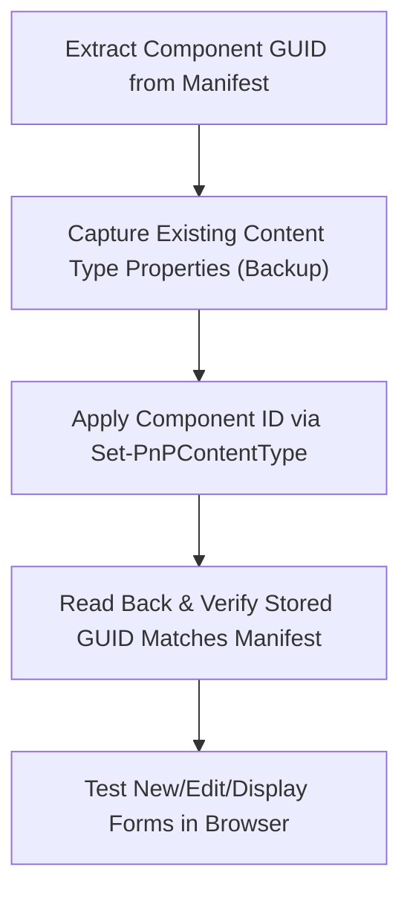

# SharePoint Content Type Association for SPFx Form Customizers

## Overview

Deploying an SPFx `.sppkg` package to a Site Collection App Catalog or Tenant App Catalog makes the Form Customizer code available to SharePoint Online. However, **deploying the package alone does not activate the custom form**.

To replace the out-of-the-box form experience on a list or library, the Form Customizer's Component ID (GUID) must be explicitly bound to the list's **Content Type**.

---

## Content Type Form Properties

SharePoint Online content types expose three pairs of properties governing client-side form rendering:

| Form Mode | Component ID Property | Component Properties Property | Description |
|---|---|---|---|
| **New Form** | `NewFormClientSideComponentId` | `NewFormClientSideComponentProperties` | Component ID and optional JSON config for creating new items. |
| **Edit Form** | `EditFormClientSideComponentId` | `EditFormClientSideComponentProperties` | Component ID and optional JSON config for editing existing items. |
| **Display Form** | `DisplayFormClientSideComponentId` | `DisplayFormClientSideComponentProperties` | Component ID and optional JSON config for viewing item details in read-only mode. |

- **Component ID**: The string representation of the extension `id` GUID from `<Name>FormCustomizer.manifest.json`.
- **Component Properties**: Optional JSON-serialized string passed to the customizer at runtime via `this.properties`.
- **Default OOB Behavior**: When these properties are empty strings (`""`) or `$null`, SharePoint Online renders its default modern form panel.

---

## Content Type Association Workflow



### 1. Extract the Component ID
Find the `id` field inside the Form Customizer manifest:
`src/extensions/<name>/<Name>FormCustomizer.manifest.json`

Example: `e672956c-38d7-4c8d-b778-9e55b4fa3977`

### 2. Inspect and Record Existing State
Before modifying the content type, record its current settings for audit and rollback purposes:

```powershell
$ct = Get-PnPContentType -List "Narratives" -Identity "Item"
[PSCustomObject]@{
    Name                            = $ct.Name
    StringId                        = $ct.StringId
    NewFormClientSideComponentId    = $ct.NewFormClientSideComponentId
    EditFormClientSideComponentId   = $ct.EditFormClientSideComponentId
    DisplayFormClientSideComponentId= $ct.DisplayFormClientSideComponentId
} | Format-List
```

### 3. Associate via PnP PowerShell

Bind the customizer to the desired form modes (New, Edit, Display, or all three):

```powershell
# Parameterized association example
$ListName = "Narratives"
$ContentTypeName = "Item"
$ComponentId = "e672956c-38d7-4c8d-b778-9e55b4fa3977"
$ComponentProps = '{"parentListTitle":"Persons"}'

Set-PnPContentType `
    -List $ListName `
    -Identity $ContentTypeName `
    -NewFormClientSideComponentId $ComponentId `
    -NewFormClientSideComponentProperties $ComponentProps `
    -EditFormClientSideComponentId $ComponentId `
    -EditFormClientSideComponentProperties $ComponentProps `
    -DisplayFormClientSideComponentId $ComponentId `
    -DisplayFormClientSideComponentProperties $ComponentProps
```

### 4. Verify Readback
Read back the content type properties from the list and verify exact GUID matching:

```powershell
$updatedCt = Get-PnPContentType -List $ListName -Identity $ContentTypeName
if ($updatedCt.NewFormClientSideComponentId -eq $ComponentId) {
    Write-Host "PASS: Form Customizer successfully associated." -ForegroundColor Green
} else {
    Write-Error "FAIL: Readback GUID mismatch!"
}
```

---

## Detachment & Rollback

To remove the Form Customizer association and revert to the standard SharePoint Online form experience:

```powershell
# Setting properties to empty string ("") completely detaches the customizer
Set-PnPContentType `
    -List "Narratives" `
    -Identity "Item" `
    -NewFormClientSideComponentId "" `
    -NewFormClientSideComponentProperties "" `
    -EditFormClientSideComponentId "" `
    -EditFormClientSideComponentProperties "" `
    -DisplayFormClientSideComponentId "" `
    -DisplayFormClientSideComponentProperties ""
```

> [!NOTE]
> Setting the component ID to an empty string `""` immediately restores the default out-of-the-box form experience without having to uninstall the `.sppkg` package from the App Catalog.
