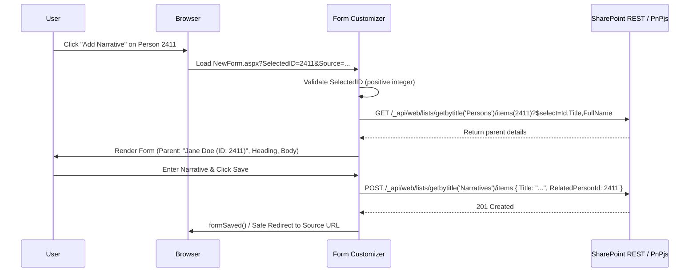

# URL-Driven Related-Item Pattern for SPFx Form Customizers

## Contents

- [Overview](#overview)
- [Technical Architecture & State Model](#technical-architecture--state-model)
- [Core Implementation Rules](#core-implementation-rules)

## Overview

A frequent enterprise modernization pattern is creating or editing child records linked to a parent item directly from a parent dossier page (e.g. `Persons` -> `Narratives`).

In classic SharePoint, this was often handled via URL query strings:
```
https://contoso.sharepoint.com/sites/hr/Lists/Narratives/NewForm.aspx?SelectedID=2411&Source=https%3A%2F%2Fcontoso.sharepoint.com%2Fsites%2Fhr%2FSitePages%2FPerson.aspx%3FSelectedID%3D2411
```

In modern SharePoint Online, out-of-the-box List Forms cannot read URL query parameters to pre-populate lookups. Furthermore, when the parent list contains thousands of records, standard SharePoint lookup picker dropdowns hit list view thresholds or cause severe performance degradation.

An **SPFx Form Customizer** solves this by:
1. Safely parsing `SelectedID=2411` from the URL query string.
2. Directly resolving the parent item by its integer ID.
3. Displaying a clear, user-friendly parent summary without loading thousands of dropdown options.
4. Saving the child item with the parent integer ID bound to the lookup field (`RelatedPersonId = 2411`).
5. Safely returning the user to the validated originating `Source` page upon save or cancel.

---

## Technical Architecture & State Model



---

## Core Implementation Rules

### 1. Treat URL Parameters as Untrusted Input

Always validate and sanitize query string parameters before using them in API queries or UI rendering:

```typescript
export function parseAndValidateParentId(searchQuery: string, paramName: string = "SelectedID"): number | null {
  const params = new URLSearchParams(searchQuery);
  const rawValue = params.get(paramName);

  if (!rawValue) {
    return null;
  }

  // Strictly enforce positive integer format (1 to 2,147,483,647)
  const isPositiveInteger = /^[1-9]\d*$/.test(rawValue.trim());
  if (!isPositiveInteger) {
    console.warn(`[FormCustomizer] Invalid numeric query parameter '${paramName}': ${rawValue}`);
    return null;
  }

  const parsed = parseInt(rawValue.trim(), 10);
  if (isNaN(parsed) || parsed <= 0 || parsed > 2147483647) {
    return null;
  }

  return parsed;
}
```

### 2. Distinguish Identification Concepts

Never confuse or conflate the following distinct attributes:

| Term | Example | Description |
|---|---|---|
| **Query Parameter Name** | `SelectedID` | The key in the browser URL query string. |
| **Lookup Display Name** | `Related Person` | The human-readable column label in SharePoint UI. |
| **Lookup Internal Field Name** | `RelatedPerson` | The schema internal name of the lookup column. |
| **REST Payload Property** | `RelatedPersonId` | The integer ID property expected by SharePoint REST/PnPjs (`<InternalName>Id`). |
| **Parent Item ID** | `2411` | The numeric `Id` (integer primary key) of the target parent item. |
| **Parent Display Text** | `Jane Doe (Dept 402)` | The human-readable string displayed in the UI banner/label. |

> [!WARNING]
> SharePoint list lookups must be saved using the integer item ID (`RelatedPersonId: 2411`), NOT the display text, GUID, or title string.

### 3. Fetch Parent Record with Minimal Selective Fields

Do not request `*` or load all columns. Query only the primary identifiers required for display:

```typescript
import { SPHttpClient, SPHttpClientResponse } from '@microsoft/sp-http';

export interface IParentSummary {
  id: number;
  title: string;
  displayName: string;
}

export async function fetchParentItem(
  spHttpClient: SPHttpClient,
  webUrl: string,
  parentListTitle: string,
  parentId: number
): Promise<IParentSummary> {
  const endpoint = `${webUrl}/_api/web/lists/getByTitle('${encodeURIComponent(parentListTitle)}')/items(${parentId})?$select=Id,Title`;

  const response: SPHttpClientResponse = await spHttpClient.get(
    endpoint,
    SPHttpClient.configurations.v1,
    { headers: { 'Accept': 'application/json;odata=nometadata' } }
  );

  if (!response.ok) {
    if (response.status === 404) {
      throw new Error(`Parent item with ID ${parentId} was not found in '${parentListTitle}'.`);
    } else if (response.status === 403 || response.status === 401) {
      throw new Error(`Access denied when reading parent item ${parentId}.`);
    }
    throw new Error(`Failed to retrieve parent record. Status: ${response.status}`);
  }

  const data = await response.json();
  return {
    id: data.Id,
    title: data.Title,
    displayName: `${data.Title} (ID: ${data.Id})`
  };
}
```

### 4. Mode-Aware State Management

Handle form modes deliberately:

- **New Form**:
  - Read `SelectedID` from URL.
  - If valid, pre-fetch and lock parent lookup ID in component state.
  - If missing and parent is mandatory, display a blocking validation warning.
  - On submit, send payload containing `RelatedPersonId: parentId`.
- **Edit Form**:
  - Load the item's existing lookup value from `this.context.item`.
  - Preserve immutable relationship fields.
  - Do NOT overwrite existing lookup bindings simply because a `SelectedID` parameter appears in the URL query string, unless explicit business logic demands override.
- **Display Form**:
  - Render resolved parent display text as a read-only hyperlink or label.
  - Disable all form input controls.

### 5. Safe Return Navigation (Prevent Open Redirects)

Always validate return URLs against an allow-list or ensure they reside on the same SharePoint tenant:

```typescript
export function getSafeReturnUrl(currentWebUrl: string): string {
  const params = new URLSearchParams(window.location.search);
  const rawSource = params.get("Source");

  if (!rawSource) {
    return `${currentWebUrl}/SitePages/Home.aspx`;
  }

  try {
    const decodedSource = decodeURIComponent(rawSource);
    // Ensure relative URL or same-origin tenant URL
    if (decodedSource.startsWith("/") && !decodedSource.startsWith("//")) {
      return decodedSource;
    }

    const currentOrigin = new URL(currentWebUrl).origin.toLowerCase();
    const sourceUrl = new URL(decodedSource, currentWebUrl);

    if (sourceUrl.origin.toLowerCase() === currentOrigin) {
      return sourceUrl.href;
    }
  } catch (e) {
    console.warn("[FormCustomizer] Invalid Source parameter:", e);
  }

  return `${currentWebUrl}/SitePages/Home.aspx`;
}
```
