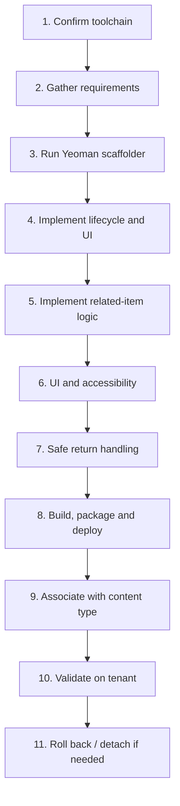

# Form Customizer: package, deploy, associate, validate, roll back

## Contents

- [The eleven-step flow](#the-eleven-step-flow)
- [Package and deploy](#package-and-deploy)
- [Associate with the content type](#associate-with-the-content-type)
- [Validate on the tenant](#validate-on-the-tenant)
- [Roll back](#roll-back)
- [Sources](#sources)

## The eleven-step flow



Steps 1 to 3 are in `form-customizer-suitability-and-setup.md`; steps 4 to 7 in `form-customizer-implementation-patterns.md`; steps 8 to 11 below.

## Package and deploy

1. Verify build and tests: `npm run build`.
2. Package the production `.sppkg` with the `sharepoint-package-spfx-solution` skill (`scripts/package-spfx-solution.ps1 -SolutionPath "."`).
3. Deploy to the App Catalog with the `sharepoint-deploy-spfx-solution` skill (`deploy-spfx-package.ps1 -PackagePath "./sharepoint/solution/<solution-name>.sppkg" -Scope Site -Install`). That script writes immediately.

Do not stop here. Deploying and installing the app makes the extension available on the site, but the content type still points at the default form. The custom form does NOT render, and SharePoint silently keeps serving the
classic form with no error, until step 9 (association) is done. Proceed to association in the same response; do not end the task or wait for the user to report that it worked.

## Associate with the content type

Deploying the `.sppkg` does not activate the custom form. Associate the manifest GUID with the list's content type.

1. Read the component `id` from `src/extensions/<name>/<Name>FormCustomizer.manifest.json`.
2. Dry-run analysis:

   ```powershell
   pwsh -File scripts/associate-form-customizer.ps1 -ListName "Reviews" -ContentTypeName "Item" -ComponentId "<manifest-component-id>"
   ```

3. Live association (needs `-Execute`):

   ```powershell
   pwsh -File scripts/associate-form-customizer.ps1 -ListName "Reviews" -ContentTypeName "Item" -ComponentId "<manifest-component-id>" -Modes @("New", "Edit") -Execute
   ```

## Validate on the tenant

```powershell
pwsh -File scripts/validate-form-customizer-association.ps1 -ListName "Reviews" -ContentTypeName "Item" -ExpectedComponentId "<manifest-component-id>"
```

Then verify in the browser using `validation-checklist.md`: open `NewForm.aspx?SelectedID=2411` (the custom form loads with parent details); submit a new item (the record appears with the parent lookup ID populated);
open `EditForm.aspx?ID=<id>` (existing values load); click Cancel (the form closes without saving).

## Roll back

To restore the standard SharePoint Online forms:

```powershell
pwsh -File scripts/remove-form-customizer-association.ps1 -ListName "Reviews" -ContentTypeName "Item" -Execute
```

Verify that `NewForm.aspx` immediately shows the standard forms.

## Sources

- Microsoft Learn: Build your first Form Customizer extension (`https://learn.microsoft.com/en-us/sharepoint/dev/spfx/extensions/get-started/building-form-customizer`).
- Microsoft Learn: SharePoint Framework development tools and libraries compatibility (`https://learn.microsoft.com/en-us/sharepoint/dev/spfx/compatibility`).
- PnP PowerShell: Set-PnPContentType (`https://pnp.github.io/powershell/cmdlets/Set-PnPContentType.html`).
