## APPEARANCES

This is the final tab for initiating a document; it's a summary list of appearance for the document., The list is sorted by the most recent appearance date first, although the list will be blank when you are initiating a file because no appearance have been scheduled yet.

### How to Schedule a File

To schedule an Appearance, you must first [locate](#locate-a-file) the file. Once the file has been located follow these steps.

1. Click on Appearance on the left hand sidebar menu, and click Add Appearance.

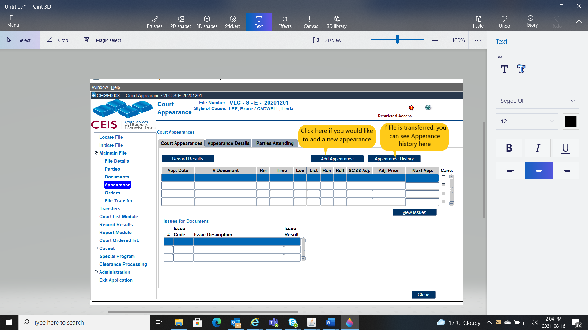

2.  Fill in the Appearance Details.

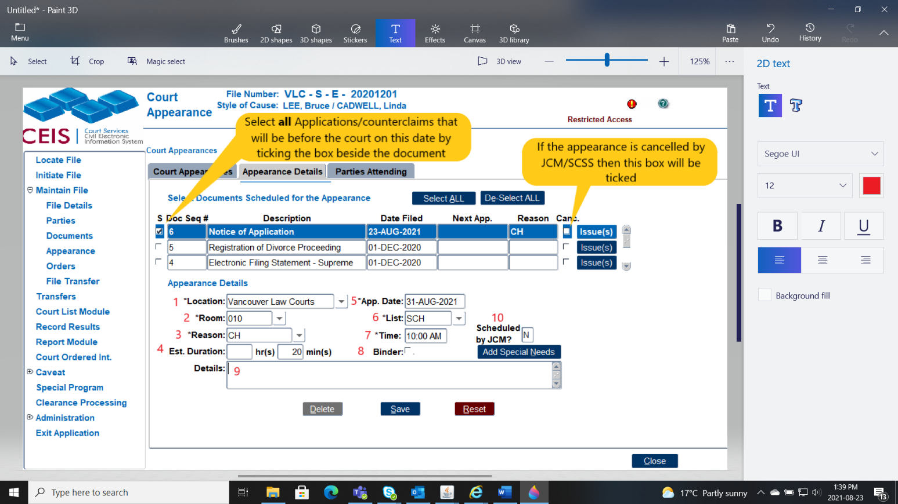

**Location**(1)**:**

Where the appearance will take place

**Room**(2)**:**

The Room Number of the appearance

**Reason**(3)**:**

The purpose of the appearance (See Appearance Reasons - [CEIS Code Table](https://csb.jag.gov.bc.ca/Civil%20Documents/CEIS/ceis-code-table.pdf), Pg 43)

**Est. Duration**(4)**:**

How long the appearance will be generally indicated on the Application.

*(Half days = 2 hrs 30min, Full days = 4 hrs 30 minutes)*

**App Date**(5)**:**

Date of the Appearance

**List**(6):

Court List type (See Court List Types - [CEIS Code Table](https://csb.jag.gov.bc.ca/Civil%20Documents/CEIS/ceis-code-table.pdf), Pg 42)

**Time**(7)**:**

What time the appearance starts

**Binder**(8)**:**

For Chambers Applications, when a binder is required. Tick here if a Binder is filed.

**Details**(9)**:**

Any details of this appearance (i.e how many days the trial will be.)

**Scheduled by JCM**(10)**:**

If the Appearance was scheduled by JCM this will be Y, if scheduled by Registry, this will be N

NOTE - The procedure for scheduling an appearance to another location is the same as scheduling to your own location --- except for the court location and room.

3.  If there is a party who is not attending the appearance, i.e did not file a reply, go the Party Attending Tab and unselect the individual.

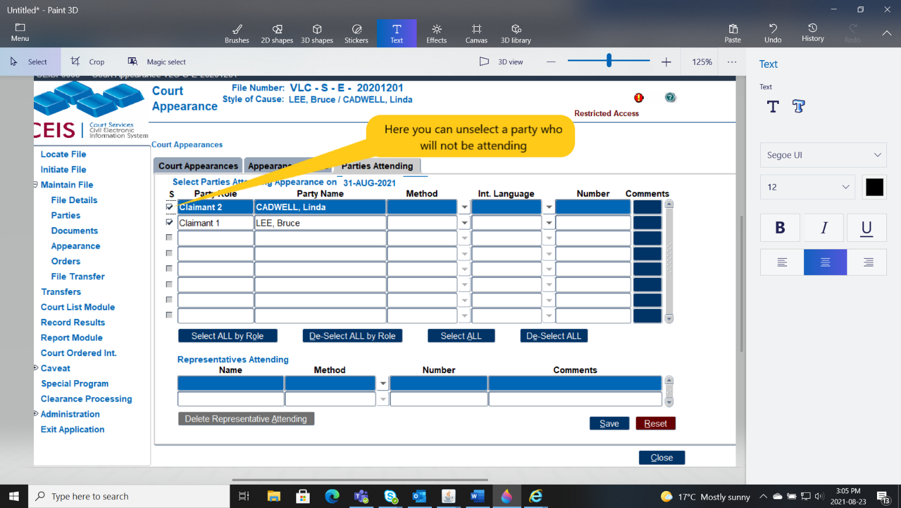

### Remote Appearances

Supreme and Provincial Court will be conducting many court appearances via MS Teams. To support this change CEIS has created auto emails to be provided to parties/Counsel at 5:30 pm the evening before the scheduled appearance and at 8:45 am the morning of the appearance which will contain the MS Teams links and dial in information.

NOTE -- For how to process a Requisition- Method of Attendance (Form 19.1) for Supreme Court Chambers matters that are under 2 hours, click [here](https://csb.jag.gov.bc.ca/Civil%20Documents/CEIS/ceimails/ceimails338.pdf).

To ensure the emails are sent, the following steps need to be completed:

1.  Confirm the party and their counsel have an email entered in CEIS.

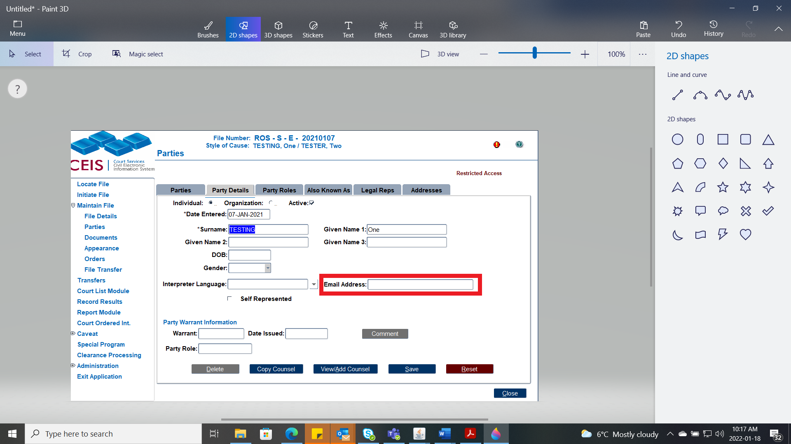You will find the party's email address here:

You will find their Active Counsel of Record Email address here:

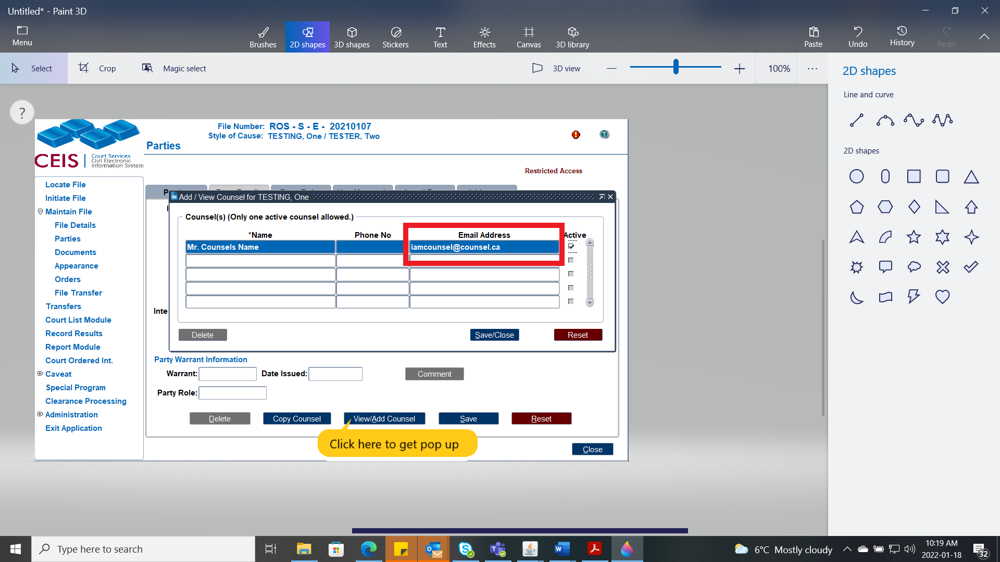

And the Child's Counsel's email address here:

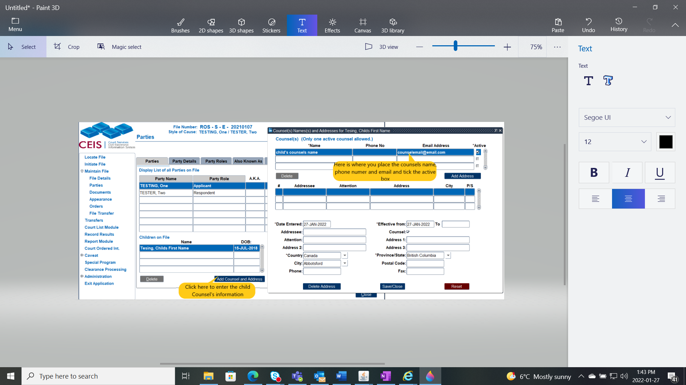

**If there is NO email address, then NO email will be sent.**

2. Add the Appearance and enter the Appearance Details per normal process.

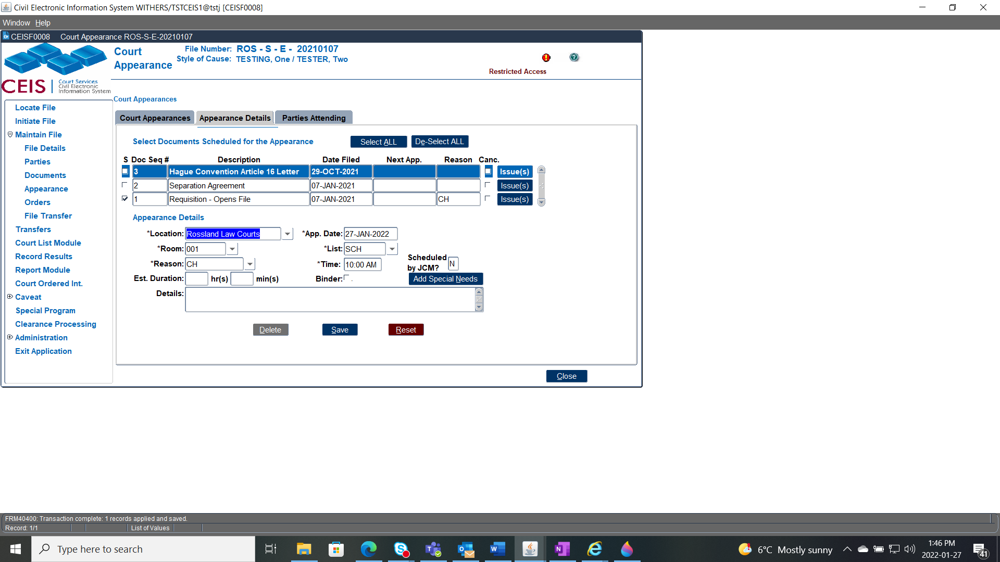

3.  Enter the method of which the parties are attending

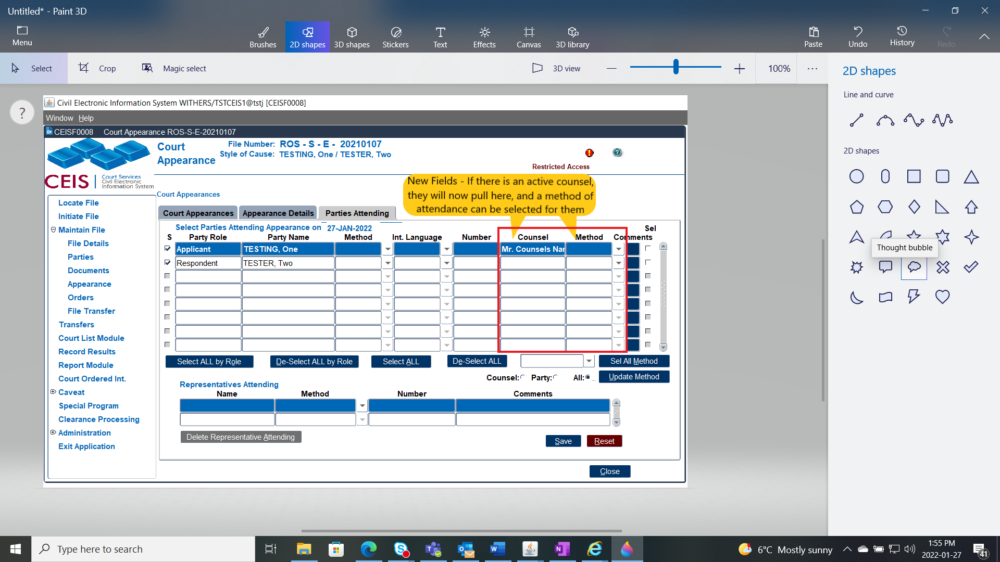

In this Screen, if the party or counsel is to appear remotely, via MS Teams, we need to capture that in their method of attendance here.

**If they are to attend via MS Teams and this step is forgotten (left blank), or they are appearing in Person NO email with the MS Teams Link will be sent.**

This attendance method DOES NOT Transfer to CCD -- it is strictly for CEIS email automation.

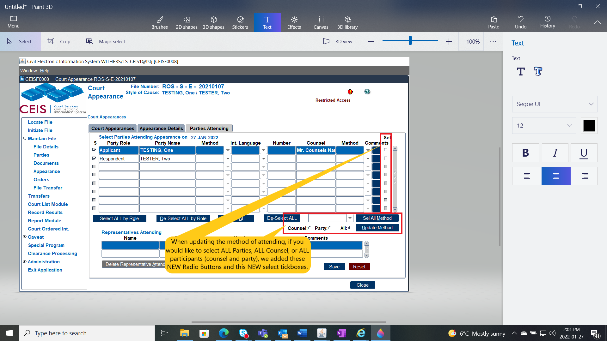

For those larger files, we added these radio buttons.

Using the **RIGHT SELECTION TICK BOX**, you can Select all:

Party's only,

Counsel Only or

Participants listed.

Then select the Attendance Method in the drop down and Click **Update Method** and **SAVE.**

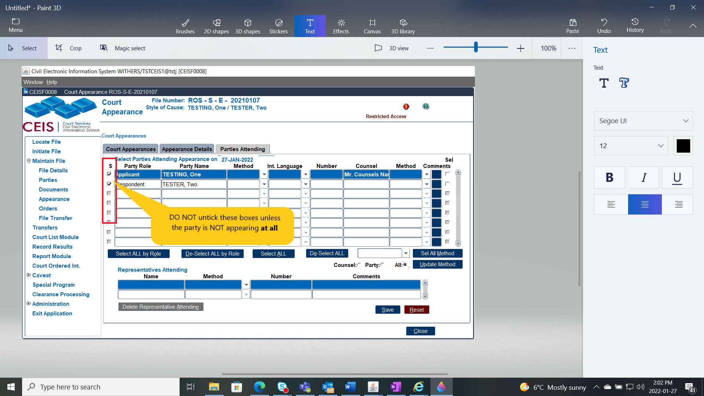

Do not untick any of these LEFT side tick boxes. This triggers who will be appearing in general.

If these three steps are done correctly, the parties and their counsel will receive 2 emails.

4.  The **first email sent is at 5:30 pm** the evening before the Scheduled Court Appearance.

The Email looks like this:

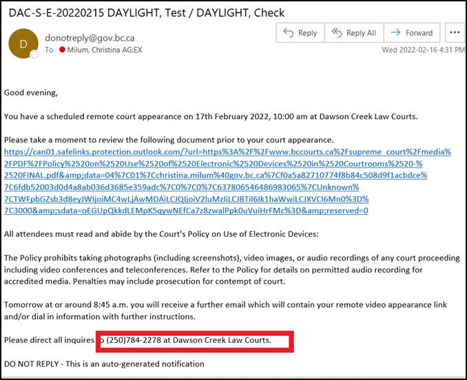

This email indicates to the party and counsel that they will be receiving a further email with the video link and dial in information the morning of their appearance at 8:45 a.m. and contains the local phone number for the appearance location.

5.  The **second email is sent at 8:45 a.m.** the morning OF the Scheduled Court Appearance.

The Email looks like this:

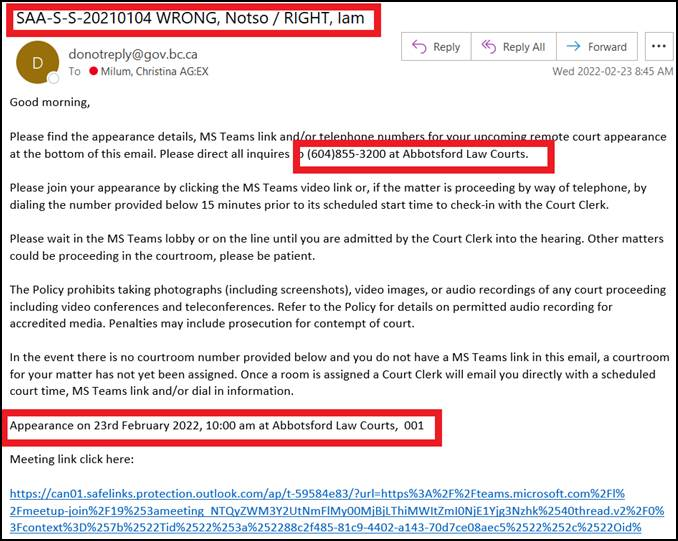

**In the event that we have not yet assigned a courtroom to the matter by 8:45 a.m. PST**, and the appearance is sitting as REG or TD, the email will still produce with no link or dial in information.

There is a paragraph in the email that states:

"In the event there is no courtroom number provided below and you do not have a MS Teams link in this email, a courtroom for your matter has not yet been assigned. Once a room is assigned a Court Clerk will email you directly with a scheduled court time, MS Teams link and/or dial in information."

6.  At 8:45 a.m. or later, you can generate a new report in CEIS called [MS Teams Appearance Report](#ms-teams-appearance-report).

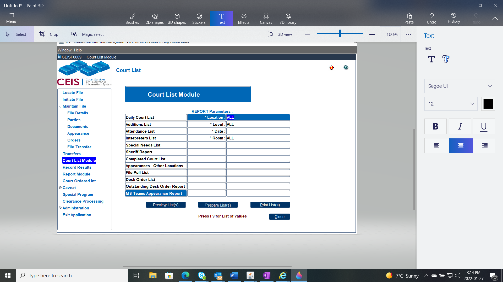

Double click on Court List Module 🡪 MS Teams Appearance Report.

Fill in the Location, Level, Date and Room and click **Preview List**

This below example I chose ALL Locations, due to limited test files, but you will see it is easy to read.

Location -- Appearance Location

Date -- Court Appearance Date

Crt Rm -- Court Room Number

File Number -- Location -- level- class- \#

Party Name -- Party on Style of Cause

Counsel -- Counsel of Record

Notified by Email -- tick mark confirms sent email

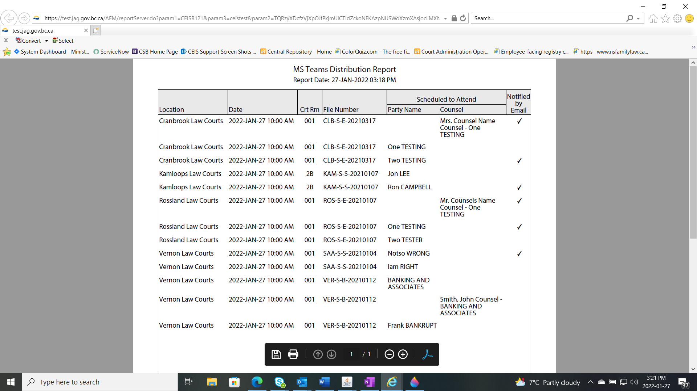

If the Auto Email is not working for whatever reason, here is your plan B.

**Help I didn't get an email !**

We anticipate you may receive some calls... when you do, and the party/counsel state they did not receive their email check these things:

1.  Is their email address entered correctly in CEIS,

2.  Did their method of attendance get changed to MS Teams

3.  It is in their JUNK/SPAM folder

4.  Check the Report

5.  Manually send them the information.

**Scenario 1:**

**Report has some missing Tick Marks: Emails Addresses and non-parties**

6.  At 8:46 am, pull your MS Teams Appearance Report at your location.

7.  If there are tick marks missing, verify that you have their email address and manually send the party/counsel an email using the email template that has been uploaded online [here](https://csb.jag.gov.bc.ca/CourtAdmin/Pages/Virtual-Courts.aspx).

8.  If there is a non-party who is to appear and you have the email address, email them manually.

(Each location may determine their own process on how to track non-parties. CEIS does not currently have this ability, however, if your location wishes to use CEIS, we suggest placing the NON-Party's name and email address in the Special Needs against the appearance and pull the Special Needs list daily with the MS Teams Appearance Report)

9.  After the manual email is sent to the party/counsel with the link, check the file to see if there was a clerical error. If not, please report it to CEIS Support.

**Scenario 2:**

**Report has some missing Tick Marks: No Emails Addresses**

1.  At 8:46 am, pull your MS Teams Appearance Report at your location.

2.  If there are tick marks missing, and there has been no email address provided, locate the party/counsel/non-party's phone number and call them in court using MS Teams Audio at the time of their appearance, or as directed by your local management.

**Scenario 3:**

**Report has no Tick Marks on the Report**

1.  At 8:46 am, pull your MS Teams Appearance Report at your location

2.  If there are **NO** tick marks on the report, contact CEIS Support **immediately**. *(If we are given enough time to send out a manual push via CEIS we will do so, if not then the registry is to follow Scenario 1 or Scenario 2).*

Remember:

If you DO NOT want an email to be sent, then do not choose MS Teams as an Appearance Method for that appearance.

 

If you DO want an email to be sent, then we require an email address and an MS Teams Appearance Method for the Party/Counsel for that appearance, and these need to be entered before 8:44 a.m.

[Counsel](https://csb.jag.gov.bc.ca/Administration%20Documents/virtual-courts/bulletins/sc-use-ms-teams-audio-videoconfernece-instructions-counsel.pdf) do have access to locate these links.

Need more info? Check out [The Virtual Court Page](https://csb.jag.gov.bc.ca/CourtAdmin/Pages/Virtual-Courts.aspx). Under Supreme Court you will also find a [recording](https://csb.jag.gov.bc.ca/Administration%20Documents/virtual-courts/bulletins/Supreme%20Teams%20Expansion%20Recording.mp4) of these above steps.

NOTE - If there is a NON-party to the action that is scheduled to appear in court, CEIS does not currently have the ability to track this information. Each location is at liberty to identify their best practice in tracking these non-parties in order to remember to send a manual email containing the MS Teams information.

CEIS offers the suggestion of adding the NON-party's name and email address as a [Special Needs **List**](#special-needs-list) against the appearance and running that list at the same time as the MS Teams Appearance Report and generating a manual email to those non-parties at the same time as the missed emails to the parties/counsel.

### Unscheduled Documents Inbox

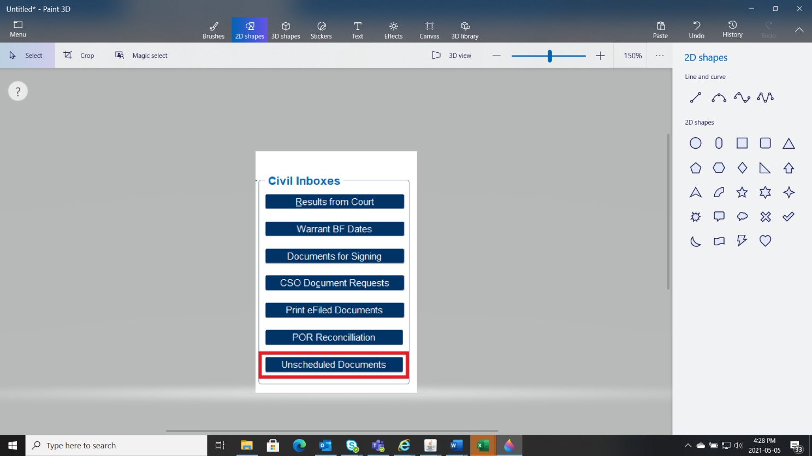For PCFR Locations, this inbox will be effective May 15, 2021. Any previously filed documents will not pull to this inbox.

> Applications will populate in the Inbox to prompt registries to review the file and determine if the application should be set for an Appearance date. The Applications that will be in the inbox will either have a Certificate of Service (CSV) (with a BF date 30+ days from the date of service), or a Reply. The file will also not have a Scheduling Instruction, IRA, Notice of Family Management Conference or Notice of Family Settlement Conference associated to the Application.

When the document code CSV (Certificate of Service) is entered, 2 new fields, Service Date and BF Date will appear.

> **Service Date:** The Certificate contains the date the document(s) was served. Enter that date in this field. Press Tab.
>
> **BF Date:** CEIS will then automatically calculate 30 days for the other party to file a reply and display that date in the BF Date field. After 30+ days the file will be pushed into the Inbox.

NOTE -- It is important you use that Association Field and associate the CSV to the appropriate Application that was served.

Otherwise the Inbox will not pull the info.

When a **Response document code** is entered, ensure you use the "In Response to Field" and tag the Reply to the proper Application.

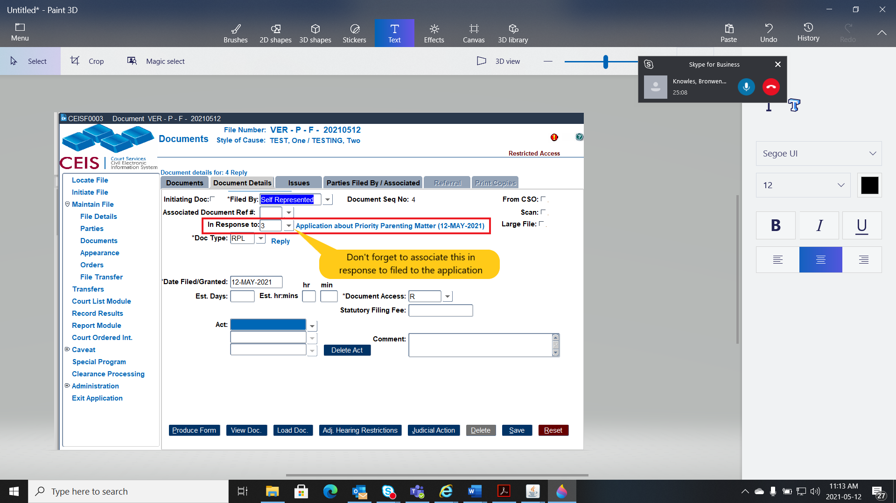

Click on the New Civil Inbox Button "Unscheduled Documents" here:

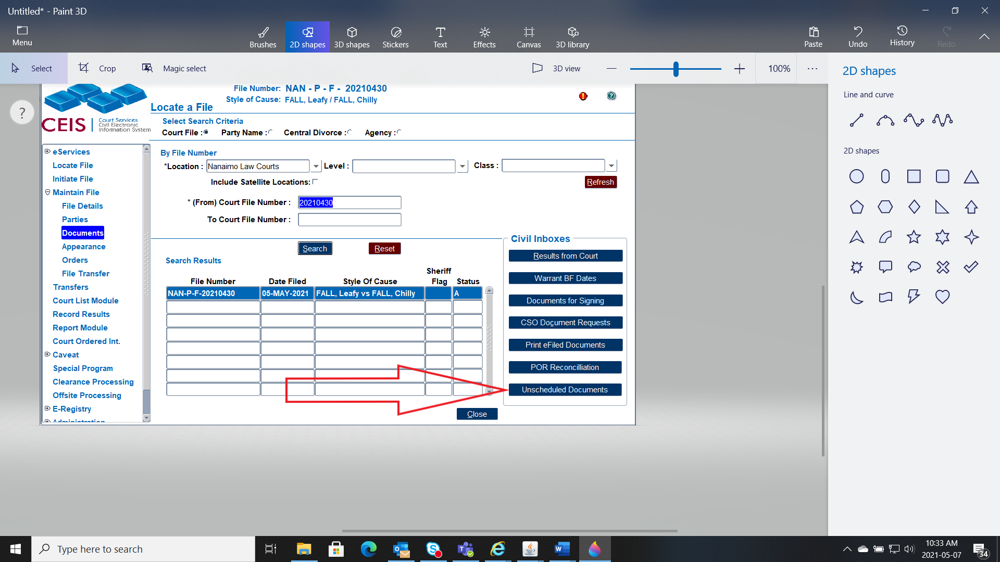

And it will bring you here:

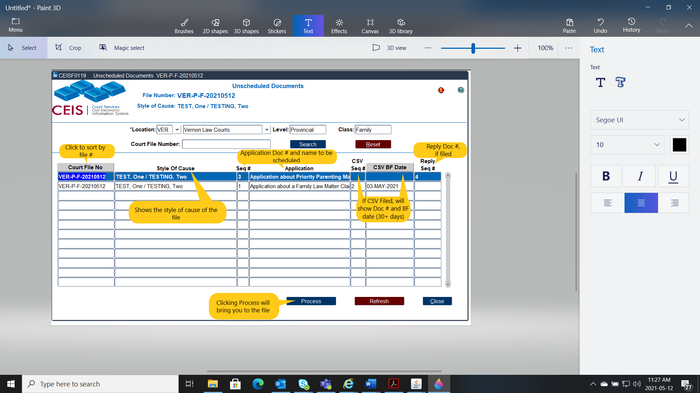

NOTE -- You can sort the inbox by Court File no or CSV BF Date.

Each Application will have its own line.

**To process:**

1.  Select a row to work with by clicking on it to highlight in blue.

2.  Click the Process button

3.  CEIS will navigate to the Documents module

4.  Check your file to ensure all requirements are met.

5.  Prepare the Scheduling document and associate it to the Application.

6.  Distribute the Scheduling document to the appropriate parties.

7.  The file is then automatically removed from this Inbox.

NOTE - Remember our [last release](https://portal.jag.gov.bc.ca/portal/page/portal/CSB_Home/document_repository/private/ceis/notes/CEInoteS-21.0-Release.pdf) notes? This is where the selecting the correct association and using the "In response to field" is important.

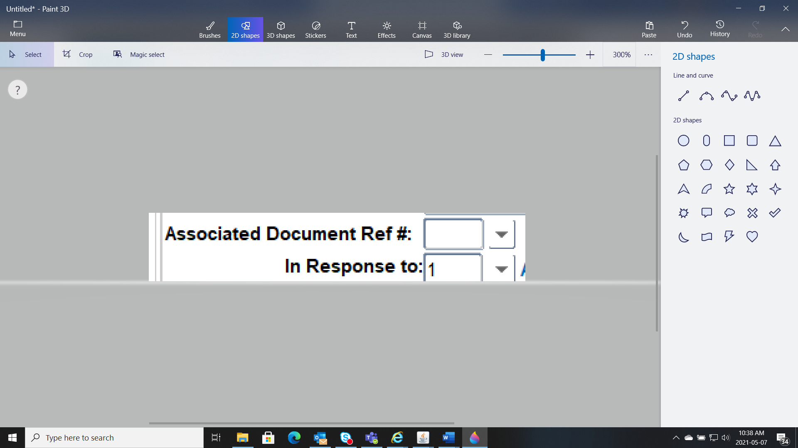

If this function is **NOT** used, then Applications will not be pulled into the inbox or removed.

**Associating the following documents to the Application will remove the Application from the Unscheduled Inbox:**

- 

- SWR

- SNR

- IRA

- NFMC

- RFJ

- RGW

- CONA

- DET

- ORD

- COR

- NWD

- WAG

### NON-Parties Attending an Appearance

Persons who are not a party to the action can be added as an attendee to a specific court appearance.

If the non-party is selected to attend by way of MS Teams they will also receive the CEIS Auto-Emails.

This is for all levels and classes.

**STEPS:**

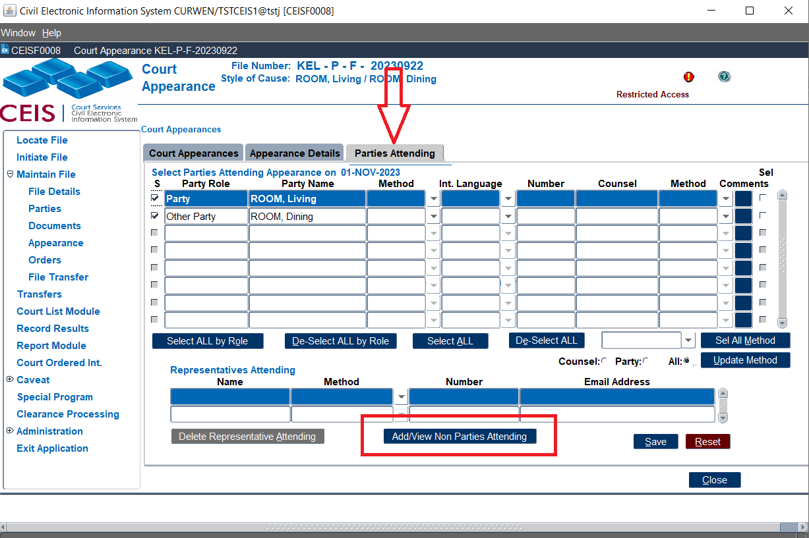After you have set the appearance in CEIS, click on the Appearance Details Tab:

Click on Add/View Non Parties Attending, and fill in the non-party information including:

- Name

- Method of attendance

- Phone Number

- Email Address

**NOTE:** Just like any other Auto email rule, the Method of Attendance of MS Teams AND the email address **MUST BE ADDED OR THE EMAIL CANNOT/WILL NOT SEND**

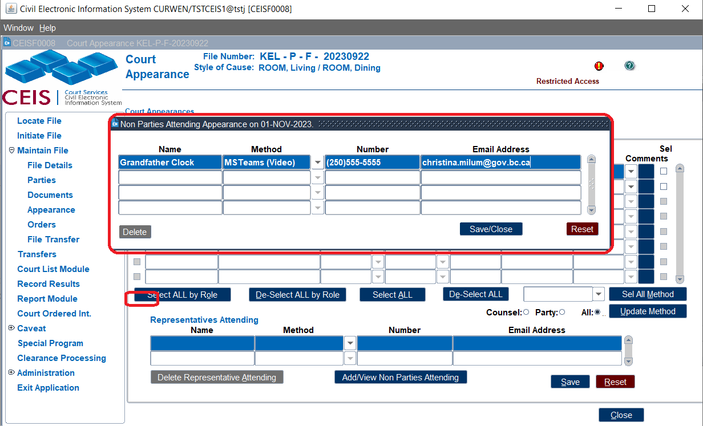

Click save/close and now you will notice there is an Asterix.

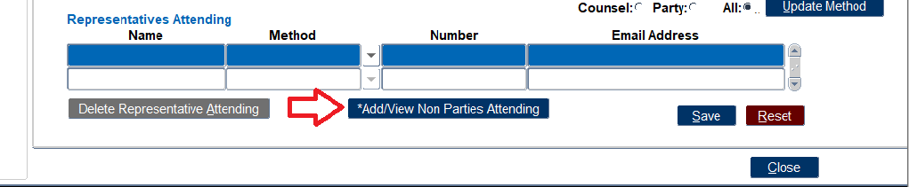

**NOTE**: Currently this feature is strictly for Auto-Emails and is not carrying into CCD or communicated with any other system. BUT they will appear on the [MS Teams Appearance Report](#ms-teams-appearance-report).

### Scheduling Appearances -- Files Transferred for All Purposes

For files transferred from one location to another for all purposes, the receiving location schedules the court appearance at their location. The system **will not** allow the sending location to schedule an appearance to the receiving location.

If the sending location has scheduled such an appearance, a pop-up box will appear when the transfer for all purposes is saved; it will not allow the transfer until the appearance has been resulted or deleted. The rationale for this is that the sending location is not familiar with which courtroom the matter should be scheduled into at the receiving location.

However, there are times when a file has been adjourned to a future date via CCD and CEIS is still allowing the transfer of the file, which results in an email to CEIS Support to correct the appearance.

### Scheduling Appearances -- Files Transferred for Hearing Purposes

If the file is only being sent for a hearing event, the file will be *scheduled* to the receiving location rather than actually being *transferred*. The receiving location then records the results of the appearance at their location (which includes adding any orders or scheduling future appearances).

However, in most cases, the physical file will be sent as well. This involves an additional step in CEIS to monitor and track the file. Check out [TRANSFERS](#transfers) for that step.

