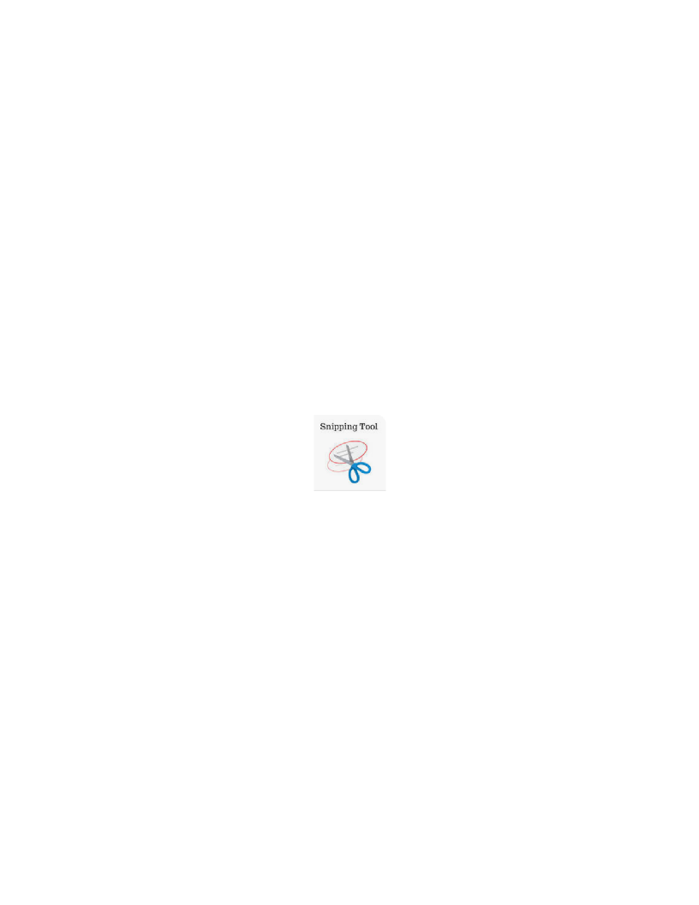
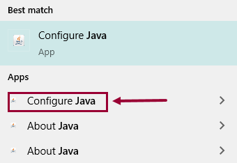
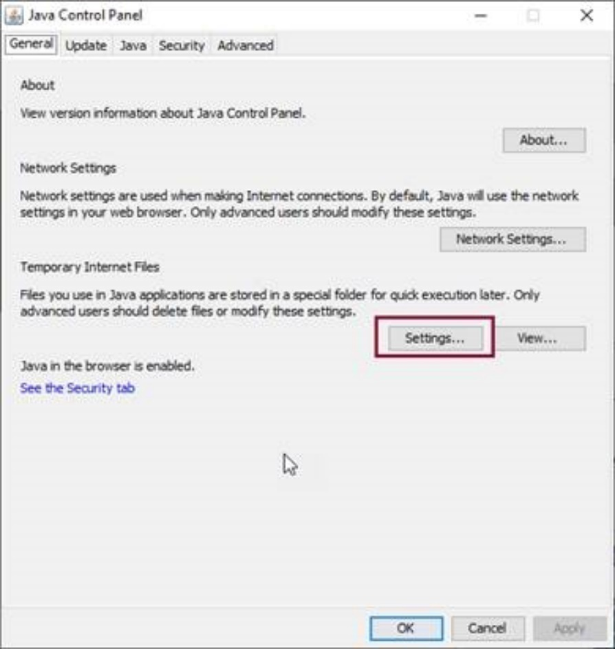
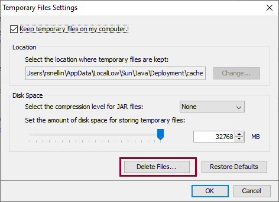

# CEIS SUPPORT FAQ

1.  **Question: What do I need to include in my email to CEIS Support?**

**Answer:** The key details we require are the following:

> • Court Location
>
> • File Number
>
> • Court Level (i.e., Provincial or Supreme)
>
> • Court Class (i.e., Family or Small Claims etc.)
>
> • Party Names

Please do your best to explain exactly what the issue is, what you have done so far to try and resolve it, and what you're ultimately trying to do.

We love screenshots!

Use the "Snipping Tool" on your computer to cut out the perfect screenshot. You can find it by typing it into the search bar at the bottom of your screen. The icon looks like this:

When cutting out a screenshot with the error, please make sure to include the **entire CEIS screen**. The bar at the top provides us with important information such as which server you're on and the official CEIS screen number.

2.  **Problem:** I am receiving an error that says "Could not reserve"

**Solution:** This generally means either another user is also in the file or CEIS has locked the file for whatever reason. In this circumstance, ensure no one else is in the file, and if you are the only one, close the file and wait about an hour and try again.

3.  **Problem: Style of Cause is not appearing**

**Possible Solution:** Check initiating document and party roles.

**How:** In the documents screen, confirm the initiating document has a tick beside it, and confirm the roles match the initiating document and level/class.

4.  **Problem: Difficulties Producing Orders or Documents in CEIS?**

**Possible Solution:** Confirm your PDF default is Adobe

**How:** In the "Type here to search" next to windows, type "Choose Default" -\> Enter -\> Scroll until you find .pdf -\> click on the file it was opening under and change it to Adobe.

5.  **Problem: Unable to sign documents with IKEY?**

**Possible Solution:** Open Adobe to enable security.

**How:** Open Adobe --\> Edit --\> Preferences --\> Security (Enhanced) --\> then untick "Enable Protected Mode at Startup" --\> then save --\> then re-boot your computer

6.  **Problem: Difficulty printing documents?**

**Possible Solution:** Clearing Cache

**How:** Close CEIS (Including the DO NOT CLOSE WINDOW and JUSTIN if you have it open), clear the Java cache, clear IE cache and then re-open CEIS and try producing the document again.

To clear you cache in Internet Explorer, here are the steps:

Click the cog wheel \> Internet Options \> Browsing history \> Delete

To clear your Java cache, here are the steps:

1.  Close CEIS

2.  Close all browser windows then,

3.  Clear Java cache:

- Search for Java and make sure to pick this one under Apps, click to open:

Click Settings

Click Delete Files -\> let it run, should be quick, then click OK (pop up will close) -\> Click Apply -\> Click OK. Then restart CEIS.

7.  **Question: What document images can we not scan or upload into CEIS**

+-------------------------------------------------------------------------------------------------------------------------------------------------------------------------+
| **DOCUMENTS NOT TO BE SCANNED/UPLOADED INTO CEIS**                                                                                                                      |
+:======================================================================:+:====================================================================:+:=======================:+
| **Doc Name**                                                           | **Why**                                                              | **Level**               |
+------------------------------------------------------------------------+----------------------------------------------------------------------+-------------------------+
| Transcripts                                                            | All types do not have image of any transcript added.                 | All levels              |
+------------------------------------------------------------------------+----------------------------------------------------------------------+-------------------------+
| Written Reasons for Judgment                                           | Order terms only                                                     | Provincial only         |
+------------------------------------------------------------------------+----------------------------------------------------------------------+-------------------------+
| Proof of service affidavit that result from the acts (Locate services) | Redacted before scanned -- The address is redacted.                  | All levels              |
|                                                                        |                                                                      |                         |
|                                                                        | (Getting back from Sheriff's office -- indicate on the request form) |                         |
+------------------------------------------------------------------------+----------------------------------------------------------------------+-------------------------+
| Large sworn/affirmed Affidavits/Docs                                   | Scan up to jurat and place a comment in the document details.        | All levels              |
+------------------------------------------------------------------------+----------------------------------------------------------------------+-------------------------+
| Settle Record -- Agreement                                             | Scan/upload first page but the agreement that is attached            | Provincial Small Claims |
+------------------------------------------------------------------------+----------------------------------------------------------------------+-------------------------+
| Order by Court to remove images                                        | Contact CEIS Support to remove image when ordered.                   | All levels              |
+------------------------------------------------------------------------+----------------------------------------------------------------------+-------------------------+
| All documents                                                          |                                                                      | Adoption                |
+------------------------------------------------------------------------+----------------------------------------------------------------------+-------------------------+
