# COURT LIST MODULE

This module has lists and reports that have to do with Court Appearances.

The **Court List Module** contains a number of standard court reports.

To generate a report:

1.  From the left-hand sidebar menu, click **Court List Module**.

2.  Select the desired List/Report from the list.

3.  Enter the report parameters. (Some parameters are mandatory.)

4.  Click PREPARE LIST(S) or click PREVIEW to view before printing.

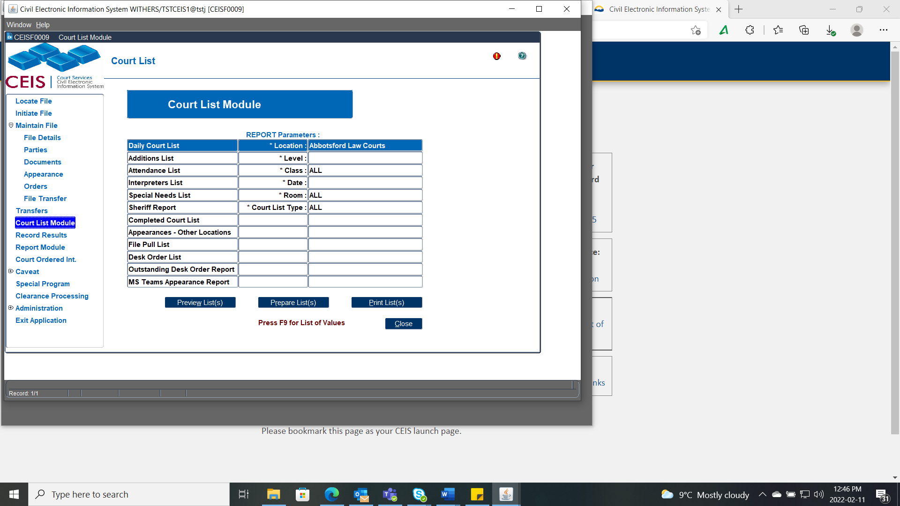

### Daily Court List

NOTE -- For CFCSA files, the Child party role **will** show on the court list. This Court List is intended for Internal Use Only.

IF you are emailing or faxing a Court List to anyone who is not a Judge, you will need to enter each CFCSA file and deselect the Child from the parties attending tab - see [**How to Schedule a File**](#how-to-schedule-a-file).

It is recommended to Prepare your Daily Court List before printing as you will need to complete the following steps:

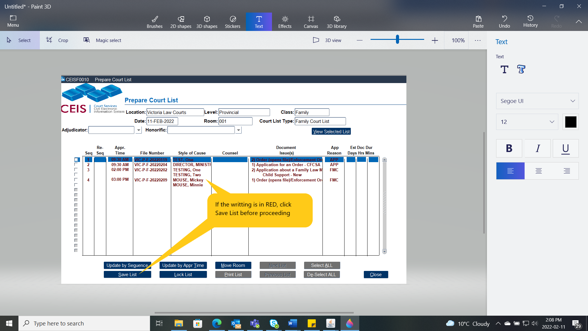

1.  If there are matters marked in red, this means the list has not yet been recently saved.

2.  After you press Save the writing will turn to black, at this stage you may update the List.

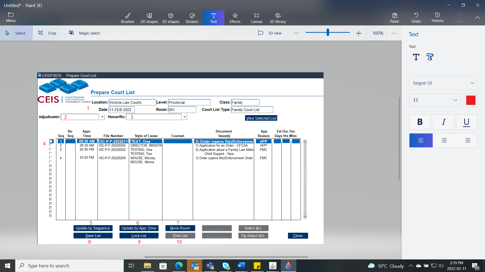

(1) This top information pulls based on the search parameters

\(2\) Adjudicator -- select in the presiding Judge's name

\(3\) Honorific -- select the proper designation of the presiding Judge

\(4\) Tick boxes to select the file -- let the blue line guide the selection

\(5\) Update by Sequence 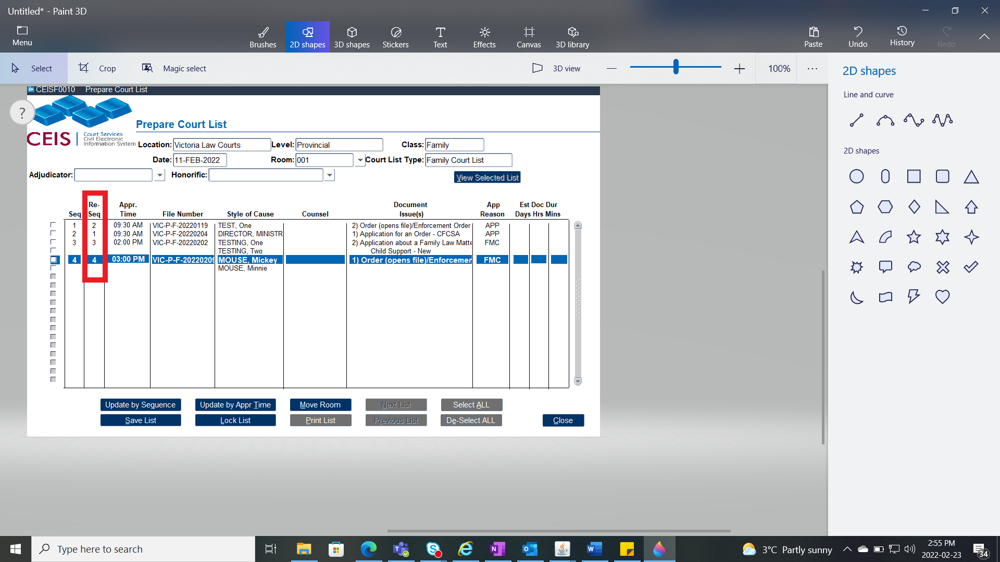- If the list needs reordering, in the re-seq column adjust the numerical list by typing in the order you wish the list to be in (ex. if the file that is currently listed as #1 on the list, should be listed as #2, Simply renumber the list as shown here, click Update Sequence then SAVE.

\(6\) Update by Appearance Time -- when the times need to be placed in proper order select this button and CEIS will make that adjustment. Then press SAVE.

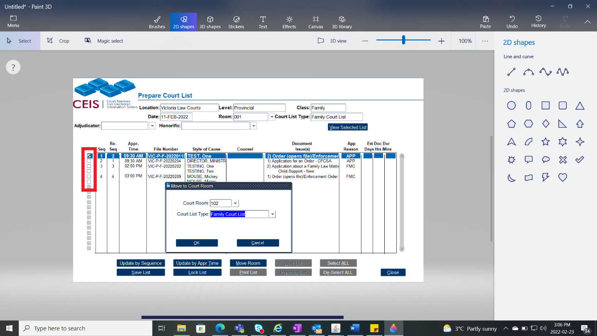(7) Move Room -- when a file requires to be moved from one room to another, select the file by ticking the box and press Move Room, choose the room the file is being moved to and what Court List Type. Then Press OK.

\(8\) Save list - Saves the list. Sometimes before editing the list, it is best to press this button first and last.

\(9\) Lock List -- Once the list is complete and ready for the court day, press Lock List. This stops anyone from editing the list unless they click this button again to UnLock the list. When the list is locked, if there are any other matters added, it will go on the Additions List (see below). On the day of the appearance, CCD will lock the list automatically.

\(10\) Print List -- After the List is set and Locked, click this button to print the court list. Ensure it is set to Landscape.

### Additions List

Shows any additions (appearances set) to the list after the daily court list has been \"locked.\"

The Additions list will function the same as the Daily Court List when preparing the list.

To add the files from the Additions to the Original List, go to:

1.  The [Daily Court List](#daily-court-list),

2.  Unlock the list and press save,

3.  Complete your set up steps, and

4.  Lock it again.

### Attendance List

NOTE -- For CFCSA files, the Child party role **will not** show on the court list. This Attendance List is intended for public facing usage.

There are two versions of the attendance list:

- *Global:* Lists all files for all courts in alphabetical order of party names. This is the list that is posted in the lobby of the courthouse for the public to locate their courtroom.

- *Courtroom-specific:* Lists files and attendees for a specific courtroom only. This is the list that is posted outside for the public to review.

### Interpreters List

Lists all files that require an interpreter.

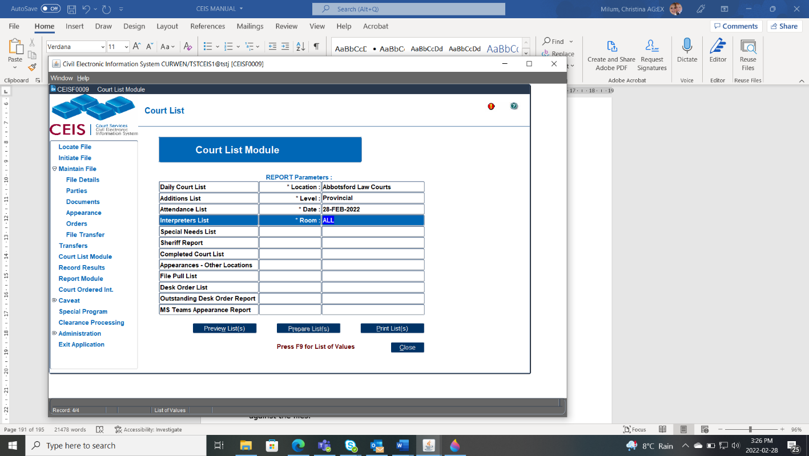

This list is grouped by courtroom for the level of court and is given to the person responsible for coordinating interpreters.

### Special Needs List

Lists all files that have special needs; this is determined where there are special needs indicated against the appearance when the appearance was scheduled.

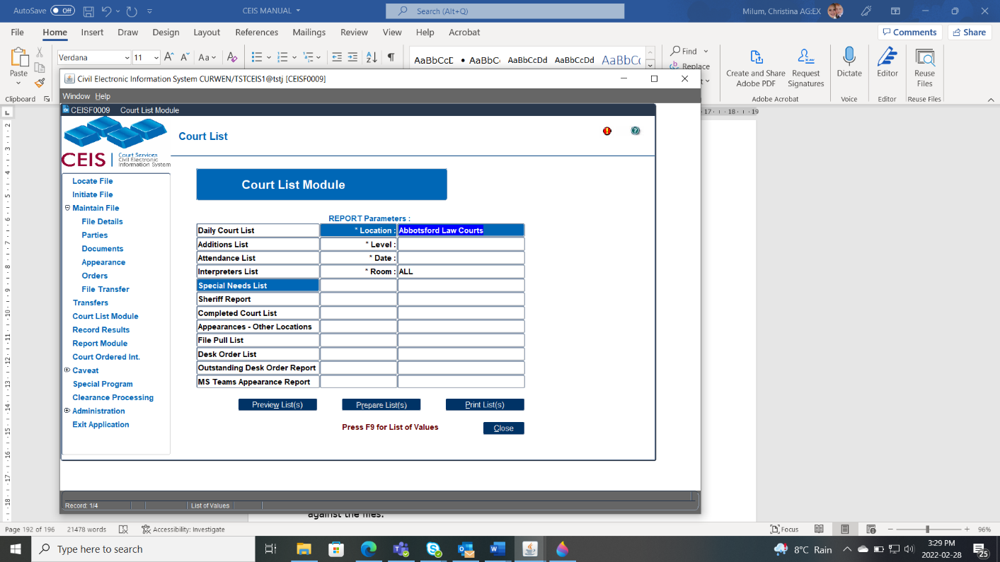

This list is grouped by courtroom for the level of court, and is given to the person who is responsible for setting up the courtroom.

This list can also be used to add information such as phone numbers and email addresses that need to be telephoned or manually sent an MS Teams Link to non-parties.

### Sheriff Report

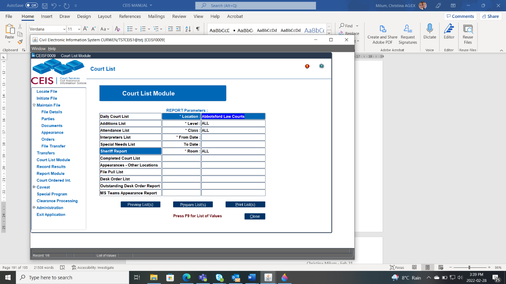Enables sheriffs to generate a list of appearances by courtroom, level and class of court, and date range, to indicate any sheriff comments entered against the files.

### Completed Court List

A summary of the results entered against each document scheduled for an appearance.

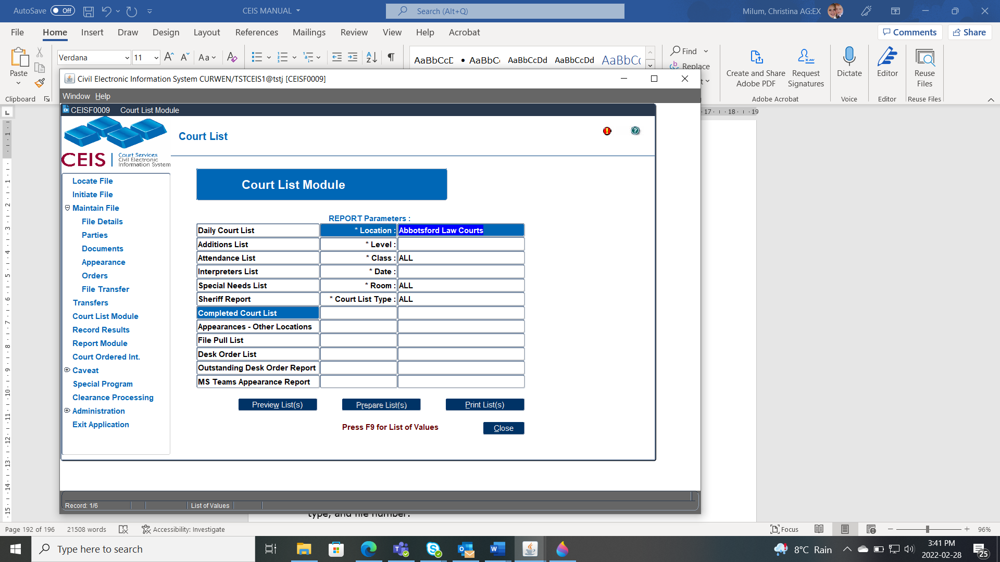

This list is generated after the results have been entered.

### Appearances \-- Other Locations Report

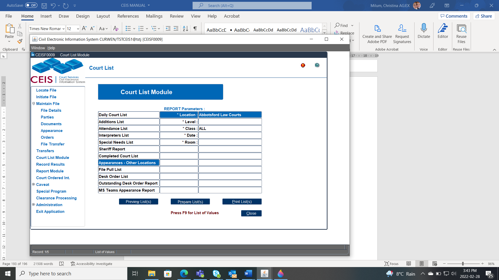

Lists all appearances that have been scheduled for your location by another registry location.

### File Pull List

Lists files in numerical order for all appearances scheduled that day.

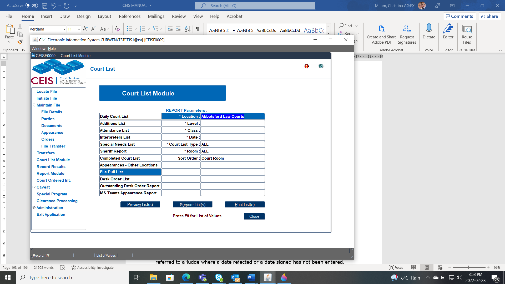

It is used by staff to pull the files for court each day.

This list is sorted by room, list type, and file number.

### Desk Order List

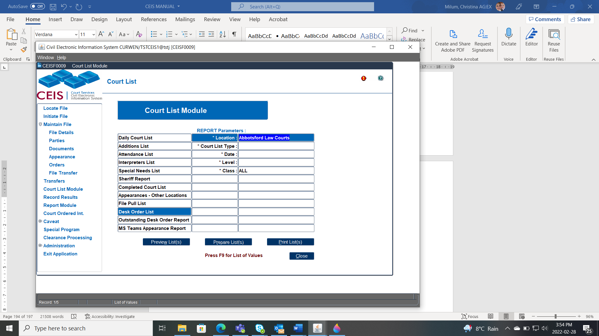

Lists all desk orders that have been referred to a judge for signature.

### Outstanding Desk Order Report

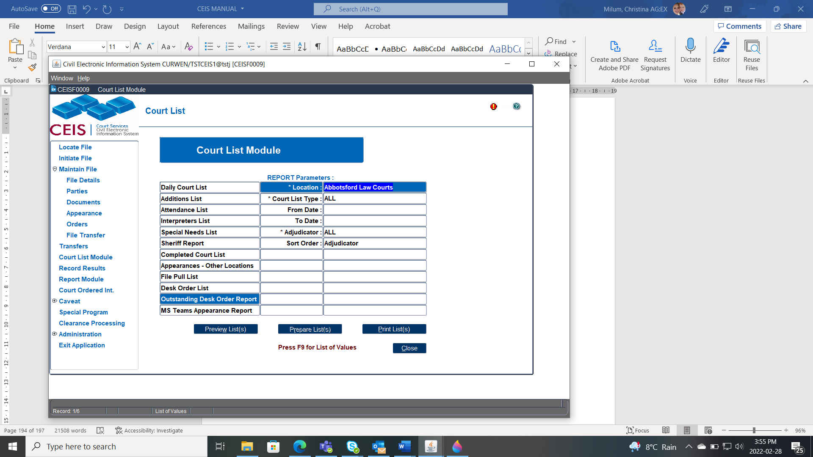

Lists all outstanding desk orders that have been referred to a judge where a date rejected or a date signed has not been entered.

### MS Teams Appearance Report

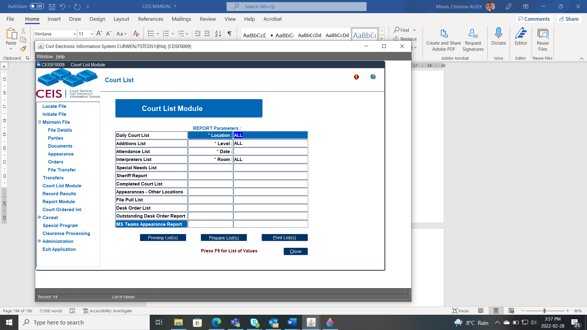Lists the daily report for all the parties and counsel who are scheduled for an appearance that day.

The Report will generate an accurate reflection of who has received an email at 8:45 a.m. that contains their MS Teams Links and dial in information for their appearance.

If there is no tick, they did not receive an email and a manual process will be required. See [Remote Appearances](#remote-appearances) to find further steps.

