## DESK ORDERS

### Provincial Family

**Application for Case Management Orders without Notice or Attendance**

Locate the file you need to update and data enter and scan in the Application for Case Management Order without Notice or Attendance (**ACMW**)

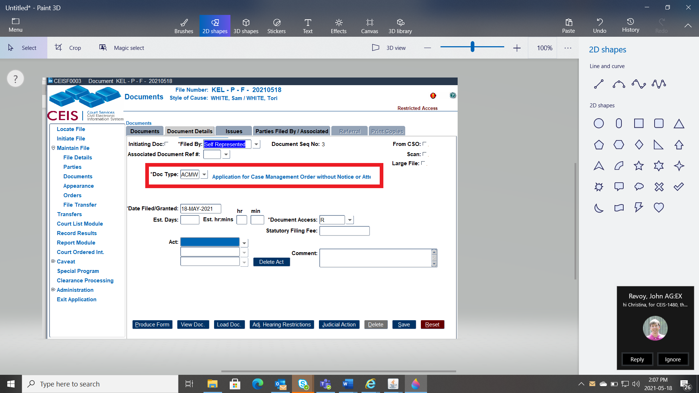

Schedule the document:

ROOM: **CHB**

LIST: **PFA**

REASON: **APP**

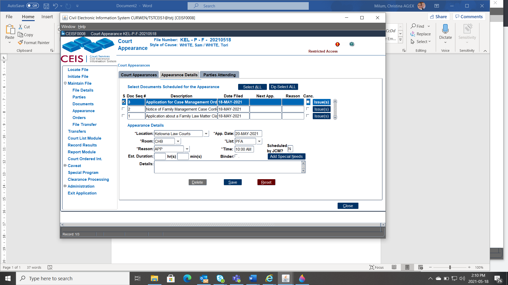

Email JAA/JCM/PCJ (as determined in consultation with the JCM) per [this](https://csb.jag.gov.bc.ca/Civil%20Documents/pcfr/bulletins/pcfr-desk-order-process.pdf) process.

If the Order is **approved** we need to manually update the Results via Record Results.

> 

1.  The first step is to update how the parties attended. You can click on the arrow for your options. In this case, they will be not present.

> 

2. Next add the Appearance of the Adjudicator.

    a)  Indicate who the Adjudicator was on that appearance.

    b)  Indicate how the Adjudicator appeared: **Personal Appearance**

    c)  Indicate how long the appearance took: **20 minutes** unless otherwise specified by the Judge

3.  Then go to Results:

> 

a)  Add the result of the Application here. Choices are: **END, OMI, OMC, or OM** or if adjourned to another date (**ADD**).

b)  Indicate whether the result is to go to all Applications (if multiple on the court appearance date, or just one).

c)  Add the result of the individual issues. You can make them all the same or update the issues individually.

d)  Ensure to click save on the updates.

e)  If an Order was made please add the Order here. By using **ORNA**

f)  If any comments were made that are to go on the Court Summary Sheet, add them here.

g)  *If this date was adjourned prior to the hearing, please enter the date it was Adjourned here -- this takes it off the court list.* **(not used for ACMW**)

***NOTE --*** If you are unsure of which code to use, please review the [CEIS CODES TABLE](https://csb.jag.gov.bc.ca/Civil%20Documents/CEIS/ceis-code-table.pdf)

4.  If there is an Order, click ADD ORDER and manually enter in the information. Once you "Save" it will take you to the "Order Terms" Screen where you would manually input the Terms of the Order. Then press "CLOSE" and send order to the Judge for signature.

**From this screen if you are complete, you can print the Court Summary Sheet. If this Application was Adjourned to another date complete the final step.**

5. Next Appearance -- add court details as if you were scheduling the document per normal, you just do not need to indicate which document you are scheduling as it will default:

    a)  Indicate the Location the Appearance will be heard.

    b)  Indicate the Date of the new Appearance.

    c)  Indicate the Room number of the new Appearance.

    d)  Indicate the List the Application will be heard under.

    e)  Indicate the Reason of the Appearance.

    f)  Indicate what time the Appearance will be heard.

    g)  If a time estimate is known, record that here.

    h)  Save this information.

> *Example:*

If the Order is **NOT approved** we need to manually update the Results via Record Results.

1.  Judge will provide written reasons.

2.  Use your [Dynamic Stamp](https://portal.jag.gov.bc.ca/portal/page/portal/CSB_Home/document_repository/private/civil/bulletins/dynamic-registry-stamp-instructions.pdf), data enter (**RRDT**) and upload these Reasons into CEIS in the Document Details Screen

3.  Navigate to the appearance screen and click Record Results.

4. The first step is to update how the parties attended. You can click on the arrow for your options. In this case they will be Not Present.

5. Next add the Appearance of the Adjudicator.

<!-- -->

a)  Indicate who the Adjudicator was on that appearance.

b)  Indicate how the Adjudicator appeared: **Personal Appearance**

c)  Indicate how long the appearance took: **20 minutes** unless otherwise specified by the Judge

<!-- -->

6.  Then go to Results:

<!-- -->

a)  Add the result of the Application using **DEN**.

b)  Any reasons for the rejection are placed in the comments so they will appear on the Court Summary Sheet.

**From this screen if you are complete, you can print the Court Summary Sheet. If this Application was Adjourned to another date complete the final step.**

7. Next Appearance -- add court details as if you were scheduling the document per normal, you just do not need to indicate which document you are scheduling as it will default:

    a)  Indicate the Location the Appearance will be heard.

    b)  Indicate the Date of the new Appearance.

    c)  Indicate the Room number of the new Appearance.

    d)  Indicate the List the Application will be heard under.

    e)  Indicate the Reason of the Appearance.

    f)  Indicate what time the Appearance will be heard.

    g)  If a time estimate is known, record that here.

    h)  Save this information.

**YOUR LAST STEP IS TO RESULT THE SESSION.**

1.  Ensure that the court list has been prepared by clicking on the ***Court List Module*** and save.

2.  After to court list is prepared, then click on ***Record Results***.

3.  Fill in all the applicable fields then click ***Session Results***.

4.  Fill in all the mandatory fields and save.

Start time- Use the time the Appearance was scheduled

End time -- 20 minutes later (unless directed otherwise by the Judge)

### CFCSA

Locate the file you need to update and data enter and scan in the Application to Change Method of Attendance (**APM**)

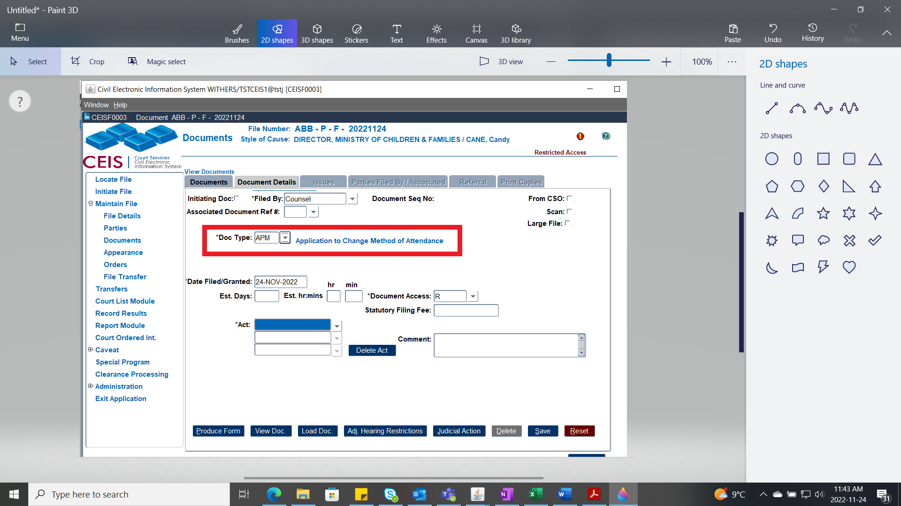

Schedule the document:

ROOM: **CHB**

LIST: **PFA**

REASON: **APP**

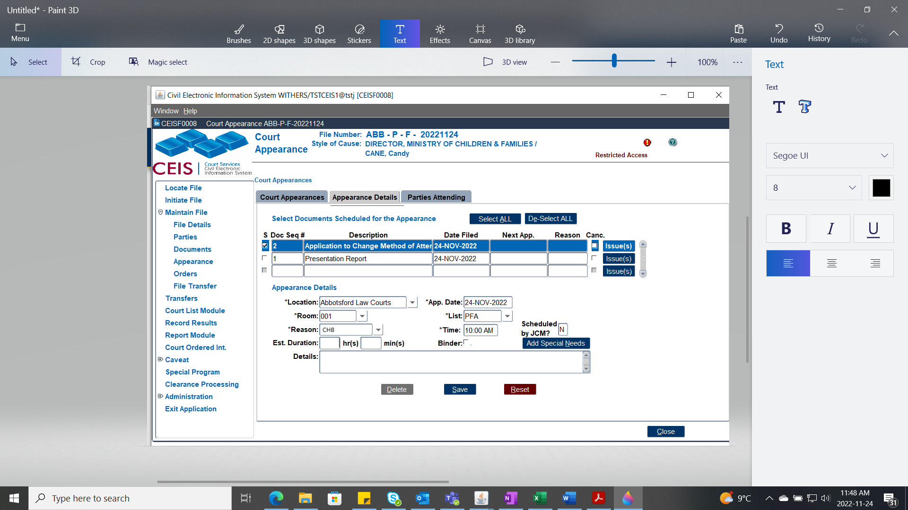

Email the Application via Outlook to the JCM/JAA for review.

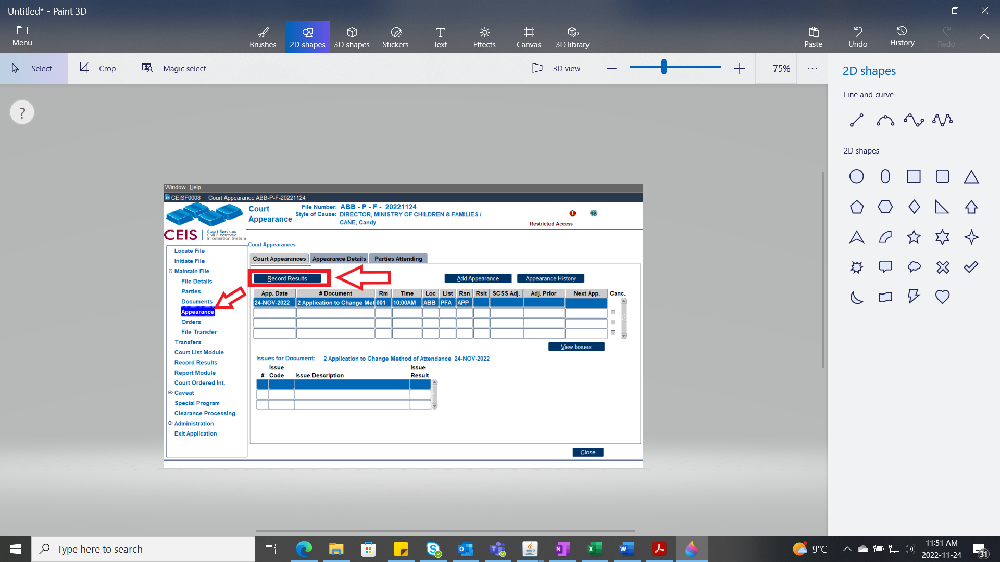Once we get the Application back we need to manually **update the Results via Record Results**.

1.  The first step is to update how the parties attended. You can click on the arrow for your options. In this case, they will be **not present**.

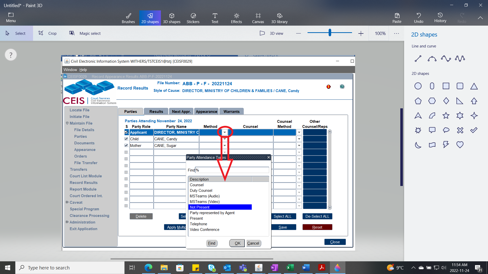

2. Next add the Appearance of the Adjudicator.

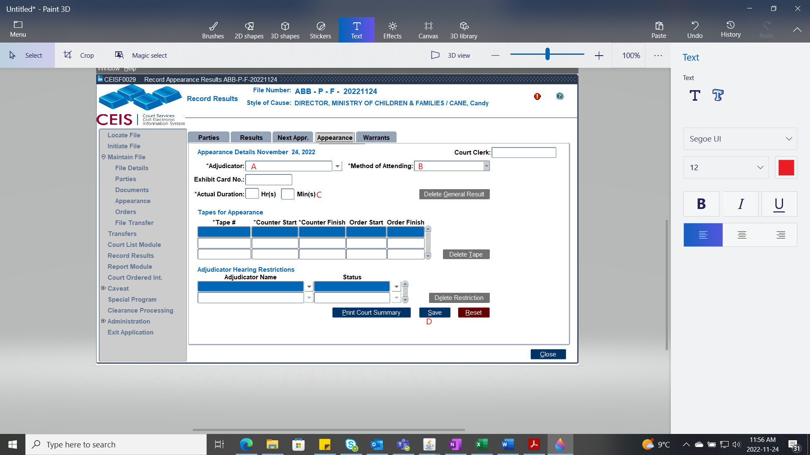

    a)  Indicate who the Adjudicator was on that appearance.

    b)  Indicate how the Adjudicator appeared: **Personal Appearance**

    c)  Indicate how long the appearance took: **20 minutes** unless otherwise specified by the Judge

3. Then go to Results:

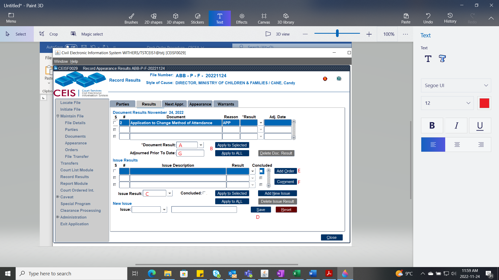

    a)  Add the result of the Application here. Choices are: Desk Order Denied **(DEN)**, Desk Order Granted **(GRA)** or if adjourned to another date **(ADD)**.

    b)  Indicate whether the result is to go to all Applications (if multiple on the court appearance date, or just one).

    c)  Add the result of the individual issues. You can make them all the same or update the issues individually. Issues Result Code is **OM**

    d)  Ensure to click save on the updates.

    e)  If an Order was made please add the Order here. By using **DOR**

    f)  If any comments were made that are to go on the Court Summary Sheet, add them here.

    g)  *If this date was adjourned prior to the hearing, please enter the date it was Adjourned here -- this essentially "cancels" the appearance. Not typically used in Desk orders.*

***NOTE --*** If you are unsure of which code to use, please review the [CEIS CODES TABLE](https://csb.jag.gov.bc.ca/Civil%20Documents/CEIS/ceis-code-table.pdf)

4. Click ADD ORDER and manually enter in the information using the code DOR. Once you "Save" it will take you to the "Order Terms" Screen where you would manually input the Terms of the Order or use the code EORD, and scan or upload the image.

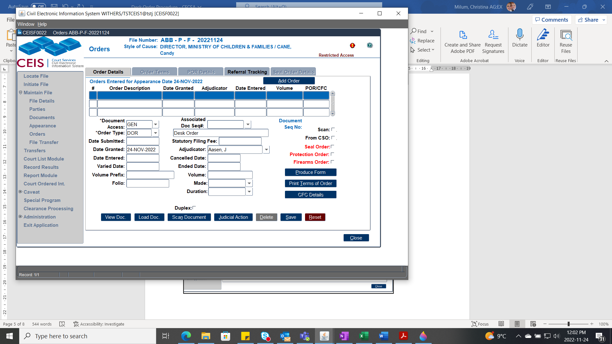

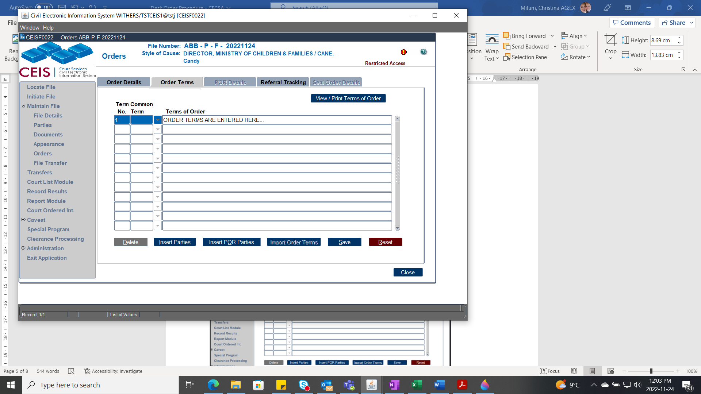

**If this Application was Adjourned to another date complete the final step.**

5. Next Appearance -- add court details as if you were scheduling the document per normal, you just do not need to indicate which document you are scheduling as it will default:

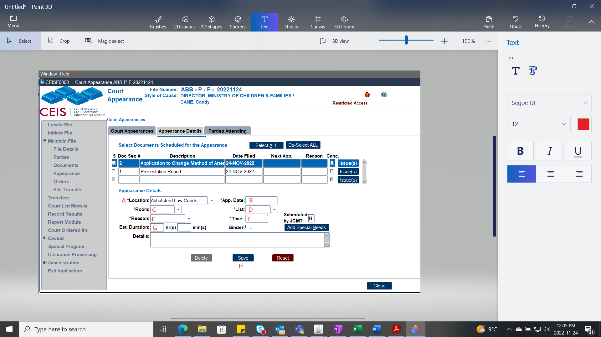

    a)  Indicate the Location the Appearance will be heard.

    b)  Indicate the Date of the new Appearance.

    c)  Indicate the Room number of the new Appearance.

    d)  Indicate the List the Application will be heard under.

    e)  Indicate the Reason of the Appearance.

    f)  Indicate what time the Appearance will be heard.

    g)  If a time estimate is known, record that here.

    h)  Save this information.

    i)  Then carry onto the Parties Attending Tab and follow [these steps](https://csb.jag.gov.bc.ca/Civil%20Documents/CEIS/ceimails/ceimails300.pdf) if anyone will be attending via MS Teams.

**YOUR LAST STEP IS TO RESULT THE SESSION.**

1.  Ensure that the court list has been prepared by clicking on the ***Court List Module*** and save.

2.  After to court list is prepared, then click on ***Record Results***.

3.  Fill in all the applicable fields then click ***Session Results***.

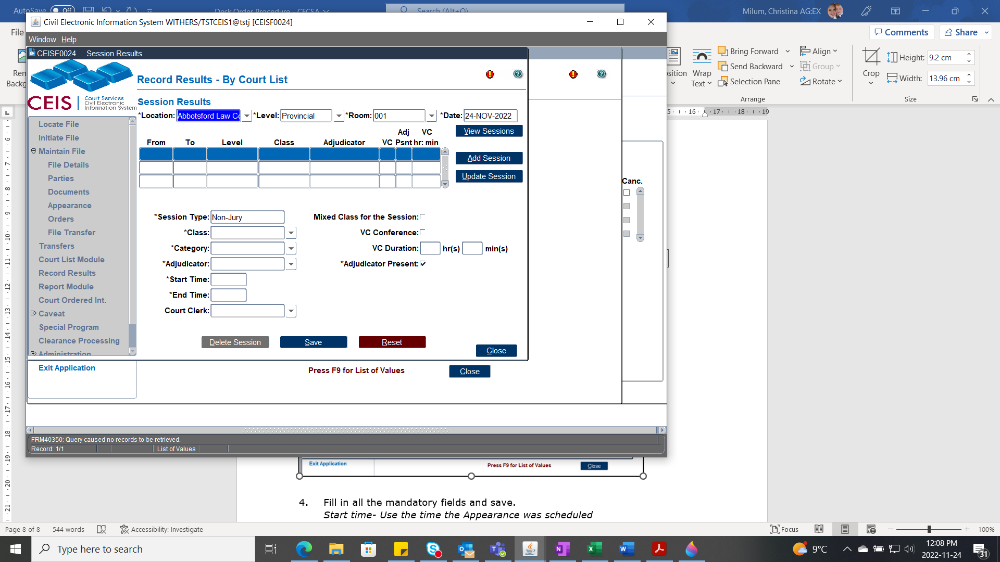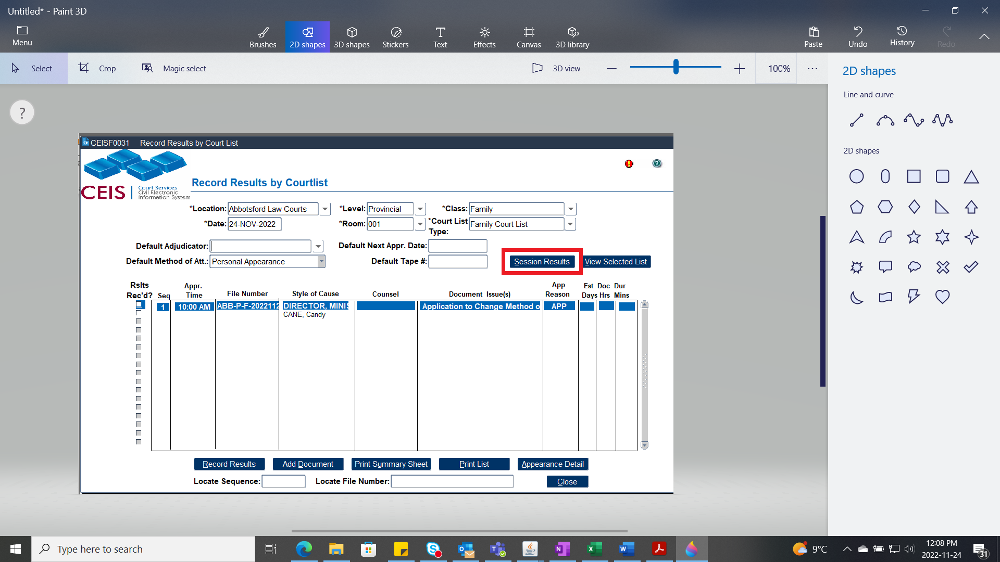

4.  Fill in all the mandatory fields and save.

*Start time- Use the time the Appearance was scheduled*

*End time -- 20 minutes later (unless directed otherwise by the Judge)*

### Small Claims

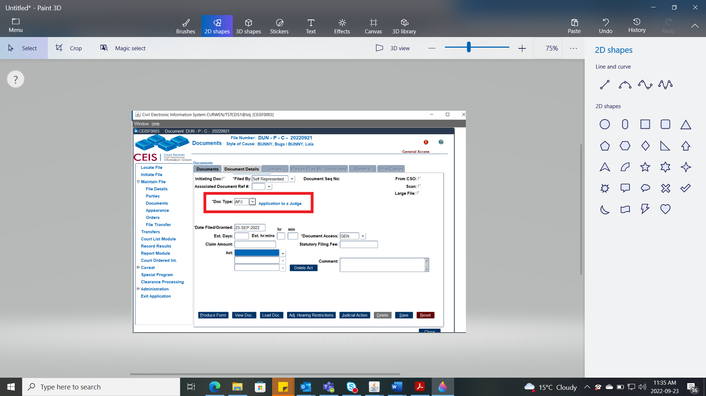Locate the file you need to update and data enter and scan in the Application to a Judge or Justice without notice (**APJ**)

Schedule the document:

ROOM: **CHB**

LIST: **PSM**

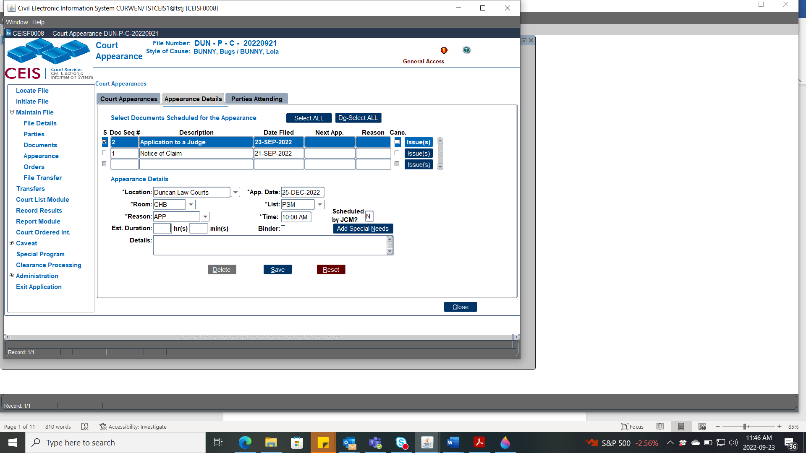REASON: **APP**

Email the Application via Outlook to the JCM/JJ for review.

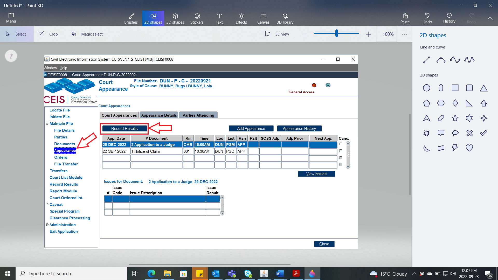Once we get the Application back we need to manually **update the Results via Record Results**.

1.  The first step is to update how the parties attended. You can click on the arrow for your options. In this case, they will be **not present**.

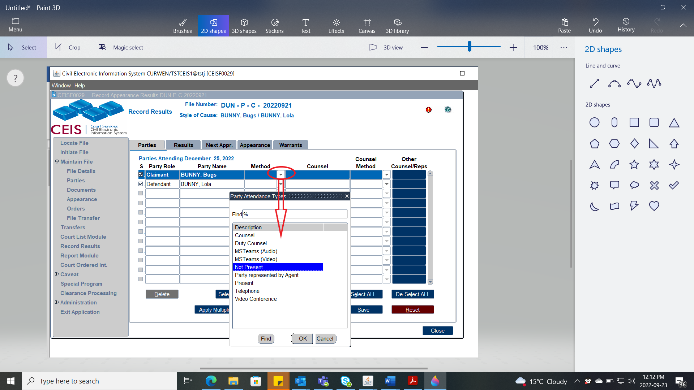

1. Next add the Appearance of the Adjudicator.

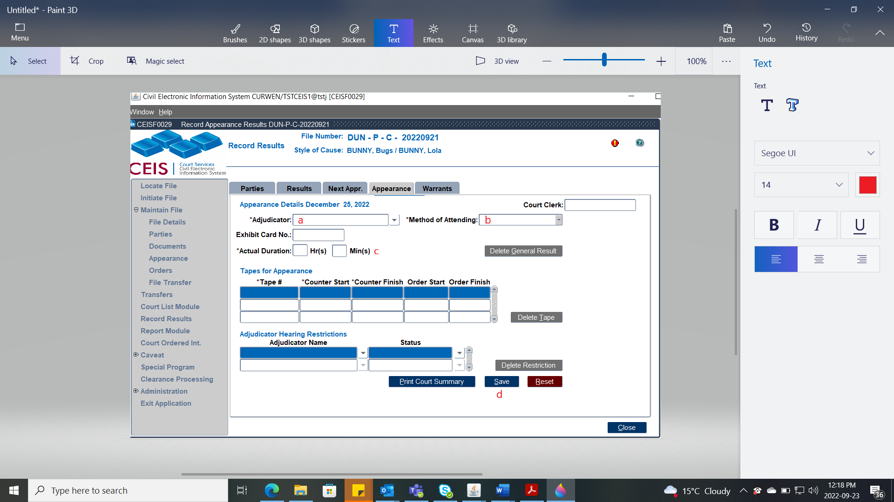

    a)  Indicate who the Adjudicator was on that appearance.

    b)  Indicate how the Adjudicator appeared: **Personal Appearance**

    c)  Indicate how long the appearance took: **20 minutes** unless otherwise specified by the Judge

2. Then go to Results:

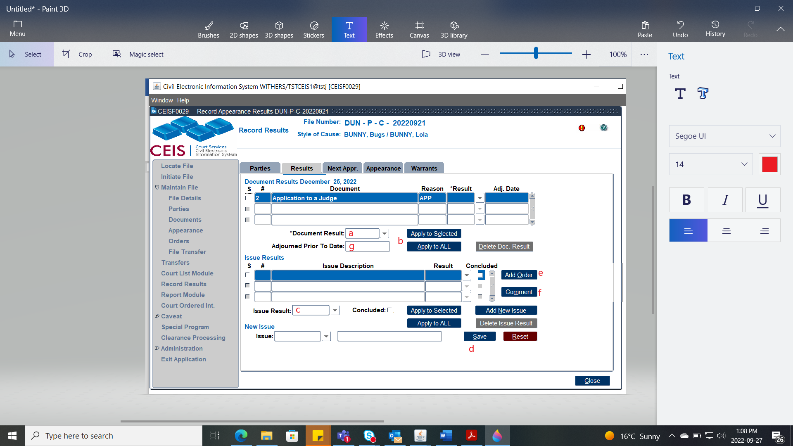

    1.  Add the result of the Application here. Choices are: Desk Order Denied **(DEN)**, Desk Order Granted **(GRA)** or if adjourned to another date **(ADD)**.

    2.  Indicate whether the result is to go to all Applications (if multiple on the court appearance date, or just one).

    3.  Add the result of the individual issues. You can make them all the same or update the issues individually. Issues Result Code is **OM**

    4.  Ensure to click save on the updates.

    5.  If an Order was made please add the Order here. By using **DOR**

    6.  If any comments were made that are to go on the Court Summary Sheet, add them here.

***NOTE --*** If you are unsure of which code to use, please review the [CEIS CODES TABLE](https://csb.jag.gov.bc.ca/Civil%20Documents/CEIS/ceis-code-table.pdf)

3. Click ADD ORDER and manually enter in the information using the code DOR. Once you "Save" it will take you to the "Order Terms" Screen where you would manually input the Terms of the Order or use the code EORD, and scan or upload the image.

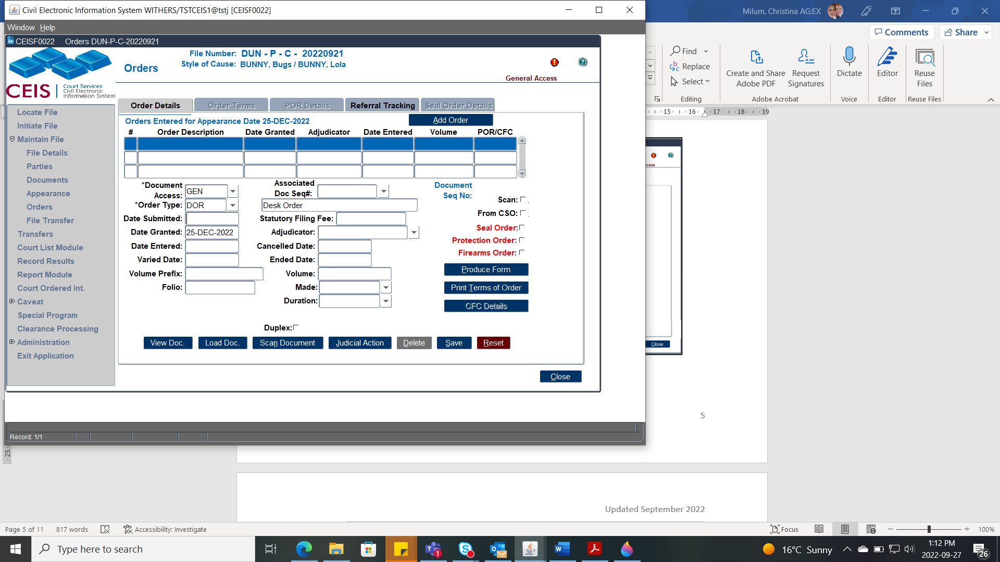

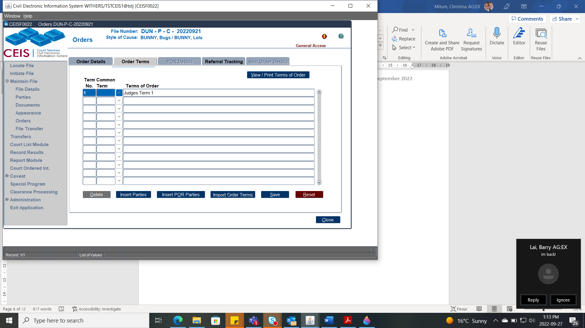

**If this Application was Adjourned to another date complete the final step.**

4. Next Appearance -- add court details as if you were scheduling the document per normal, you just do not need to indicate which document you are scheduling as it will default:

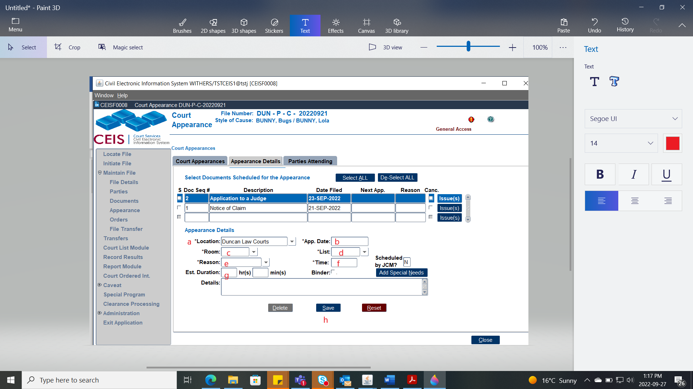

    a)  Indicate the Location the Appearance will be heard.

    b)  Indicate the Date of the new Appearance.

    c)  Indicate the Room number of the new Appearance.

    d)  Indicate the List the Application will be heard under.

    e)  Indicate the Reason of the Appearance.

    f)  Indicate what time the Appearance will be heard.

    g)  If a time estimate is known, record that here.

    h)  Save this information.

    i)  Then carry onto the Parties Attending Tab and follow [these steps](https://csb.jag.gov.bc.ca/Civil%20Documents/CEIS/ceimails/ceimails300.pdf) if anyone will be attending via MS Teams.

**YOUR LAST STEP IS TO RESULT THE SESSION.**

1.  Ensure that the court list has been prepared by clicking on the ***Court List Module*** and save.

2.  After to court list is prepared, then click on ***Record Results***.

3.  Fill in all the applicable fields then click ***Session Results***.

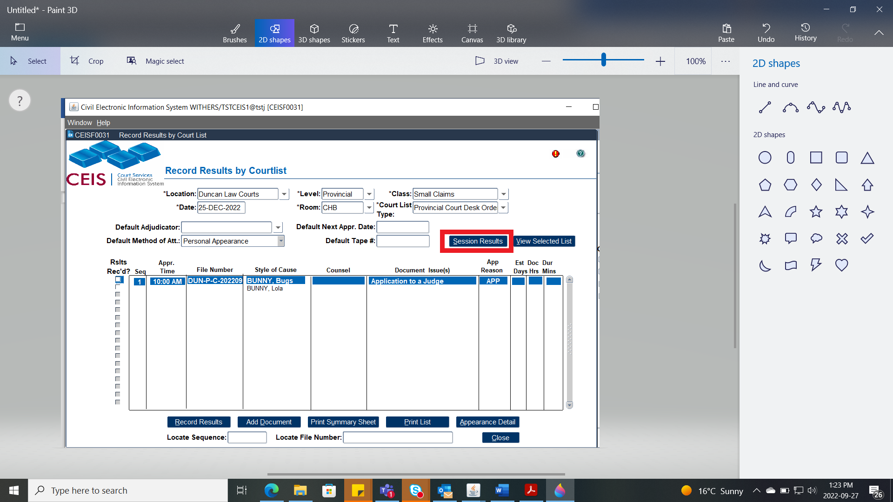

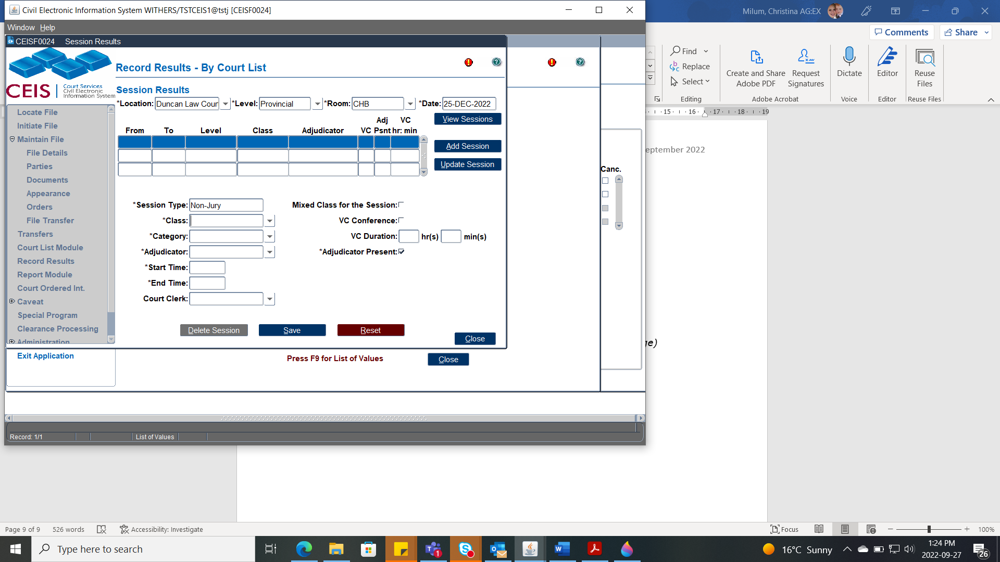

4.  Fill in all the mandatory fields and save.

*Start time- Use the time the Appearance was scheduled*

*End time -- 20 minutes later (unless directed otherwise by the Judge)*

