## DOCUMENT PRODUCTION

CEIS requires all data entry to be completed prior to forms production.

For instance, you will not be able to produce a Certificate of Divorce until the appropriate divorce details are entered in CEIS; a Warrant cannot be produced until results are recorded properly against the person to be arrested.

### Producing Forms

All forms produced must be entered in CEIS to complete the electronic record of the file. The *Document* tab includes a summary of all forms that have been produced on the file along with all documents and orders.

If the form is available in CEIS, it must be produced from CEIS rather than another application.

If the forms within CEIS are unavailable for any reason (such as the form is not included, or CEIS application is down) then registry staff can use the Intranet PDF forms. If a document is produced using another application, the document must be updated in CEIS to reflect the accurate history of documents.

**Adobe Forms that are produced in CEIS**

  --------------------------------------------------------------------------------------------
  **Level**   **Class**               **Name**                                 **Code**
  ----------- ----------------------- ---------------------------------------- ---------------
  P           Small Claims            Notice of Settlement Conference          NSC

  P           Small Claims            Warrant of Arrest                        WOA

  P           Family                  Notice of Family Management Conference   NFMC

  P           Family                  Notice of Family Settlement Conference   NFSC

  P           Family/Small Claims     Order                                    ORD

  P           Family                  Order Terminating Protection Order       OTP

  P           Family                  Order without Notice                     ORNA

  P           Family                  Consent Order                            COR

  P           Family                  Order for Imprisonment                   OI

  P           Family                  Summons                                  SUM

  P           Family                  Warrant of Committal                     WOC

  P           Family                  Release from Custody                     RC

  P           Family                  Warrant for Arrest                       WFA

                                      Warrant for Arrest After Subpoena        WAP

  P           Family                  Protection/Restraining Order             POR

  P           Family                  Recognizance- BCFMA                      RECO

  P           Family                  Restraining Order -- FMER                RESO

  P           Family                  Notice of Restraining/Protection Order   NRP

  S           Family Law Proceeding   Certificate of Divorce                   COD

  S           Probate                 Grant of Administration                  GOM

  S           Probate                 Grant of Probate                         GRP
  --------------------------------------------------------------------------------------------

### How to Produce Adobe Forms in CEIS

**This example is a Notice of Settlement Conference for Small Claims, all steps to produce any form is similar process.**

**STEP 1:** Check the file to ensure a the file is ready to be set, review the correct [manual](https://csb.jag.gov.bc.ca/Pages/Manuals.aspx), if needed.

**STEP 2:** Add in the [APPEARANCES](#appearances) Date.

**STEP 3:** Create the Document:

a)  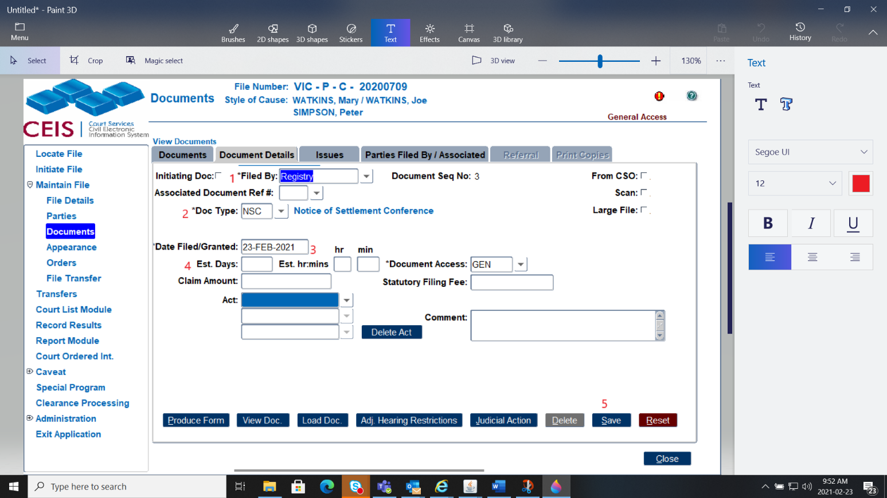Click Add [[DOCUMENTS](#documentsdata-entry)]

b)  Filed By and enter Registry (1)

c)  Select the document by typing in NSC code or finding the description (2)

d)  Date Filed/Granted will auto fill to today's date, this can be changed (3)

e)  Est Days/hours/mins if known you may enter these details (4)

f)  Click save to populate other tabs (5)

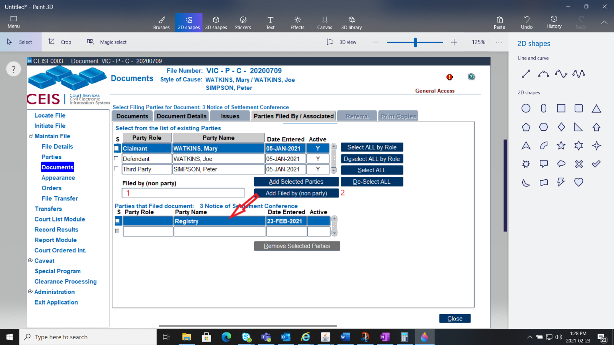

g)  Enter Registry in the Filed By (non Party) (1)

h)  Click on the Add Filed By (non Party) button (2)

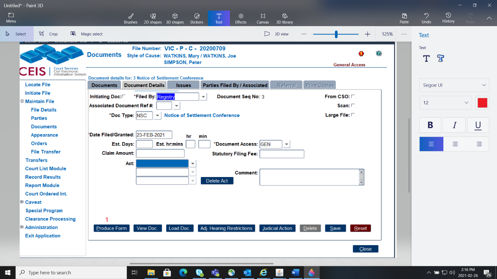

i)  Click back to the Document Details tab

j)  Click the Produce Button (1)

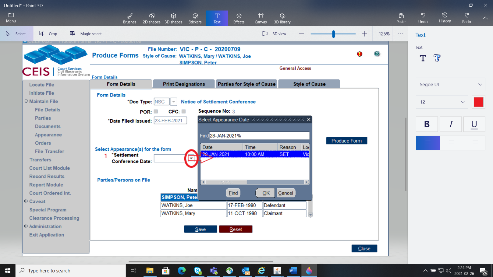

*NOTE --* If you do not need to look at any of the other tabs you can Produce the Form from here

k)  There are 4 tabs in this area.

l)  To select who should be notified of this hearing, click on the Print Designations Tab

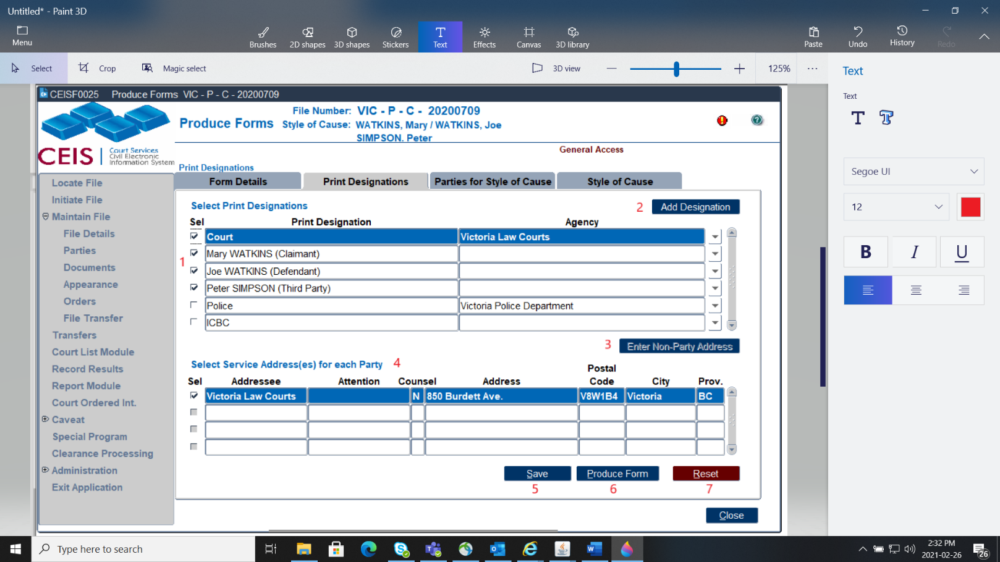

m)  Untick the parties that will not or should not be receiving the Notice (1)

n)  To add a non party; click on Add Designation and fill out their details (2)

o)  To enter that non party; click on the Enter Non-Party Address button (3)

p)  Placing the blue line on the party, will show the party's address in the bottom field. If they have multiple addresses you and select which on you would like the address to be. (4)

q)  When you have finished your update, click Save. (5)

r)  From this screen you have the option to Produce your document (6)

s)  If you need to reset the screen you can click Reset (7)

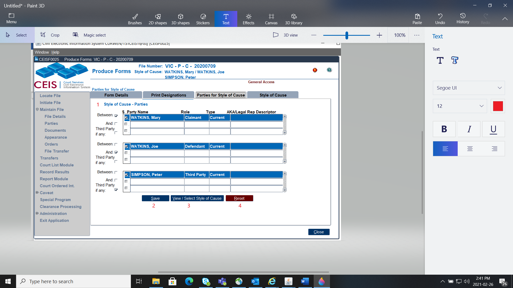

t)  This Parties for Style of Cause Screen shows you all the parties and their designations. If a party has multiple designations or you wish to remove someone from the Style of Cause you can modify it here. (1)

u)  Once you are satisfied with your update, click save (2)

v)  To view your style of cause, click the View/Select Style of Cause (3)

w)  If you need to reset what you clicked, click Reset (4)

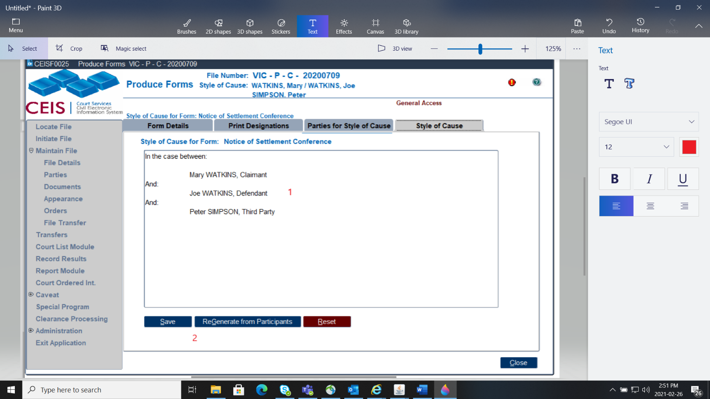

x)  In this box, you can manually type if you need to add or change the style of cause. (1)

y)  If the Style of Cause it not showing properly, click ReGenerate from Participants to update, then click Save (2)

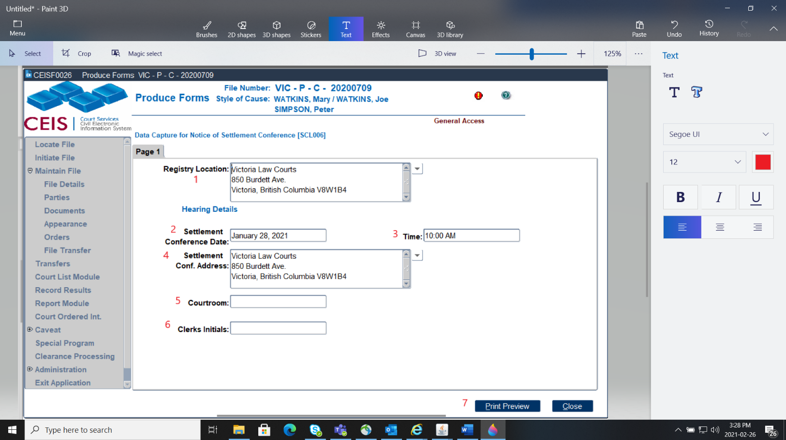**STEP 4:** Producing the Document

z)  Registry Location is the location producing the document. (1)

a)  "Settlement Conference Date" is the appearance date selected (2)

b)  Time is the scheduled appearance time (3)

c)  "Settlement Conference Address" is the location in which the appearance will take place (4)

d)  The Courtroom will need manual entry (5)

e)  The Clerks Initials will need manual entry (6)

f)  Next step is to Print Preview (7)

g)  Ensure you review your document before saving and printing, if there is an error and you have saved and printed the form, you will require [CEIS Support](mailto:courts.ceis@gov.bc.ca) to remove the document.

h)  When you are satisfied, you can electronically sign the form using your IKEY and click **Save form** at the top of the page.

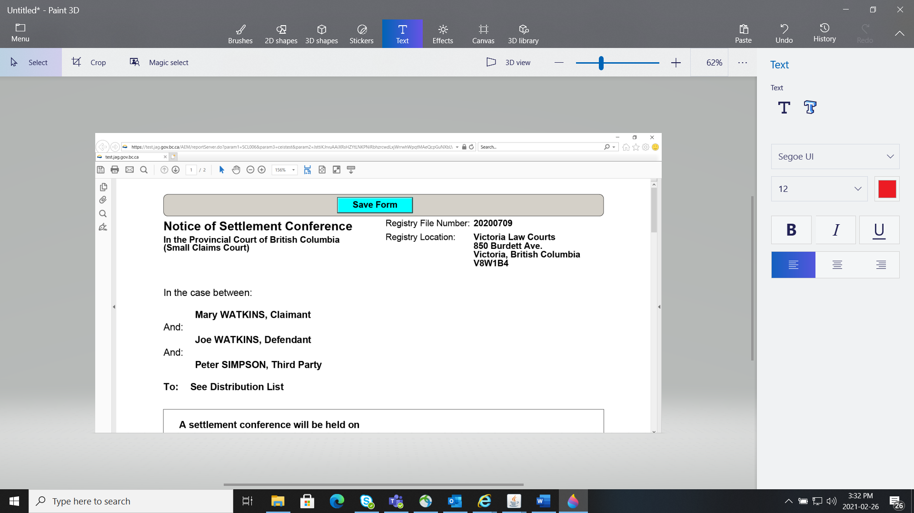

### How to Scan Documents

Highlight the blue line on the document or order you wish to scan and use either the Documents tab or the Orders tab to scan.

**STEP 1:** Turn the scanner on.  Ensure that the blue line is highlighting the document or order that you wish to scan to and the document or order has been placed into the document feeder of the scanner.

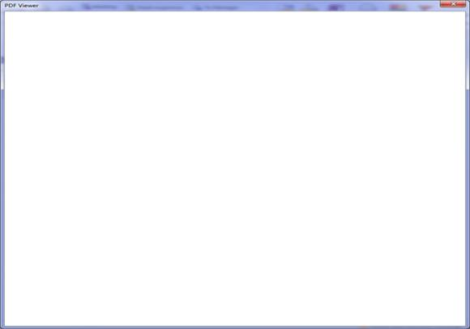**STEP 2:** Click the **Scan document** button and a blank pdf viewer will appear on the screen and the scanner will commence scanning the document. 

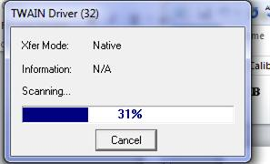You may also see the following box appear to advise how much of the scanning job has been completed.

**STEP 3:** Once the scanning has completed, the document will appear in the pdf viewer.  To save the image, you click the "X" in the upper right hand corner to close and save the image

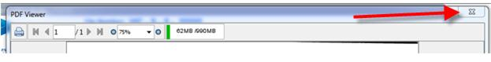

A message will appear asking you if you want to save the document and you would select YES to save the document or NO to cancel.

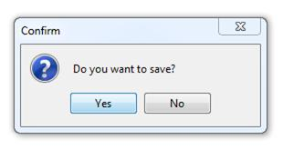

### How to Upload Documents

Here are the steps to Upload documents.

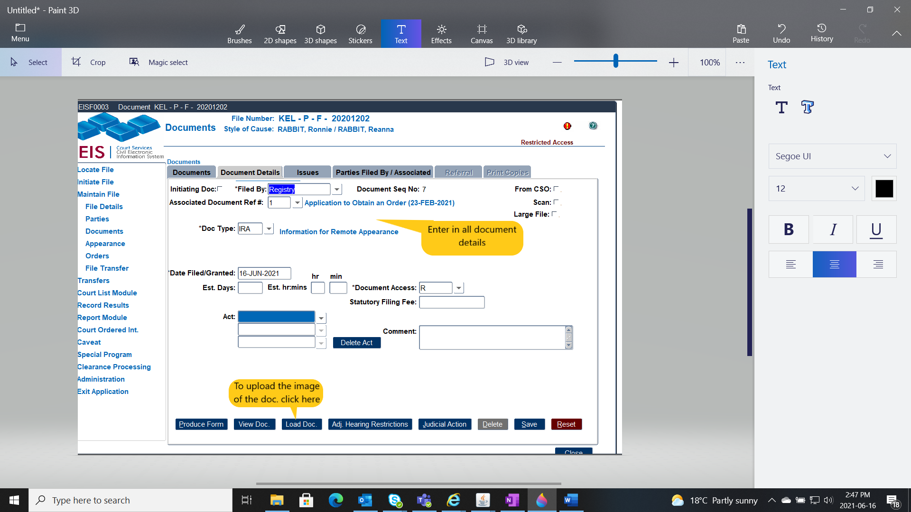

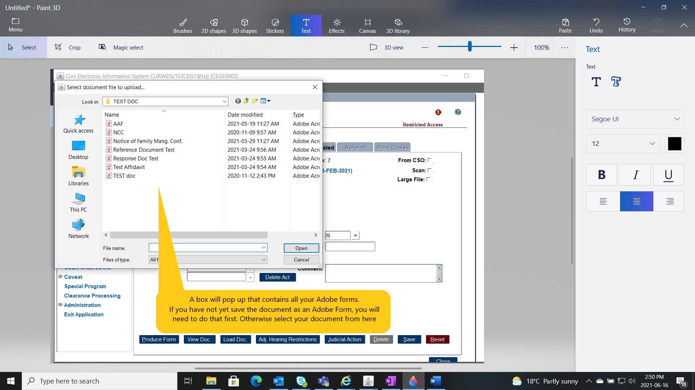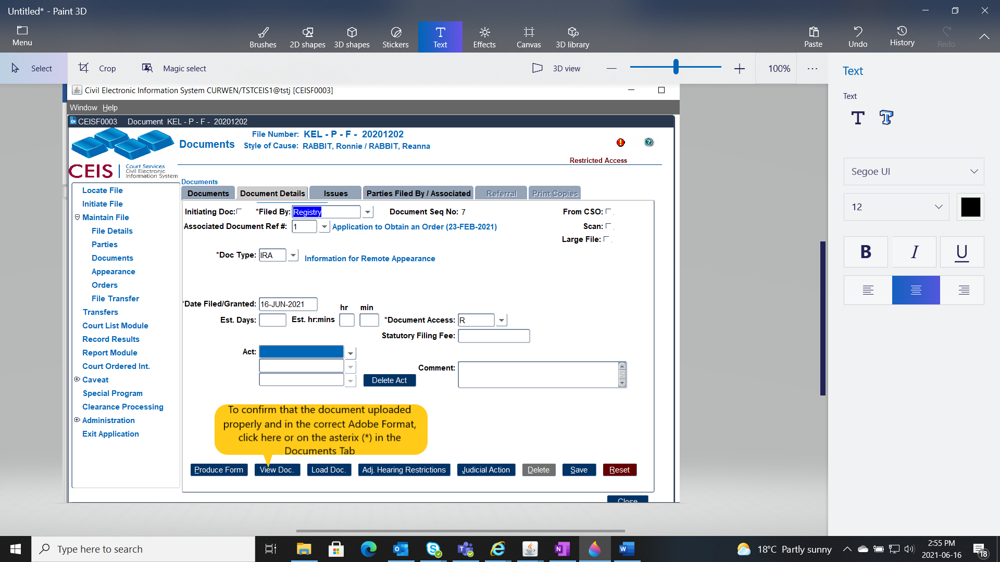

### How to Email Documents

We have some exciting news! Effective May 17, 2021 **ALL** **Provincial Family** and Effective August 16, 2021 **ALL Small Claims Files** will have the ability **to email ANY** **document** to the parties on file (if they have an email address on file)

New **Email Documents** button added to Documents module.

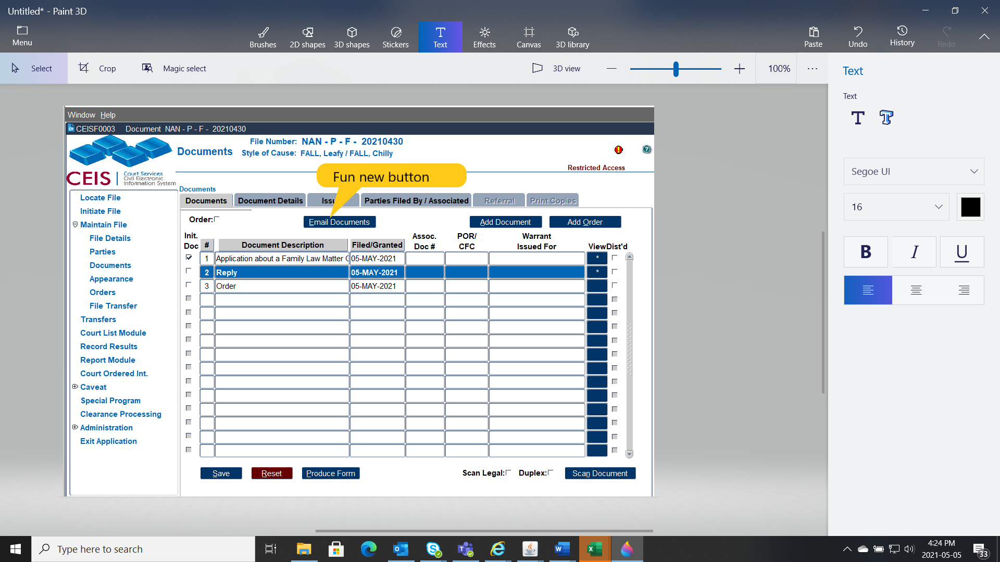

**What are the Rules of this fun new button..**

- File must be a Provincial Family/Small Claims File

- At least one party must have an email address

- Click to highlight row of document to send by email (blue line)

- Document must have an image

- Press to access new Distribute Documents by Email screen

- Hotkey for quick navigation: Alt+E

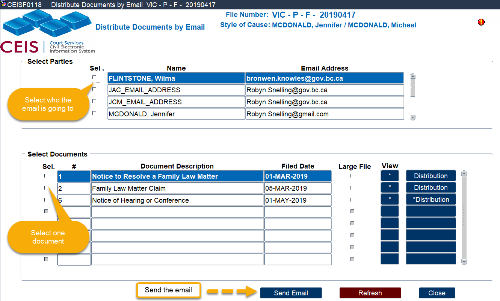

New **Distribute Documents by Email screen** has been added. This is where the magic happens! Select your document and your party, JCM or JAC and email away.

**STEPS:**

1.  Select 1 or more recipients (Party/JCM/JAC)

2.  Select 1 document. To view the document prior to emailing, click the **\*** button

3.  Click Send Email.

NOTE - You can only email 1 document per email. If there are multiple documents to send to a party/JCM/JAC then you will need to email 1 at a time.

You can select multiple parties to email the document to and CEIS will email them all individually.

To send a 2^nd^ document:

**STEPS:**

1.  Unselect the initial document selected by clicking the active checkmark

2.  Select the 2^nd^ document to send by clicking the Sel. check box

3.  Click Send Email button

    **Large File** -- indicates an image is very large and may take some time to display if a CEIS user wishes to preview it.

Click **Distribution** if you need to view the details of where the email was sent. An asterisk on the Distribution button indicates there are details to view. The Document Deliveries by Email pop up will appear when the Distribution button is clicked.

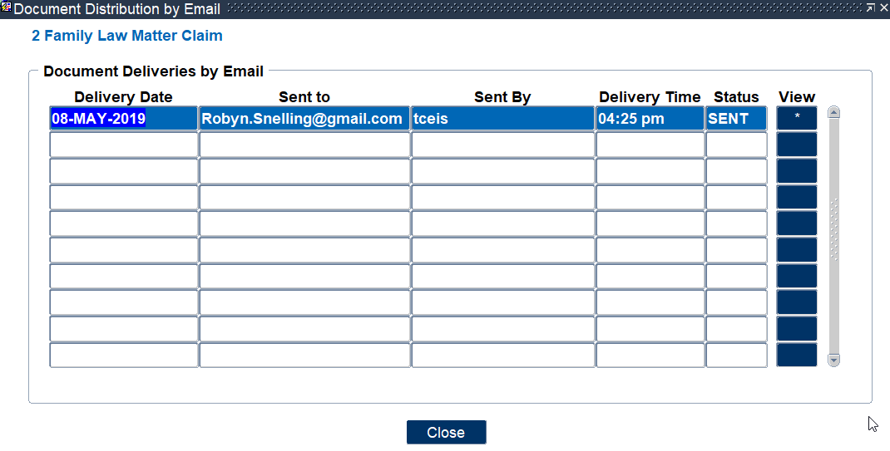

> **Date:** Date email was sent
>
> **Sent to:** Email address of the recipient
>
> **Sent by:** CEIS user ID of sender
>
> **Delivery time:** Time the email was sent
>
> **Status:** Sent -- Email sent
>
> Click the Close button to leave this screen and return to the Documents module.

***Sample Email to Parties***

(sample taken from outlook, other email programs will vary in display format but content remains the same.)

> 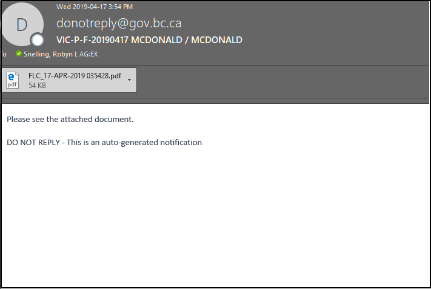
>
> **From address**: [donotreply@gov.bc.ca](mailto:donotreply@gov.bc.ca) This address is not monitored; replies will not be answered.
>
> **Subject line:** File number & brief Style of Cause. The SoC is the first active left/right party roles for the file.
>
> **Attachment:** PDF document format
>
> **Body:** References there is an attached document and that the email is system generated.

