## DOCUMENTS/DATA ENTRY

### Entering Documents

To complete the initiation of a civil file, you must enter the initiating document. CEIS automatically assigns it a \"sequence number\". The initiating document will be the first number; any documents you assign after file initiation will be numbered \"two\", \"three\", and so on. This makes it easier to track all the documents within a file.

For a list of active documents check out our [CEIS Codes Table](https://csb.jag.gov.bc.ca/Civil%20Documents/CEIS/ceis-code-table.pdf).

To add an initiating document to the file, click **Add Document** at the bottom of the **Party Details** screen.

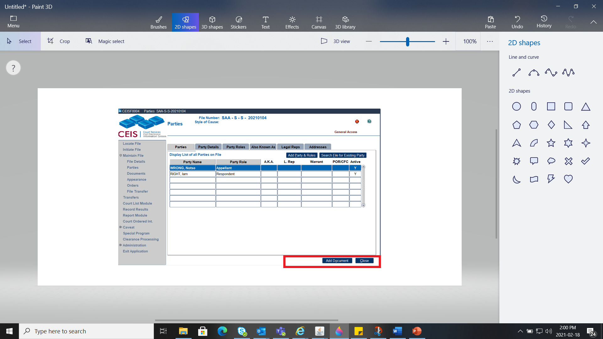

To add a Document to an existing file, click **Add Document** at the top right side of the **Document Summary** screen.

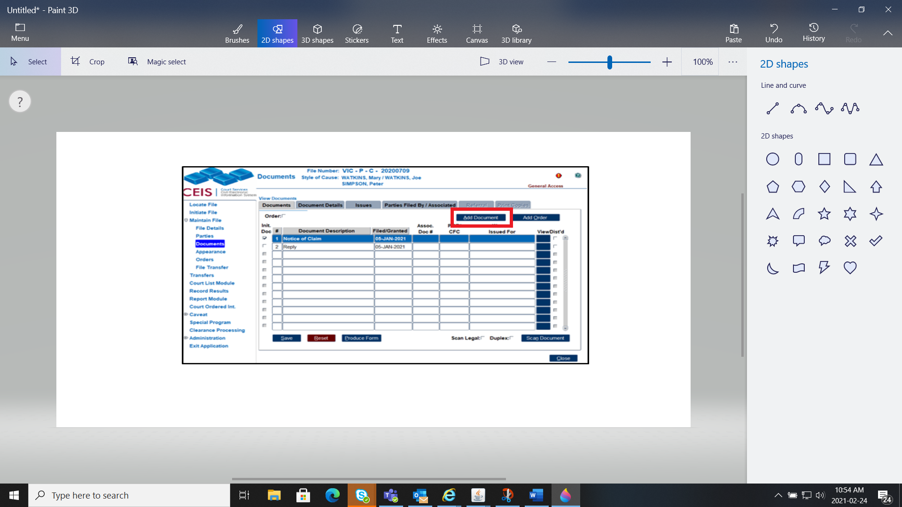

NOTE *--* All mandatory fields have and asterisk (\*) beside them

**Initiating Document** (1):

By default, this checkbox is ticked if this is the first document being added to the file.

**Filed By** (2):

Select if the document was filed by counsel, a self-represented party, or the registry (if it was an internally generated document.)

**From CSO** (3):

This checkbox will be ticked if this document was e-filed via Court Services Online.

**Scan** (4):

This checkbox will be ticked if this document is scanned into CEIS.

**Large File** (5):

This checkbox will be ticked if CEIS has indicated this this is a large document.

**Associated Document Ref \#** (6):

This selection is used to associate one document to another. For example, if a document is amended, you would associate it to the original.

**Document Type** (7):

Select the appropriate document alpha code from the drop-down list, and the full document description will appear. For a list of the CEIS Codes, click [here](https://csb.jag.gov.bc.ca/Civil%20Documents/CEIS/ceis-code-table.pdf).

**Appendix** (8):

On select documents, an Appendix button will appear, when it does it is a mandatory field. Appendix information can usually be found on the last page of the document.

**Date Filed/Granted** (9):

The date the document was filed.

**Est. Days** (10):

The estimated number of days required to hear the case (rounded off to a whole number).

**Claim Amount** (11):

For Supreme Civil and Small Claims, enter the amount of claim excluding costs.

**Act** (12):

Select the appropriate act(s) from the drop-down list. The Act is mandatory for initiating documents in the following classes: Adoption, Family Law Proceedings, Legislated Statutes and Provincial Family. Up to three Acts can be entered against one document.

**Document Access** (13):

Identifies any access restrictions for the document. This field defaults to GEN, based on the access level of the file.

**Statutory Filing Fee** (14):

If there is a standard fee involved

**Grounds for Divorce** (14):

Located under Statutory Filing Fee in Supreme Court Family Files (Divorce) only. This field is not mandatory but the grounds must be entered for all divorce files.

**Comment** (15):

Use this field for any general comments about the document.

**Delete Act** (16):

Highlight the entered act using the blue line if you need to remove an Act from the Act field.

**Produce Form** (17):

Use this button if this is a [CEIS generated document](#how-to-produce-adobe-forms-in-ceis) that requires production.

**View Doc** (18):

Displays an image if the document has been [scanned](#how-to-scan-documents) or e-filed.

**Load Doc** (19):

Used to process e-filing documents or upload a PDF image to the document.

**Adj. Hearing Restrictions** (20):

Indicates if an adjudicator is seized, disqualified or appealed on file.

**Judicial Action** (21):

Used to process e-filing documents.

**Delete** (22):

You can delete a document using this button so long as all related field to the document are removed.

**Save** (23):

You can save your changes to the document details by click this button. Once you do, 2 other tabs will appear, [Issues](#_Issues) and [Parties Filed by](#parties-filed-by).

**Reset** (24):

To reset the information you added to the document details, click this button.

### Issues

When you\'re on the *Issues* screen, you\'ll see that the document entered in the *Document Details* screen now prompts the Style of Cause to show.

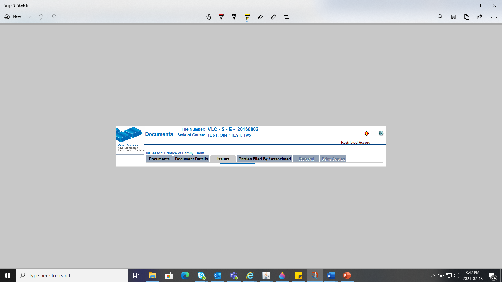

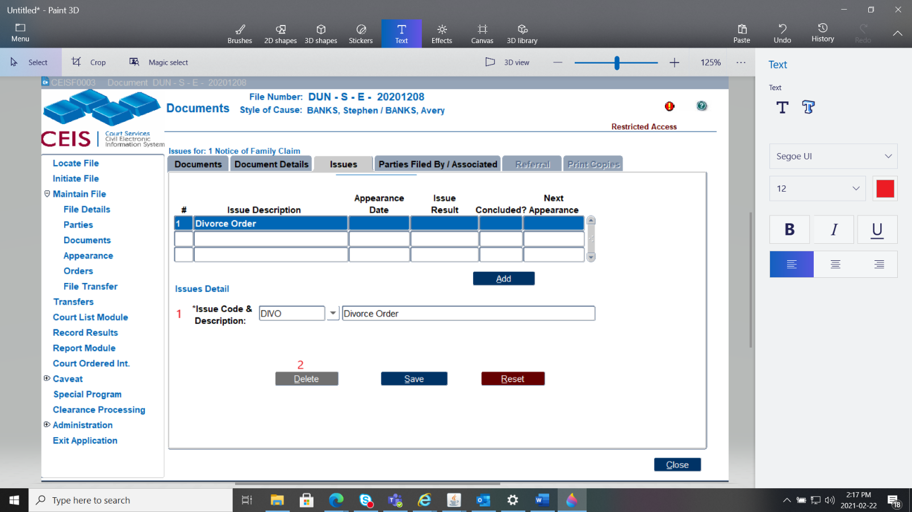

**Issue Code and Description** (1):

Select a code from the drop-down list, and the full document description will appear automatically.

**SAVE** (2):

*NOTE --* If the issue does not have a code, use OTH and manually enter the issue in the description field.

### Parties Filed By

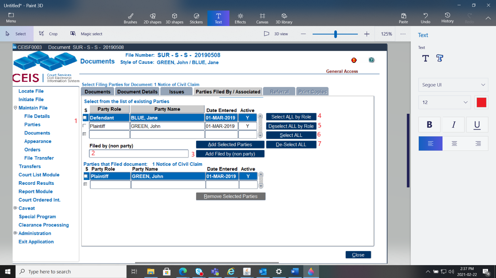In this Tab, the document is associated to the filing party. If the filing party is the Registry or another party, we also add this here.

**"S" Column** (1):

Tick the checkbox beside the party who is filing the document.

**Filed By** (2):

If the person filing the document is not a party to the file, including the Registry, enter the name of the party here.

**Add filed by (non party)** (3):

After entered the non party's name in the filed by screen (2), click this button to add the party against the document.

**Select ALL by Role** (4):

If a document is filed by all the parties (I.E. ALL 5 claimants), rather then selecting them individually you can use this button.

**Deselect ALL by Role** (5):

If you need to de-select all party's per role, use this button.

**Select All** (6):

Use this button if ALL parties in ALL Roles are filing a document jointly.

**De-select ALL** (7):

To unselect them all, use this button.

*NOTE --* If the document is an Initiating document, this tab will auto-fill according the initiating party role, i.e. Claimant, Applicant etc.

### Action Documents

**Reply (Provincial Family and Provincial Small Claims)**

When a Reply is filed, you should:

Data enter the document,

Check if the file is ready for an [Appearance Date](#appearances), and

Data Enter the replying parties [address](#addresses) for service.

**Requisitions**

Ensure you read requisitions carefully, they can request:

Data enter the document,

To Cancel an Appearance

To re-set an Appearance date

To provide copies of a document

***Counsel on Record***

When Counsel are adding or removing themself from a file, they file this document:

When you receive this document, you should:

Data enter the document,

Add the counsels name to the [Party's details](#party-details), and

Update the [Address](#addresses) for Service for the party to the counsel's address.

**Change of Address**

If a party needs to update their address, they will file this document, then you should:

Data enter the document,

Go to the Party Address tab and end the previously entered address, and

ADD a new Address for the party.

**Parenting Education/Dispute resolution**

Some Locations require a Parenting Education Certificate to be filed, or proof of Dispute Resolution, check out the family manual to determine which registry's require these.

If these are received in your registry, you should:

Data enter the document,

Review the file and determine if an [APPEARANCES](#appearances) Date can be set, and

> Go to the [[FILE DETAILS](#file-details)] Tab and type the name and completion date of the education course of dispute resolution in the comment's field.

**Certificate of Service/Affidavit of Personal Service**

When a party files one of these documents to prove service you should:

Data enter the document,

Review the file if the other party filed a reply,

If no reply, check if the 30 days to file a reply expired,

> If the 30 days to file a reply from date of service expired and the file is ready to be set, Set the [APPEARANCES](#appearances) Date.

**Notice of Discontinuance**

The Notice of Discontinuance code reflects whether the discontinuance is in whole or in part. The following two codes are available:

- NDP - Notice of Discontinuance in Part

- NDW - Notice of Discontinuance in Whole

If discontinued in part, data enter using \"NDP\" and in the [Entering **Documents**](#entering-documents) Comments field to indicate what/who has been discontinued against. Then deselect the party, if applicable.

If discontinues in whole, data enter using "NDW" and in the [FILE DETAILS](#file-details) Comments field and indicate when it was discontinued and change the status of the file to Inactive.

### How to relate documents

1.  Any Document relating to the Application (or another Document) such as a Certificate of Service (CSV) please use the "Associate Document Ref #" to relate one document to another.

2. Any Response document to an Application, for example a Reply (RPL), relate the document to the Application by using the "In Response to" field.

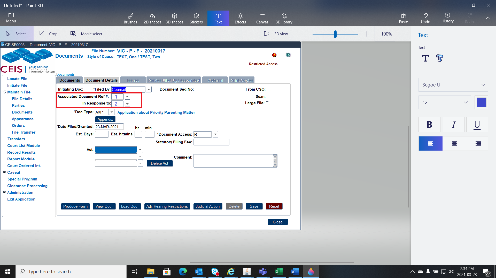

### How to amend and delete documents

Looking at the document screen, you can

1.  Highlight the Document and select the **Document Details** **tab**, OR

2.  Double click the Document which takes you directly to the **Document Details tab**

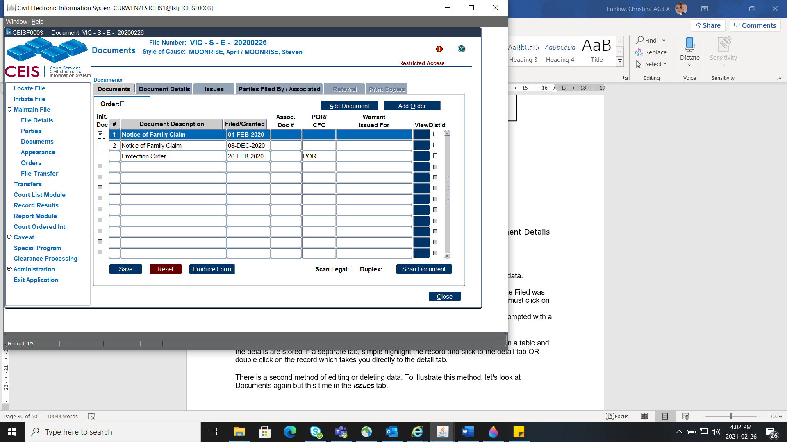

In the [[DOCUMENTS](#documentsdata-entry) Details tab], any information can be edited.

If the Date Filed or Document Code was initially entered incorrectly, simply overwrite the date or code with the correct information. You must click on the Save button to save your changes.

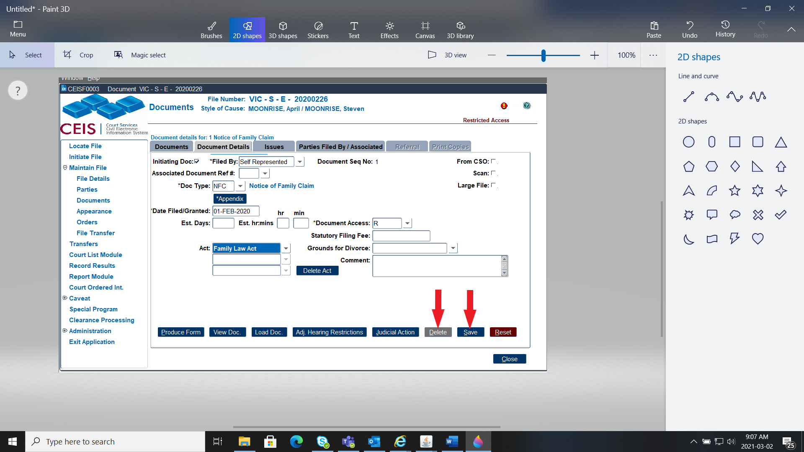If you want to delete a document, simply click on the DELETE button. You will be prompted with a message to confirm the deletion.

The record may not allow you to delete if you have data tied to this document such as Issues and Parties Filed By.

If this is the case, go through each screen and remove the data entered, then come back to the **Document Details Tab**, and click DELETE.

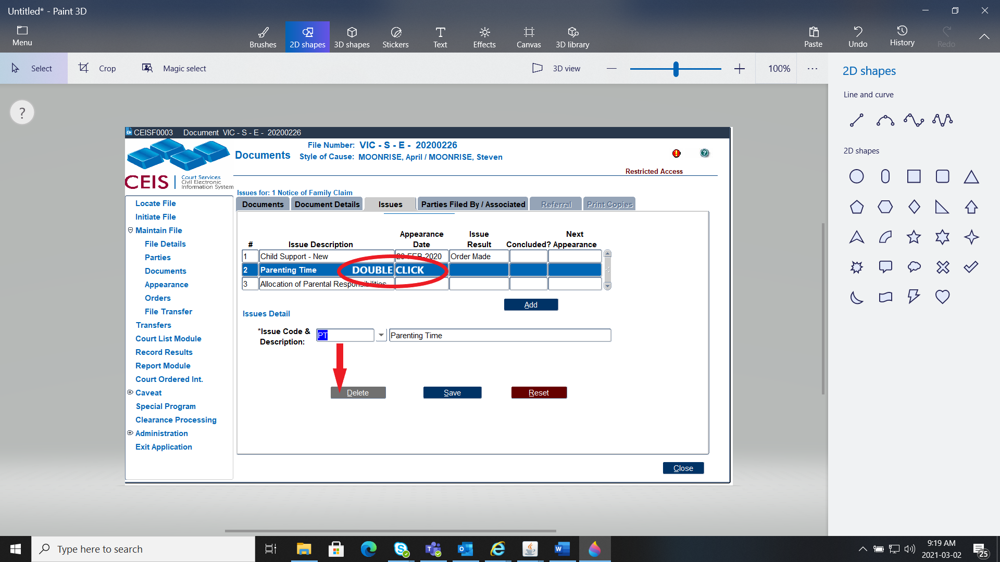To delete Issues, place the blue line on the Issue you are deleting (or changing) and double click to pull it down to the bottom screen then click DELETE and SAVE.

*NOTE --* Once you start using CEIS, you may start wondering why a double click is necessary to select records. This design was intended to give users the optimal system performance so that CEIS did not respond slowly.

### Document List Report

A Report to generate a list of the documents filed and entered in CEIS for all levels and classes.

**STEPS:**

Whenever you need to a print a list of documents that have been filed, either for the file itself, counsel, a party etc. We have created a super easy to read and producible list.

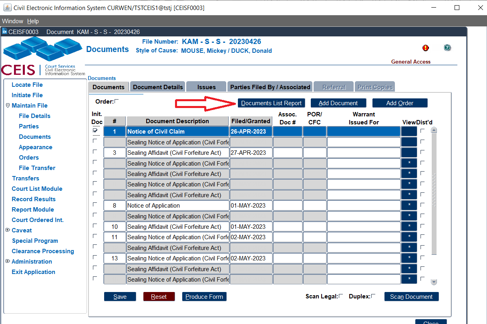Simply click on Documents to bring you into a file and at the top you will see a new button called "Document List Report"

Click on that, and a report will be generated.

*NOTE: You will notice that if there is a document with a Sealed Access level, those documents will not be listed. If the file itself is sealed, this report will not be functional.*

### How to enter Affidavits

At the request of the Judiciary, we have added extra fields in the Document Details screen when any Affidavit it filed.

As of March 24, 2021 the Sworn By is mandatory, and the Affidavit is option. In the previously data entered Affidavits (before March 24 2021) this field will populate but is NOT mandatory -- it is recommended that if the Affidavit is going into court that these fields are filled in to assist our Judiciary.

**STEPS:**

1.  Add Document

2.  Enter Document Type (Any Affidavit Code)

3.  Type in the full name of who SWORE or AFFIRMED the Affidavit (mandatory field after March 24, 2021) -- NOT the Commissioners name, and

4. If known, enter the number of the Affidavit (this is optional)

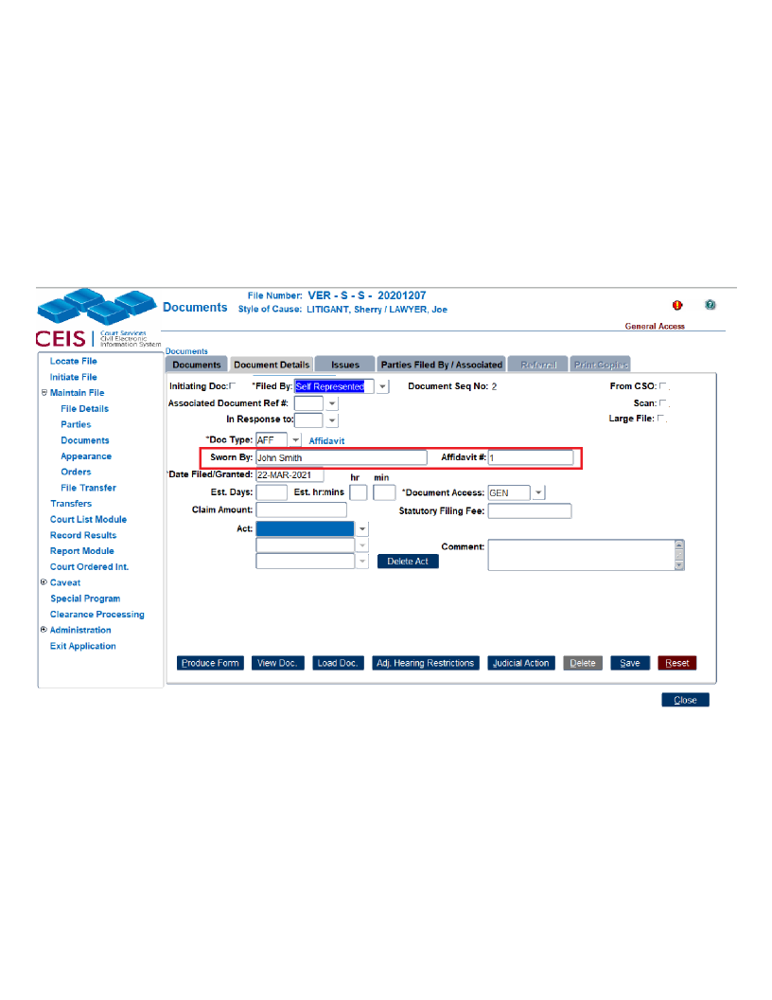

### Child Support Recalculation Service Procedure

As outlined the [ADM Memo dated February 23, 2022](https://csb.jag.gov.bc.ca/Branch%20Info%20Documents/admmemos/admmemo-csrs.pdf) the Child Support Recalculation Service (CSRS) is expanding from its pilot location, Kelowna, to the rest of the province, effective March 1, 2022. There are some changes that accompany this expansion, specifically related to CEIS.

**When a file is enrolled**

Kelowna's pilot was mandatory enrolment if a child support order was made. The expansion to the province is moving in a different direction.

Enrolment in the Child Support Recalculation Service (CSRS) is either:

- By Consent, or

- By Order of the Court

*If the Court Orders the file be enrolled in the CSRS, the registry will email a copy of the Order directly to the Child Support Recalculation Service via CEIS:*

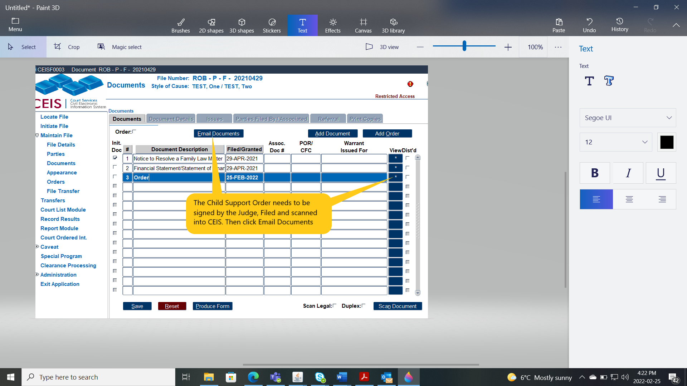

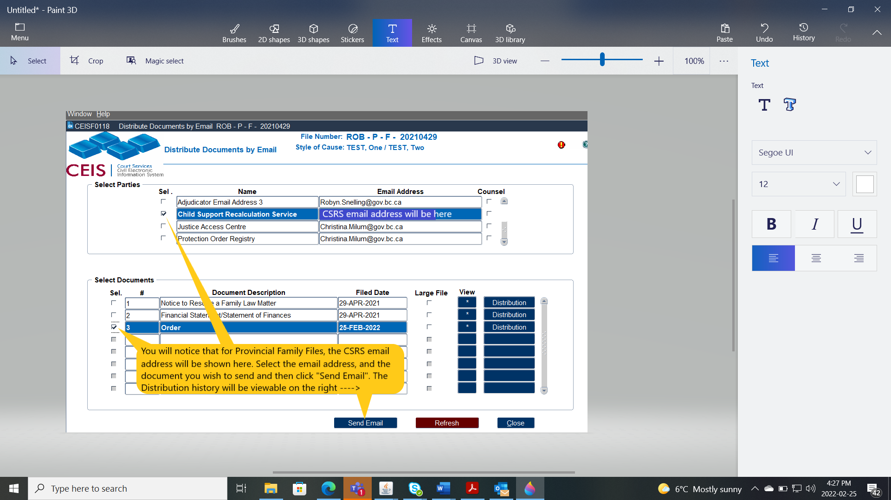

After either an Order of the Court is provided or a voluntary enrolment package is provided to the Child Support Recalculation Service, **they will provide the local registry a Notice of Enrolment (CEIS Code: NOE).**

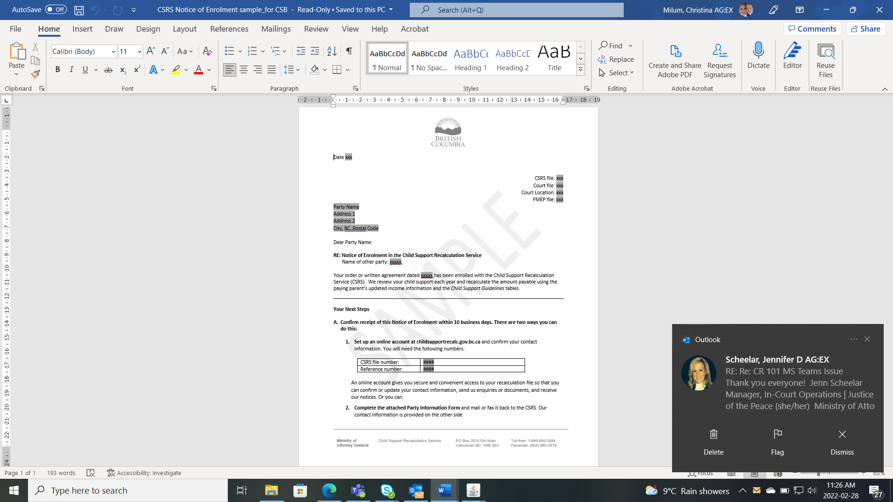

Once that Notice if received, we need to navigate to the **File Details Tab** and enter the enrolment date and reason why they were enrolled under **Special Programs.**

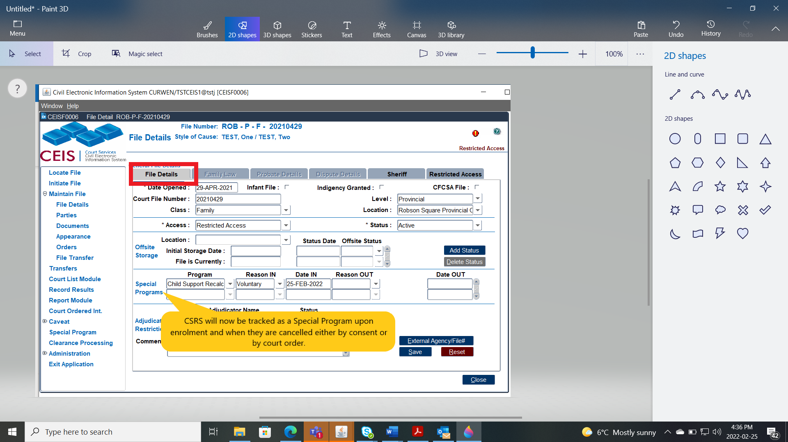

**When a file is removed from the Child Support Recalculation Service**

Parties may choose to remove themselves by consent by filing a Withdrawn from Child Support Recalculation Service Document (CEIS CODE: NWCS) or by Order of the Court.

When this happens, go back to the File Details Screen and select the **Reason Out** and enter the **Date Out** according to the documents filed.

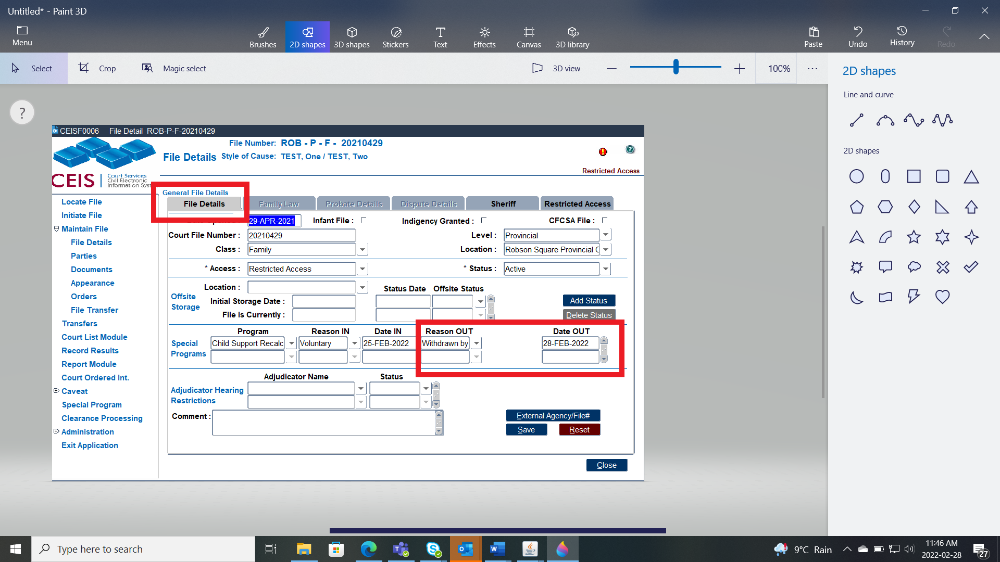

**New Codes for CSRS**

  ------------------------------------------------------------------------------------
  **Name of Document**                                  **CEIS Code**   **New (Y/N)**
  ---------------------------------------------------- --------------- ---------------
  Notice of Enrolment (CSRS)                                 NOE              Y

  Statement of Recalculation                                 SRO              N

  Amended Statement of Recalculation                         SRO              N

  Recalculation Suspension Notice                            RSN              Y

  Recalculation Suspension Ending Notice                    RSEN              Y

  Withdrawn from Child Support Recalculation Service        NWCS              Y

  Child Support Recalculation Declined                      CSRD              Y

  Child Support Recalculation Voided                        CSRV              Y
  ------------------------------------------------------------------------------------

  ------------------------------------------------------------------------------
  **Special Program Name**                        **CEIS Code**   **New (Y/N)**
  ---------------------------------------------- --------------- ---------------
  Child Support Recalculation Service                 CSRS              Y

  ------------------------------------------------------------------------------

  ------------------------------------------------------------------------------
  **Special Program Entry**                       **CEIS Code**   **New (Y/N)**
  ---------------------------------------------- --------------- ---------------
  Voluntary                                            VOL              N

  Mandatory                                            MAN              N
  ------------------------------------------------------------------------------

  ------------------------------------------------------------------------------
  **Special Program Exit**                        **CEIS Code**   **New (Y/N)**
  ---------------------------------------------- --------------- ---------------
  Withdrawn by Consent                                WCON              Y

  Order removing CSRS                                 RORD              Y
  ------------------------------------------------------------------------------

### Civil Forfeiture Act Procedure

The Civil Forfeiture Office has modified their Notice of Applications to assist us in recognizing these special situations.

They've made the following changes that you will need to look for:

> 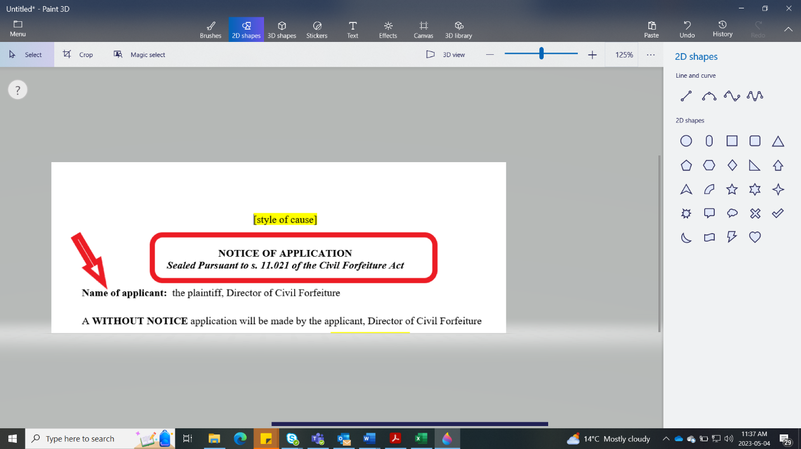

- Added 'Sealed Pursuant to ss. 13 and 14 (previously ss. 11.01 and 11.02) of the Civil Forfeiture Act' under the title Notice of Application; and you will notice the Plaintiff is the Director of Civil Forfeiture.

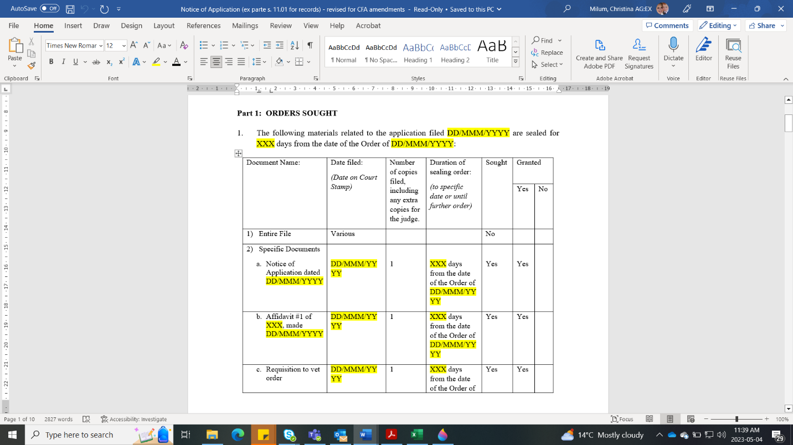

- The sealing order language is included under the Orders Sought.

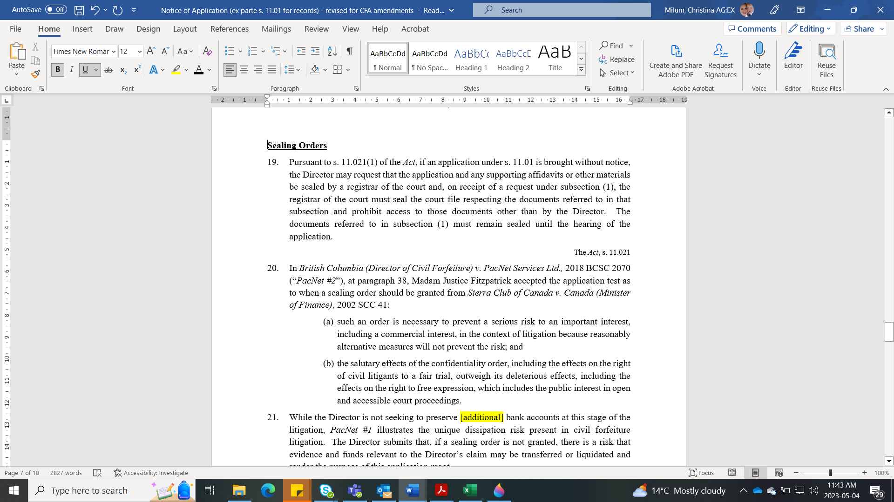

- Added a new paragraph 19 under the 'Sealing Orders' heading of the Legal Basis.

**STEPS WHEN A SEALING NOTICE OF APPLICATION AND SUPPORTING MATERIAL IS FILED (VIA E-FILING OR OVER THE COUNTER):**

1)  Review the Notice of Application and identify if this is a Sealing Application or not (see the above outlined indicators)

2)  If you see any of the indicators;

- in e-filing confirm the correct "SNAP/SAFF" codes are used,

- when data entering manually confirm that you use the correct SNAP/SAFF codes.

- Confirm you are in the correct level and class -- Supreme Civil (General)

- Enter the correct Act -- Civil Forfeiture Act

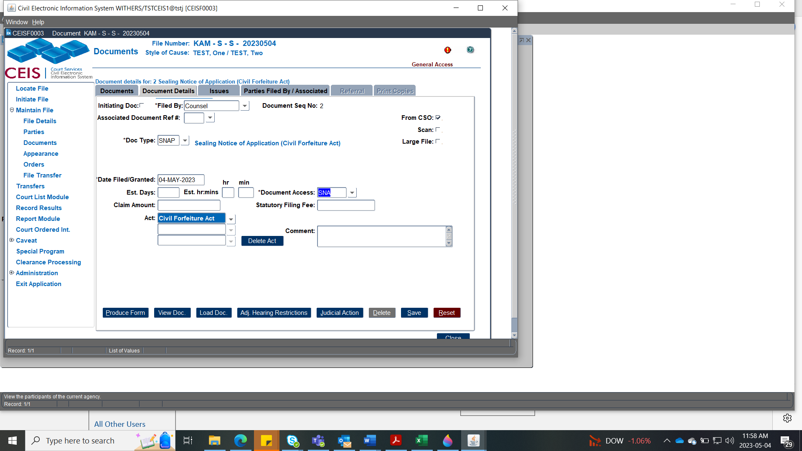

3) After these codes are entered into CEIS, the Document(s) will auto seal to the new Access Level SNA.

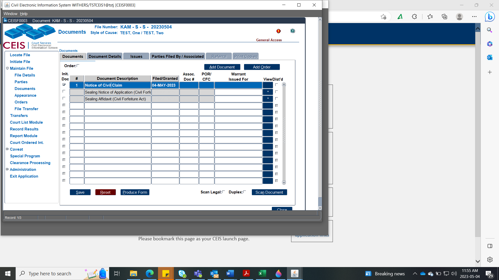

4)  Once the court speaks to this Application (SNAP) they should indicate whether these documents are to remain sealed, or if your local DDR needs to unseal these documents.

**HOW TO UNSEAL THE SNAP/SAFF DOCUMENTS:**

Once the Court has heard the file and these 2 documents (SNAP and SAFF) are no longer needing to be Sealed:

1)  Enter into the file

2)  Go to Documents

3)  Click on Document Details of the SNAP/SAFF

4) Navigate to the Access Level and change the SNA to GEN and save.

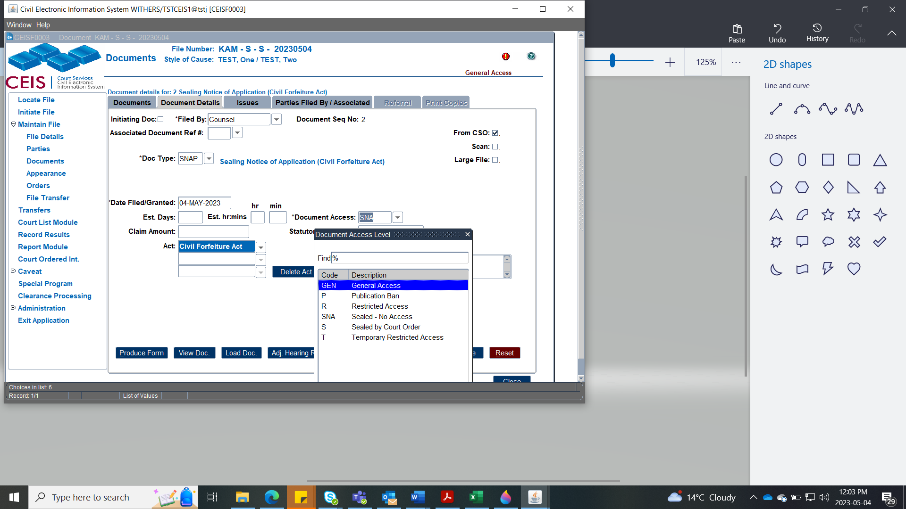

5)  Confirm the document is now unsealed

> 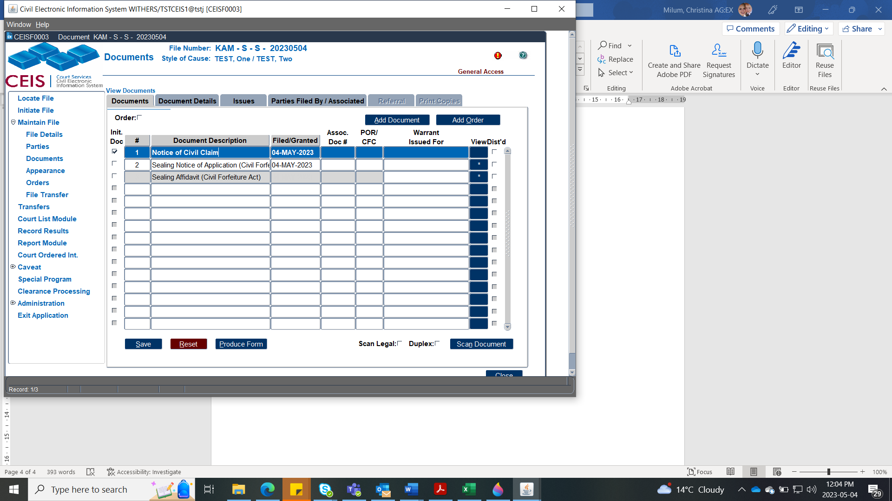

**UNEXPLAINED WEALTH ORDERS:**

This is a new issue type that we may see on Notice of Applications (sealing or not) from the Civil Forfeiture Office.

If you notice this in the Orders sought, please use the new code **UWO.**

For further information on why we are sealing these applications and what the new issue code Unexplained Wealth Order means, please refer to the ADM Memo outlining the background or reach out to [AskPolicy](mailto:askpolicy@gov.bc.ca).

### C78- French Divorce Proceedings

Initiating a Divorce file is the same process as a regular Divorce Act file.

Things change when a party wishes to file and/or proceed in the French Language. New features will appear when the RFOL code is added as a document in CEIS.

Follow along on [this document](https://csb.jag.gov.bc.ca/Civil%20Documents/CEIS/notes/CEInoteS-Bill-C-78-Dec1-2024.pdf) that outlines all the unique features when working in French Divorce Files.

### Intimate Images Protection Act (IIPA)

Per this [ADM Memo](https://csb.jag.gov.bc.ca/Branch%20Info%20Documents/admmemos/admmemo-bill12-Intimate-Images-Protection-Act.pdf), we have a few new specific requirements in our data entry into CEIS when accepting enforcement orders from the CRT into Provincial Small Claims regarding the Intimate Images Protection Act.

**Access Level:**

There is a change in the Court Record Access Policy, therefore, in the File Details screen, we need to change the Access Level from General to Restricted.

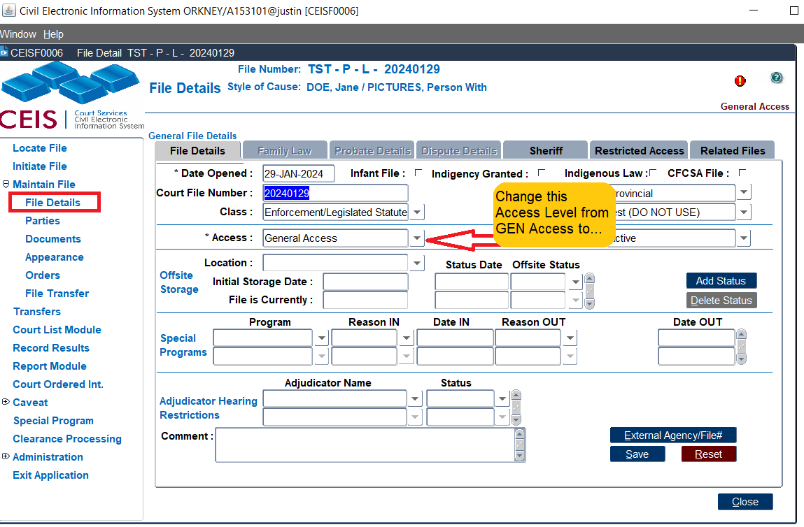

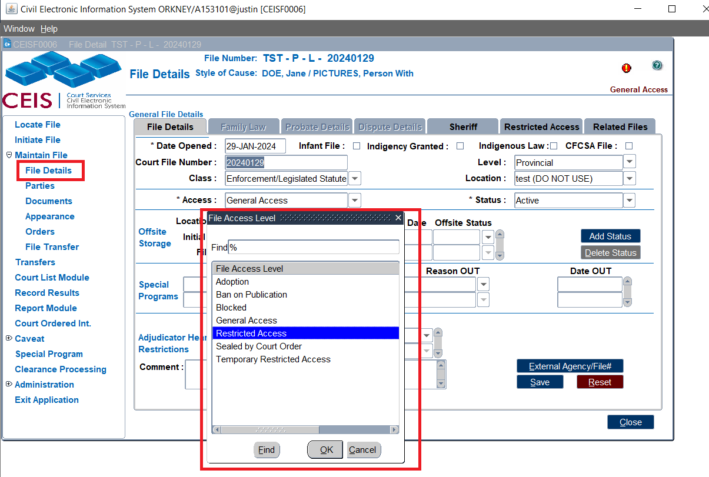

**Act**:

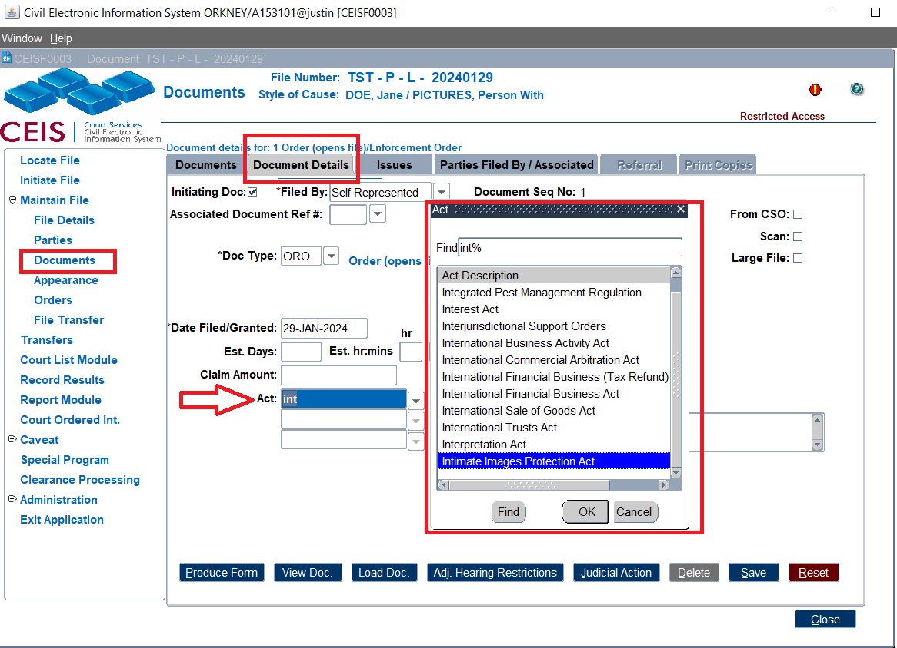We also need to ensure the Act we enter in Document Details is the Intimate Images Protection Act.

Entering the Restriction Access level and the ACT will apply proper backend coding to ensure the file is NOT Viewable in CSO.

Failing to enter these, will allow the file to be viewable ... and that's a big no no.

**Publication Ban:**

If the CRT orders a Publication Ban, **we are automatically** adding this into CEIS, per the new Provincial Court Access Policy under section 13 of the *Intimate Images Protection Act (IIPA).*

**IIPA clues on the CRT Order to look for:**

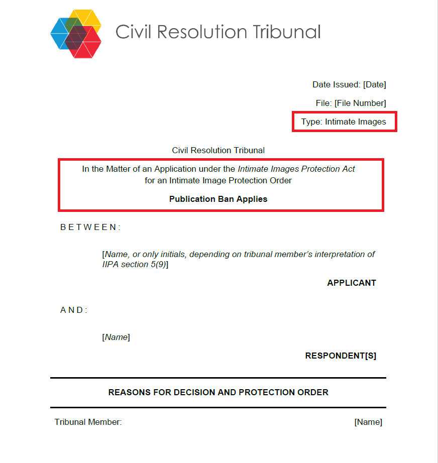

