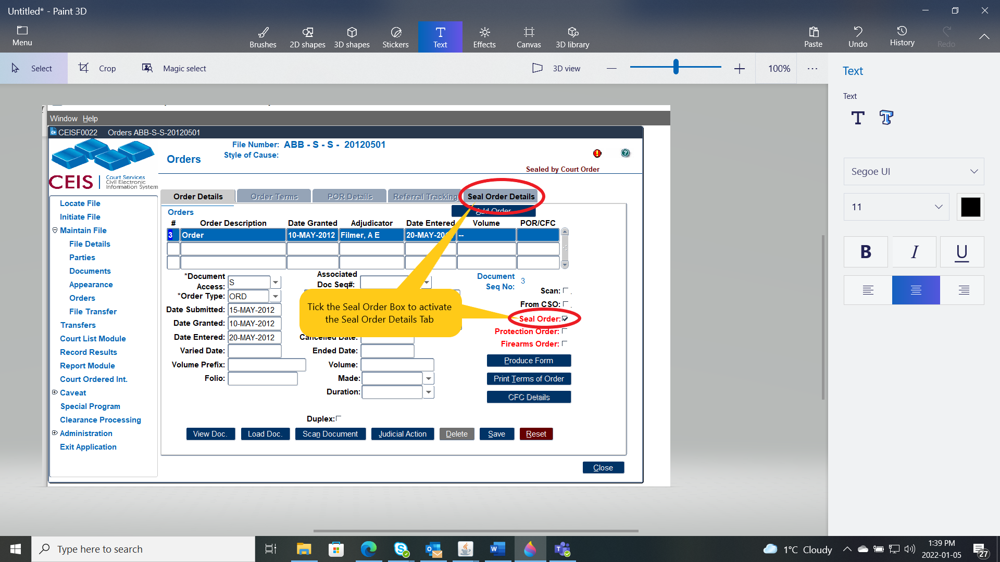
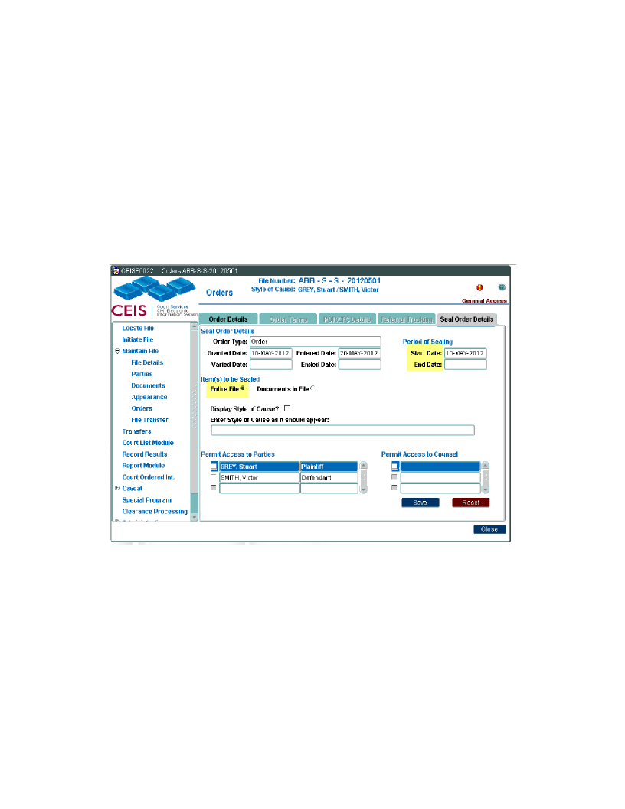
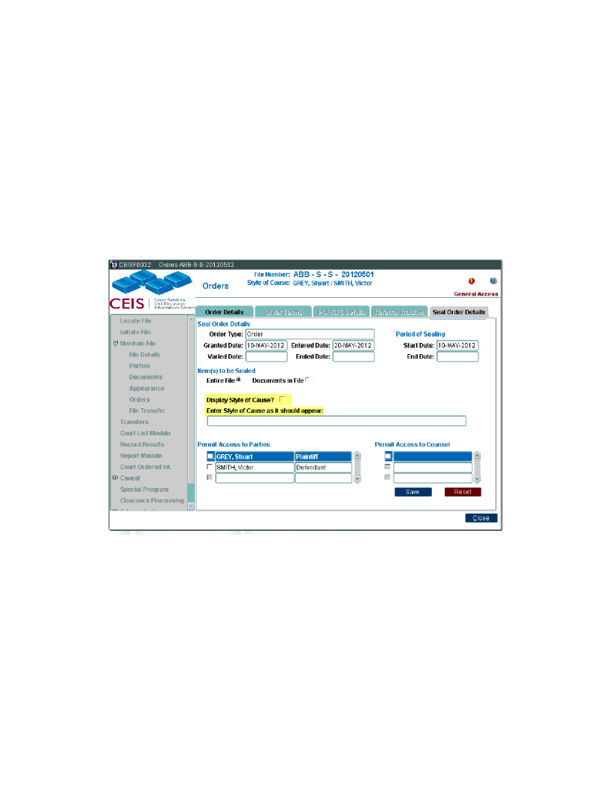
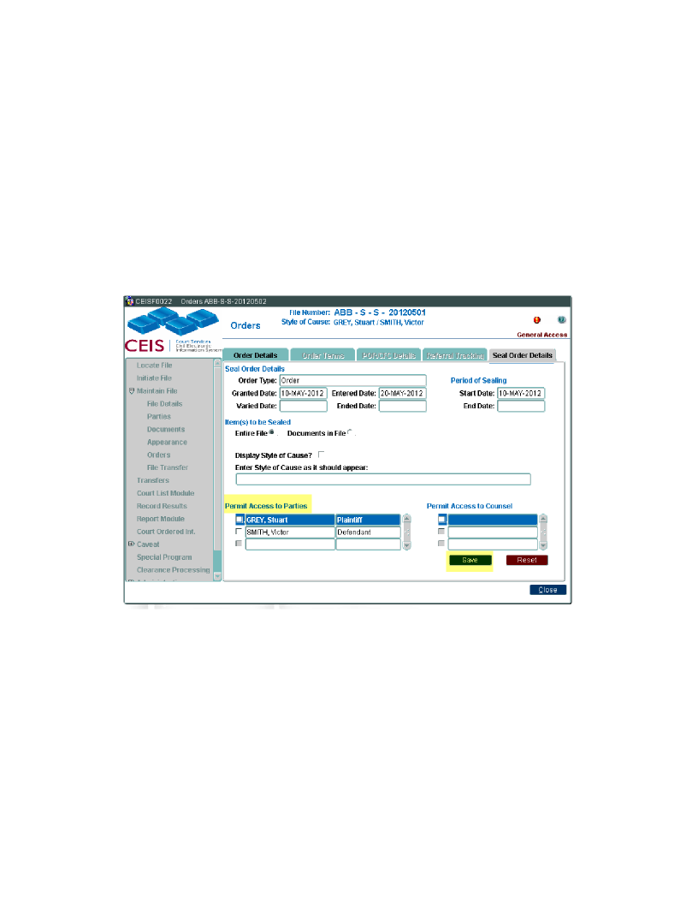
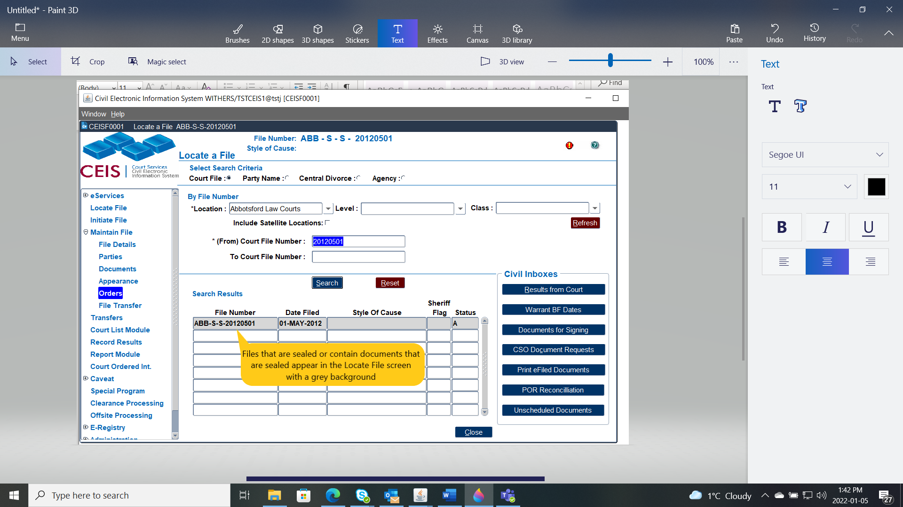
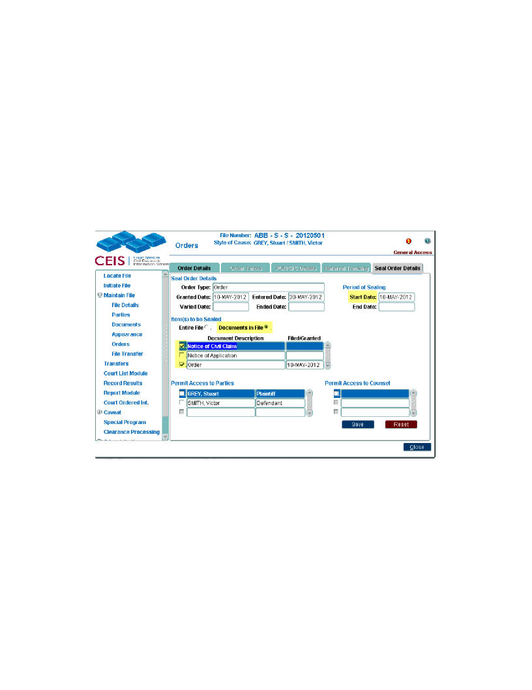
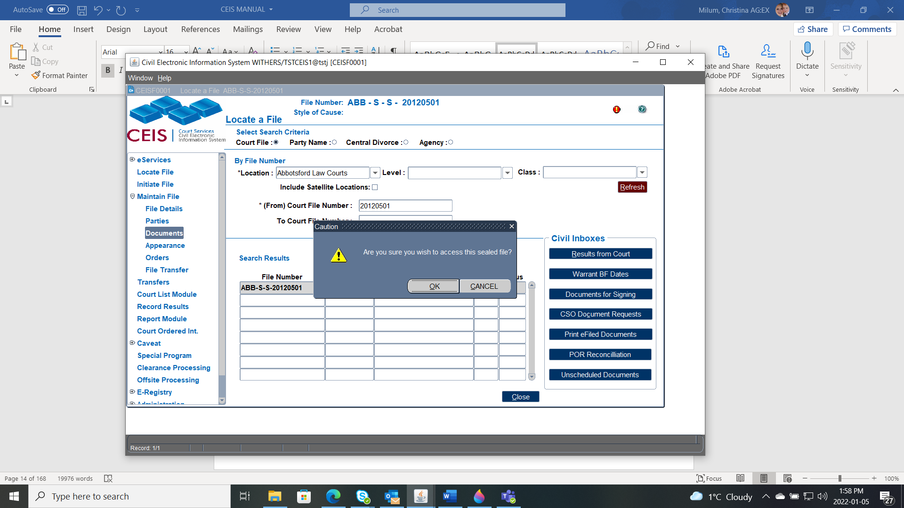

## FILE ACCESS 

### File Access Levels

An \"Access Level\" code entered at the time of file initiation and determines who will have access to that file.

Access to a file is differentiated between internal and external users. Internal users are court staff, while external users are members of the public.

The access levels are:

- **General Access** to all data. (All files will have general access with the exception of Supreme Family Law, Provincial Family, Supreme Adoption, and Supreme Probate.

- **Temporary Restricted Access** restricts access to a file for a limited time during processing. (Internal users will have full access; external users will only be able to access file numbers (Adoption is the exception)

*NOTE -* By default, all family matters are set to Restricted Access when the file is initiated.

In addition to the above access restrictions, further restrictions may be set by order of the court:

- **Publication Ban** restricts access so that external users will not be able to view the file.

- **Sealed By Court** Order means an order has been made sealing the file or document if applicable.

In addition to access levels at the file level, the same types of access restrictions can be set for individual documents.

CEIS automatically sets access restrictions based on the class and category of file. For example, if a Supreme Court file is classed as Adoption, it can only be viewed by users who have the security permissions to access adoption files.

### How to Seal a File

You must have authorization to Seal files.

1.  Add the Date Submitted, Date Entered as well as any other details required and press SAVE.

NOTE - The Seal Order Details tab will remain inactive until the Seal Order check box is ticked.

2.  Add the **Start Date** of the Sealing Order and if Ordered add the **End Date**. All Sealing Orders must have a Start Date. (End date is not required)

*NOTE -* This sample is how to Seal an Entire file -- for how to Seal a document only see below

> 

3.  **Hide** the Style of Cause from the CEIS header leave all boxes in this section unchecked.

4.  **Display** a new Style of Cause the Court has ordered to appear click the Display Style of Cause tick box and;

5. **Enter the new** Style of Cause in the field below.

6. Check the box beside the Parties that are permitted access to the file. **SAVE**

7.  The File access level will automatically change to **Sealed by Court Order**

### How to Seal a Document

NOTE - Only authorized users can add a document and/or an appearance to a file that has been sealed.

1. Click the **Seal Order** tick box to activate the **Seal**

2.  Add the Start Date of the Sealing Order and if Ordered add the End Date.

3.  Click the radio button beside Documents in File

4.  Select the Documents to be sealed by clicking the tick box beside the document name

> 

5.  Check the box beside the Parties that are permitted access to the file. **SAVE**

> 
>
> 

### How to unseal a File or Document

1.  Search for the file on the **Locate a File** screen

2. Navigate to the **Orders** or **Documents** module and this prompt will appear.

3.  Confirm you wish to access the file. An audit entry will be created containing your user ID. (If you do not wish to access this file click No)

4.  Select the Order and uncheck the **Seal Order** tick box.

NOTE - The grey background will disappear from the document and the document access level will be reset to general.

