## FILE DETAILS 

The **File Details** screen has five tabs and there are three other tabs in **File Details** related to specific file classifications --- \"Divorce\", \"Probate\", and \"Caveat\".

### General File Details

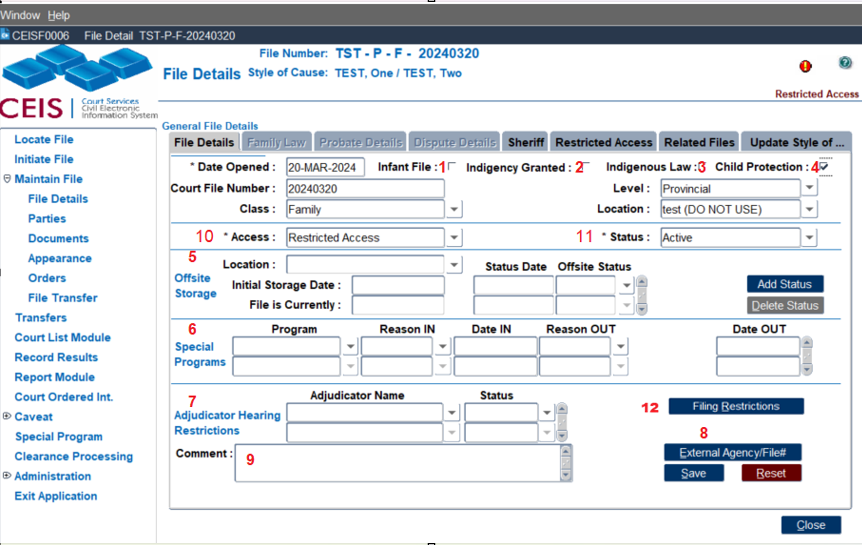 The General File Details is the first tab and must be completed before you can navigate to the others.

**Infant File checkbox** (1)**:**

If the file is an infant settlement file, enable this radio button. An Infant File Report can be generated for all infant files that have this checkbox activated. This is important information for the registry since retention periods differ for infant files.

**Indigency Granted checkbox** (2)**:**

For files where indigency status (fees are waived) is granted.

**Indigenous Law checkbox** (3)**:**

Provincial Family has a new sub class for Indigenous Law files, to discuss Jurisdiction of a child that has been placed into care. Re: Bill 38. When this tick box is active, the Child Protection tick box will also be active.

**Child Protection File checkbox** (4)**:**

In Child Protection files, this radio button must be enabled. Otherwise, the parties will not appear properly on attendance and court lists.

**Offsite Storage** (5)**:**

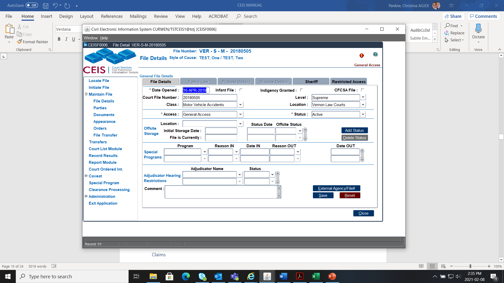Used to help manage and locate older files that have been sent offsite, requested to be brought from offsite storage or paper file destroyed. To add a new offsite status, click the

**Special Programs** (6)**:**

Used to help manage pilot projects within registries (such as fast track projects or Child Support Recalculation). Indicate the "**Date In**" which a file was accepted into a special program, the "**Reason Out**" for the file opting-out of a special program and the "**Date Out"** when the file opted out of a special program.

**Adjudicator Hearing Listings** (7)**:**

Indicates the adjudicator\'s name that is seized, disqualified or has been appealed.

**External Agency File \#** (8)**:**

An optional pop-up button that contains a field of codes for an external agency (such as \"BCFMA\") as well as an optional field used to note the external agency\'s file number

**Comment** (9)**:**

Use this area if required for general, short comments about the file.

The two mandatory fields are \"**Access Level**\" (9) and \"**Status**"(10):

 

**Access Level** (10): Sets any access restrictions to the file as a whole. Access to a file is differentiated between internal users (Court Staff) and external users (Public).

The access levels are:

- **General Access** (All files will have general access with the exception of Supreme Family Law, Provincial Family, and Supreme Adoption.)

- **Temporary Restricted Access** restricts access to a file for a limited time during processing. (Internal users will have full access; external users will only be able to access file numbers (Adoption will be the exception)).

NOTE - By default, all family matters are set to Restricted Access when the file is initiated.

In addition to the above access restrictions, further restrictions may be set by order of the court:

- **Publication Ban** restricts access to internal users only; external users will not be able to view the file.

- **Sealed By Court Order** means neither internal nor external users can view the file. Internal users can check if the file exists in an index but will not be able to view the file data.

**Status** (11)***:*** Indicates the current status of the file.

The status levels are:

*NOTE -* By default, CEIS sets all files as active.

- **Inactive** means the file has been inactive for two years.

- **Concluded** means the file has been closed, and documentation should be on file indicating that no further action will be taken.

- **Transferred out for all Purposes** means the file has been transferred to another location.

**Filing Restriction** (12)***:*** Captures parties where an Order has been made restricting a party from filing documents without leave from the court.

### Family Law Details

NOTE -- The Divorce Act must be entered against a document to activate this tab

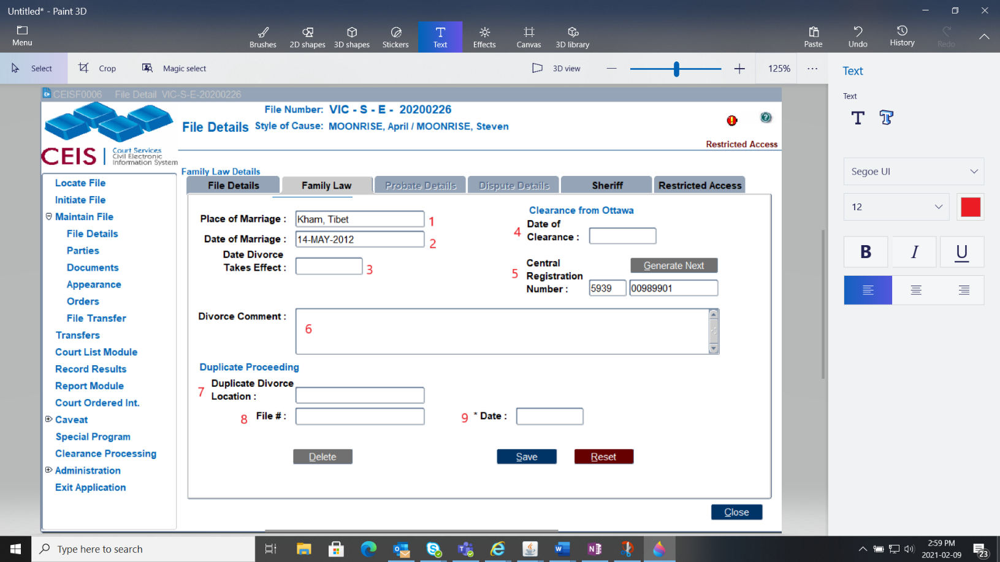

**Place of Marriage** (1)**:**

The location of the city of marriage from the marriage registration or certificate.

**Date of Marriage** (2)**:**

The date of the marriage registration or certificate.

**Date Divorce Takes Effect** (3)**:**

The date of divorce.

**Date of Clearance** (4)**:**

Date the clearance was obtained.

**Central Registration Number** (5)**:**

This is the Central Registry ID provided by the federal government. (CEIS automatically assigns the 4-digit prefix particular to your registry, and then generates the next sequential 8-digit number particular to your location.)

**Comment** (6)**:**

Use this area if required for general, short comments.

**Duplicate Divorce Location** (7)**:**

If there are duplicate divorce proceedings, enter the location here.

**Ref File#** (8)**:**

The file number of duplicate divorce proceedings.

**Date** (9)**:**

The date of the duplicate divorce proceedings file.

### Related Files Tab

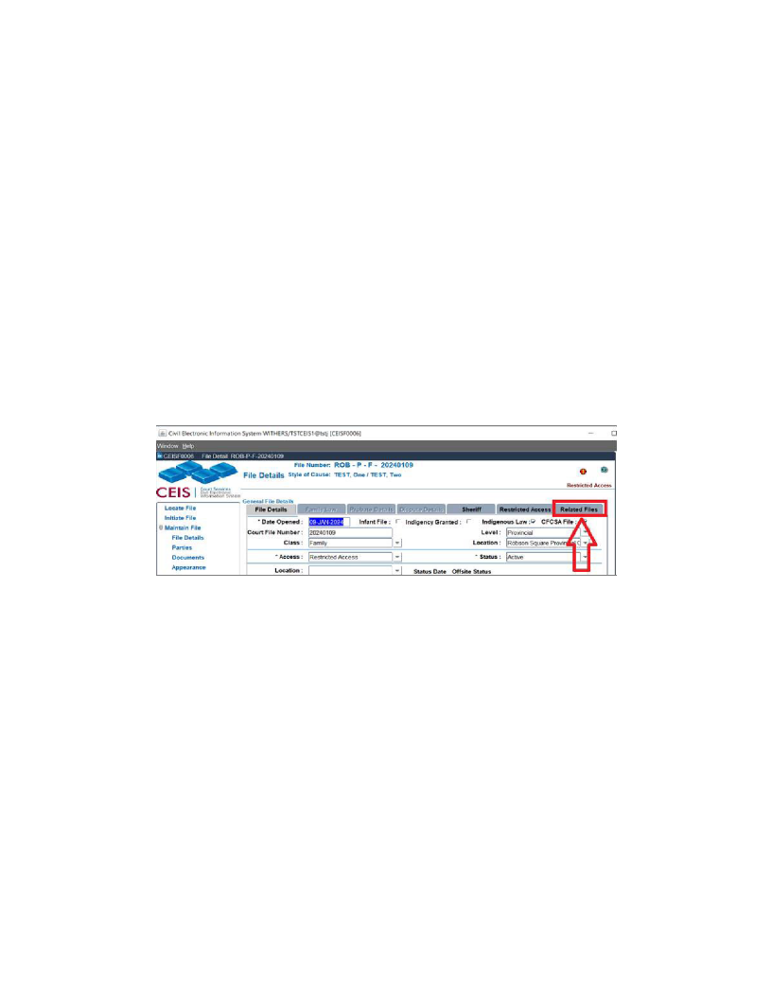We use this Tab to link a Provincial Family Indigenous Law File to the CFCSA File.

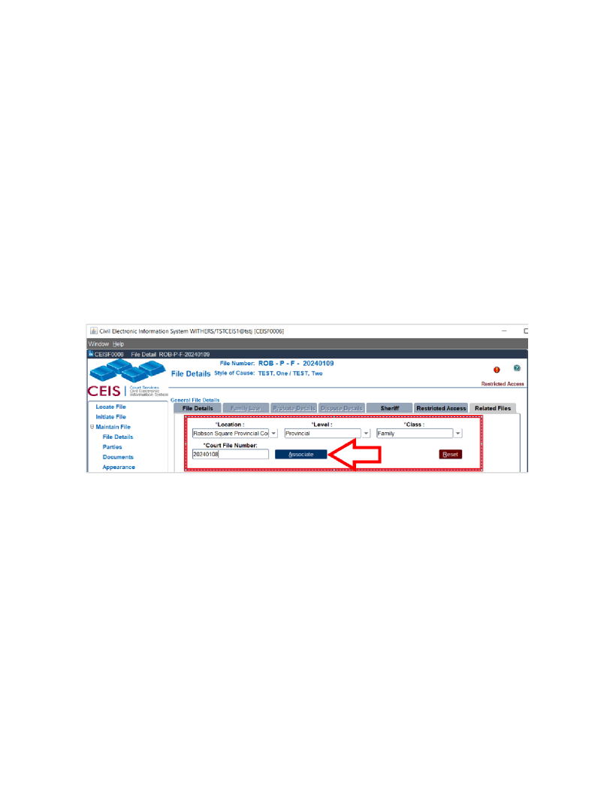In the Indigenous Law file tab, click on the Related Files Tab and enter the information, then click Associate:

If you want to take it a step further, you can now open the original CFCSA file that you linked to, you'll see a big red flag on the top right that says, *Indigenous Law File Exists*.

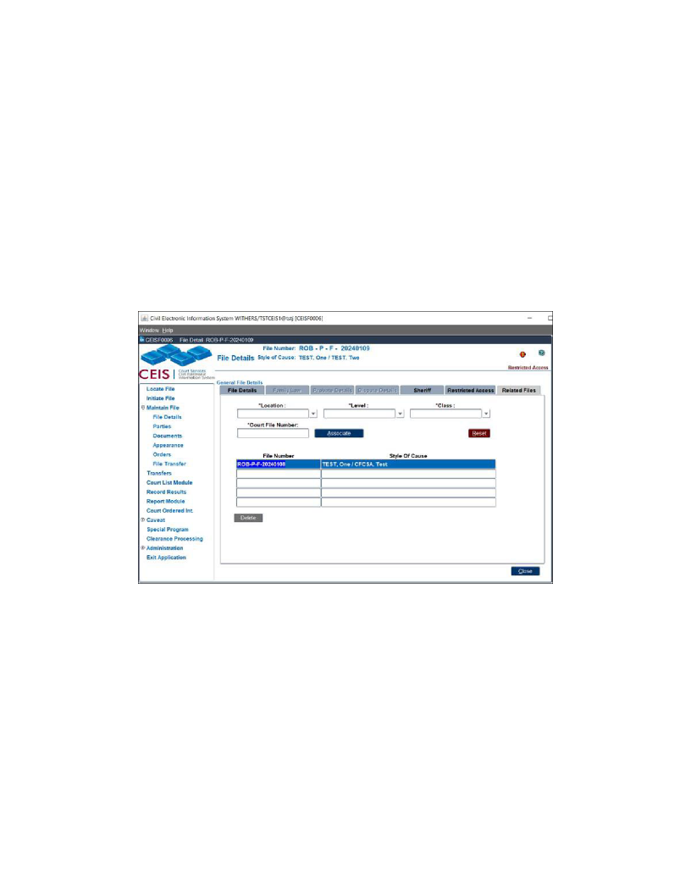Please note, it is possible to associate multiple Indigenous Law files to a single CFCSA file. The other way is not possible, you cannot associate a CFCSA file to an Indigenous Law file. It can only be done in the Indigenous Law file.

### Filing Restriction

After an Order has been made restricting a party or parties from filing documents without leave from the court, go to the File Details screen in the file:

Click on Filing Restrictions:

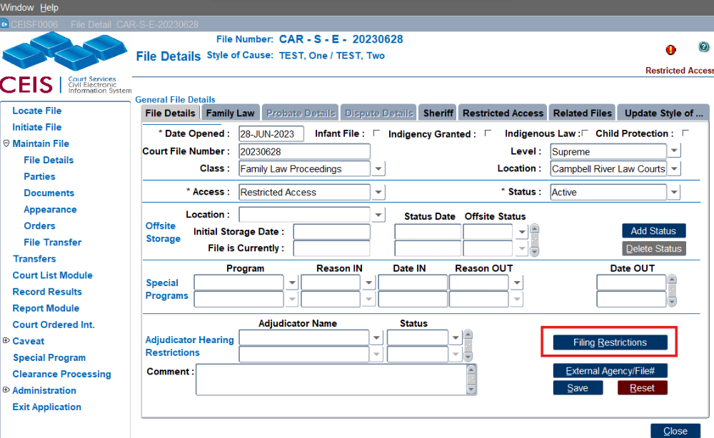

Select who is restricted (if it is all parties, you will need to do this for each party), the date the restriction begins (generally same date as the order), and if an end date is provided enter that as well (or go back to here if there is a new order removing the restriction):

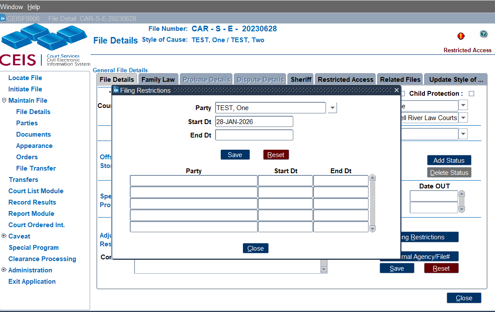

Click Save then Close.

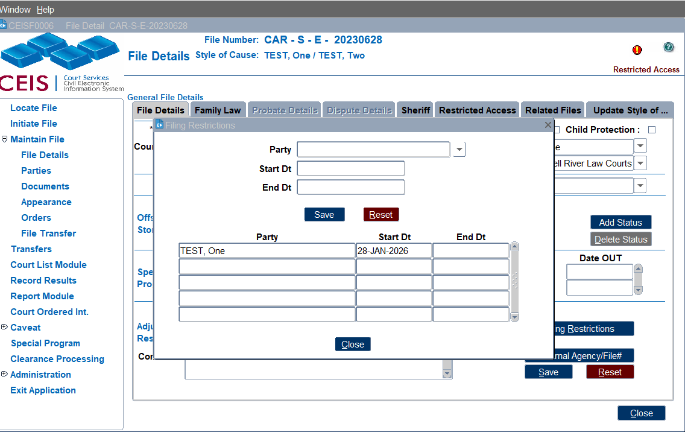

When someone enters the file, this pop up will now appear:

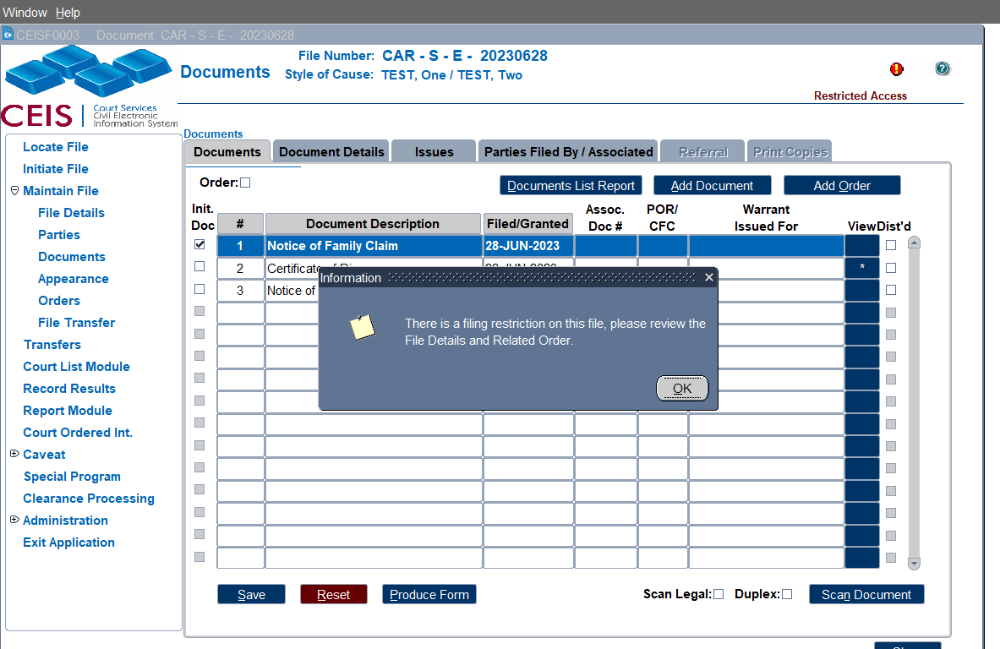

### Parenting After Separation

CEIS CODES (PAS) Parenting After Separation Certificate and (PASE) Parenting After Separation Exemption.

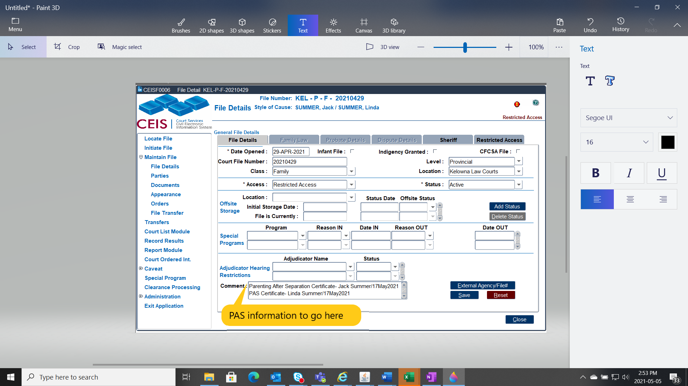Enter **WHO** completed the PAS program (or received an exemption) and **WHEN** in the **File Detail's Comment area**.

### Adding the FIS2 Number

If you are an **ERP location or Family Justice Registry**, we need to make sure the "Family ID" number for FJSD is entered in the **External Agency/File#** pop up on the **File Details** tab.

A pop up will appear as a reminder to do this.

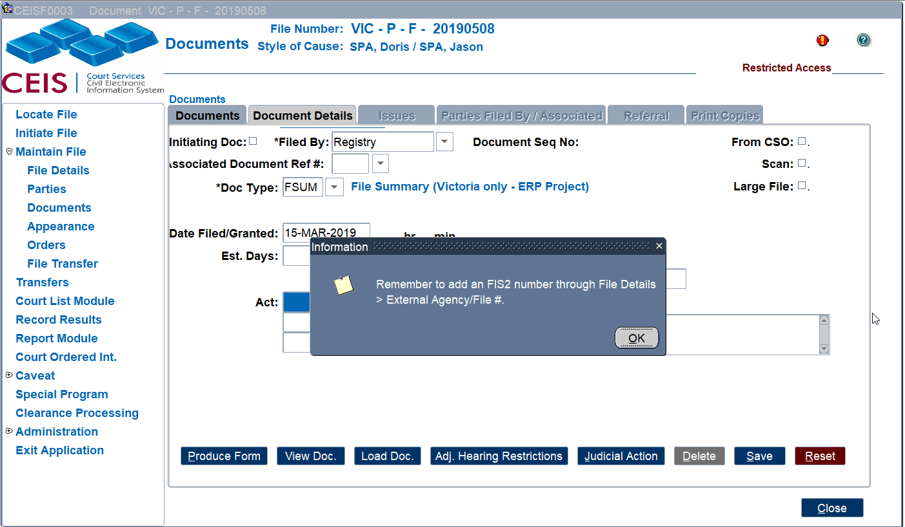

### Probate Details

NOTE -- The "Date of Grant" and "Additional information: cannot be entered yet.

**Assets Declared** (1)**:**

The dollar value of the estate.

**Original Probate Fee** (2):

This is automatically calculated based on a formula identified in the processing rules.

**Date Entered** (3)**:**

The date the probate was granted.

**Additional Assets Declared** (4)**:**

A declaration of additional assets located after Probate was granted.

**Additional Fee** (5)**:**

A revised fee amount covering the additional assets.

**Total Estate Value** (6)**:**

The total dollar value of the estate for assets within BC.

**Assets Outside BC** (7)**:**

Assets that are situate outside of BC - no fees payable on these.

**Probate Comments** (8):

Enter any pertinent comments.

**First Responder** (9):

Tick if the 1^st^ Responder Memorial Grant is applicable.

### **Caveat Details**

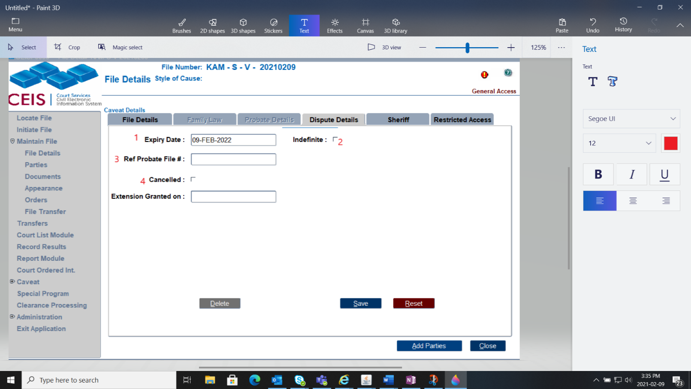

**Caveat Expiry Date** (1)**:**

This is automatically calculated to expire 12 months after the caveat is filed.

**Indefinite** (2):

If there is an indefinite expiry date, enable this radio button. This will disable the automatic expiry date calculation.

**Ref Probate File** (3):

If there is a cross-reference file number to a Probate file, enter that number here.

**Caveat Cancelled** (4):

If the caveat has been withdrawn or cancelled, enable this radio button.

### Sheriff Details

Finally, there\'s an optional tab called **Sheriff**. Use this area if required for sheriff comments and/or alerts about this file.

Any text entered in this field will print in a Sheriff Report, which can be accessed in the [[COURT LIST MODULE](#court-list-module).]

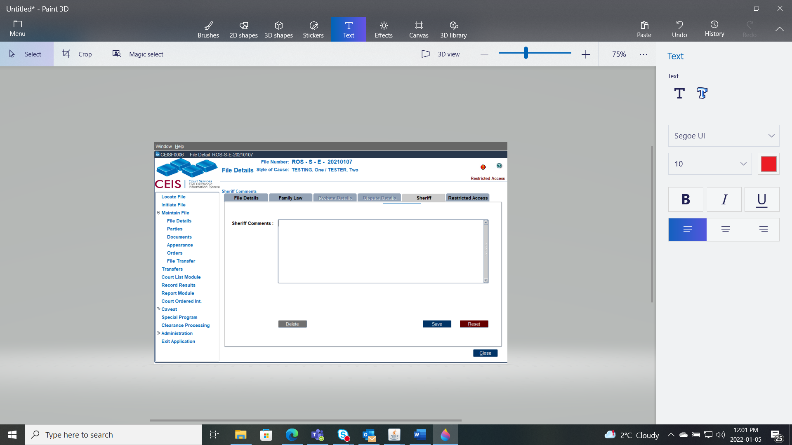

