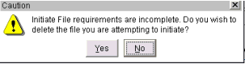
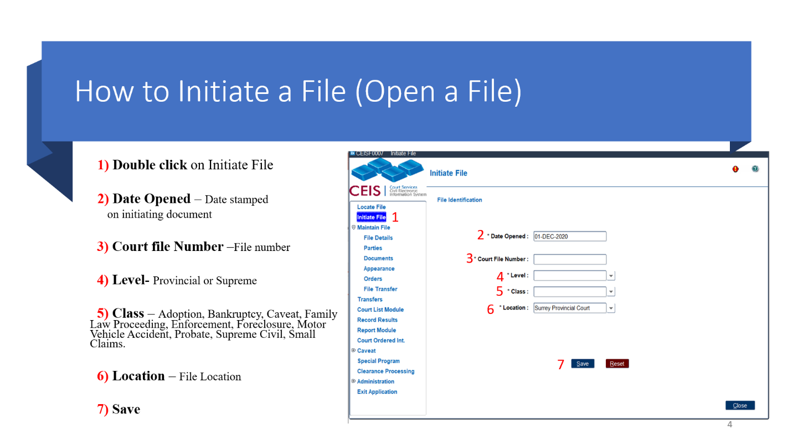

## INITIATE A FILE

Specific mandatory data must be entered before a new file can be saved.

CEIS will check that the following details have been entered:

- File Details

- Party and Role (at least one party and role)

- Initiating Document

If you abandon the Initiate File sequence without having entered the above minimum details, this warning message will appear:

If you select \"Yes\", the file will be deleted from the database and all details must be entered again from the beginning. If you select \"No\", the screen stays open so you can continue initiating the file.

### How to Initiate a File

The first step in initiating a file is to record the file identification details.

NOTE - All the fields in the File Identification screen are mandatory

NOTE -- The Date opened should never be AFTER the filed date of the initiating document. They should be the same day. The only exception to that rule is file amalgamation and the initiating document on the amalgamated file will be different that the new file.

1.  **Court File Number**: The file number that corresponds to the physical file jacket in your registry. This field uniquely identifies a file across the province. (At this time, exactly how new files are to be numbered is left to the discretion of individual regions.)

2.  **Level**: The level of court: Supreme (S) or Provincial (P).

3.  **Class**: This is the file type.

When initiating a Provincial Court civil file, the following classes must be used:

  ----------------------------------------------------------------------------
  C   Small Claims                       F   Family
  --- ------------------------------ --- --- ---------------------------------
  M   Motor Vehicle Accidents            L   Enforcement/Legislated Statutes

  ----------------------------------------------------------------------------

NOTE - Class \"D\" is the old divorce class, so it should not be used for any new family/divorce files. However, it\'s referenced in the documentation because you\'ll still see your old files in CEIS

+---+---------------------------------+---+------------------+------------------------------+
| B | Bankruptcy and Insolvency       |   | N                | Adoption                     |
| --- | --- | --- | --- | --- |
+===+=================================+===+==================+==============================+
| E | Family Law Proceeding           |   | P                | Probate and Administration   |
| --- | --- | --- | --- | --- |
+---+---------------------------------+---+------------------+------------------------------+
| H | Foreclosure                     |   | S                | Supreme Civil General        |
| --- | --- | --- | --- | --- |
+---+---------------------------------+---+------------------+------------------------------+
| L | Enforcement/Legislated Statutes |   | V                | Caveat                       |
| --- | --- | --- | --- | --- |
+---+---------------------------------+---+------------------+------------------------------+
| M | Motor Vehicle Accidents         |   |                                                 |
| --- | --- | --- | --- |
+---+---------------------------------+---+-------------------------------------------------+

4.  **Location**: The default location is entered automatically, but you can select another location if required.

5.  **SAVE**: It\'s important to note that once you\'ve filled in the *File Identification* details, you\'ll be using the **Maintain File** screens to enter the rest of the data and complete the file initiation. These are the exact same screens used for working with existing files.

NOTE - When initiating a new Provincial or Supreme Court civil file in CEIS, use numeric values only. CEIS does not accept alpha characters in the File Number field for new files.

### Re-Initiating Old or Destroyed Files

In the event you find yourself in a circumstance where a file that was properly destroyed after 25+ years and is not in CEIS but is being resurrected and has an upcoming hearing date in a court location. How should you manage this?

Although there are no real statistical requirements, we recommend initiating the file under the original file number. Although the physical file has been destroyed, once a \'case\' has a number it should keep it wherever possible, providing it\'s still in the same level and class.

In the File Details Comment section, fill in the detailed that this file is being resurrected and was originally opened in DayMonthYear.

The purpose is to have a full story of the file within the file, and also as this is new action on the file, we should have a newer date to re-set possible retention time frames for this file.

As for the Documents, if we are accepting old documents, enter them as the date of the new opened date, and in the Document Detail Comments, place the original filing date if known.

### Provincial Family Files

The Provincial Family umbrella has grown with a variety of different types of family files.

Demystify the changes with this table to ensure you are choosing the correct type of file:

+--------------------+--------------------------------------------------------------------------------------------------------------------------------------------------------------------------------------------------------------------------------------------------------------------------------------------------------------------------------------------------------------------------------------------------------------------------------------------------------------------------------------------------------------------------------------------------------+
|                    | **PROVINCIAL FAMILY FILE TYPES**                                                                                                                                                                                                                                                                                                                                                                                                                                                                                                                       |
| --- | --- |
+====================+=======================================================================+============================================================================================================================+=========================================================================================================================================================================================+=========================================================================================================================================================+
| **TYPE**           | **Family Law Act**                                                    | **Child, Family, Community and Services Act** *(Director (government) removes child from guardian due to safety concerns)* | **Indigenous Law Files** *(one or more disputes on who has jurisdiction of a child who has been removed by the Director, the Director or Indigenous community who has filed a dispute)* | **Cowichan Files  **(The Chief Executive Officer who is in need of the courts assistance with a family/child who is under the care of the Cowichan Law) |
| --- | --- | --- | --- | --- |
|                    |                                                                       |                                                                                                                            |                                                                                                                                                                                         |                                                                                                                                                         |
|                    | *(mom v dad -- child support, parenting time, protection orders etc)* |                                                                                                                            |                                                                                                                                                                                         |                                                                                                                                                         |
+--------------------+-----------------------------------------------------------------------+----------------------------------------------------------------------------------------------------------------------------+-----------------------------------------------------------------------------------------------------------------------------------------------------------------------------------------+---------------------------------------------------------------------------------------------------------------------------------------------------------+
| **ACT**            | Family Law Act (FLA)                                                  | CFCSA                                                                                                                      | Splatsin Law                                                                                                                                                                            | Snuw\'uy\'ulhtst tu Quw\'utsun Mustimuhw u\' tu Shhw\'a\'luqwa\'a\' i\' Smun\'eem                                                                       |
| --- | --- | --- | --- | --- |
|                    |                                                                       |                                                                                                                            |                                                                                                                                                                                         |                                                                                                                                                         |
|                    |                                                                       |                                                                                                                            | Sts'ailes Law                                                                                                                                                                           |                                                                                                                                                         |
|                    |                                                                       |                                                                                                                            |                                                                                                                                                                                         |                                                                                                                                                         |
|                    |                                                                       |                                                                                                                            | Gwa'sala-'Nakwaxda'wx Law                                                                                                                                                               |                                                                                                                                                         |
|                    |                                                                       |                                                                                                                            |                                                                                                                                                                                         |                                                                                                                                                         |
|                    |                                                                       |                                                                                                                            | Cowichan Law                                                                                                                                                                            |                                                                                                                                                         |
|                    |                                                                       |                                                                                                                            |                                                                                                                                                                                         |                                                                                                                                                         |
|                    |                                                                       |                                                                                                                            | Huu-ay-aht Law                                                                                                                                                                          |                                                                                                                                                         |
|                    |                                                                       |                                                                                                                            |                                                                                                                                                                                         |                                                                                                                                                         |
|                    |                                                                       |                                                                                                                            | Tsilhqot'in Law                                                                                                                                                                         |                                                                                                                                                         |
+--------------------+-----------------------------------------------------------------------+----------------------------------------------------------------------------------------------------------------------------+-----------------------------------------------------------------------------------------------------------------------------------------------------------------------------------------+---------------------------------------------------------------------------------------------------------------------------------------------------------+
| **ROLES**          | Party/Other Party                                                     | Applicant (Director)/Child                                                                                                 | Applicant/IA (Indigenous Authority)                                                                                                                                                     | Applicant (CEO)/Smun'eem                                                                                                                                |
| --- | --- | --- | --- | --- |
+--------------------+-----------------------------------------------------------------------+----------------------------------------------------------------------------------------------------------------------------+-----------------------------------------------------------------------------------------------------------------------------------------------------------------------------------------+---------------------------------------------------------------------------------------------------------------------------------------------------------+
| **INITIATING DOC** | FLC/AAP/ACMO/ACMW/AEA/AEC/AFCO/AFET/AFET/AGSW etc. 😊                 | REP/AFO                                                                                                                    | AOIL/ASCC                                                                                                                                                                               | APH/AROD                                                                                                                                                |
| --- | --- | --- | --- | --- |
+--------------------+-----------------------------------------------------------------------+----------------------------------------------------------------------------------------------------------------------------+-----------------------------------------------------------------------------------------------------------------------------------------------------------------------------------------+---------------------------------------------------------------------------------------------------------------------------------------------------------+
| **FLAGS**          | None                                                                  | Child Protection (aka CFCSA)                                                                                               | Indigenous Law and Child Protection (aka CFCSA)                                                                                                                                         | Child Protection (aka CFCSA)                                                                                                                            |
| --- | --- | --- | --- | --- |
+--------------------+-----------------------------------------------------------------------+----------------------------------------------------------------------------------------------------------------------------+-----------------------------------------------------------------------------------------------------------------------------------------------------------------------------------------+---------------------------------------------------------------------------------------------------------------------------------------------------------+

