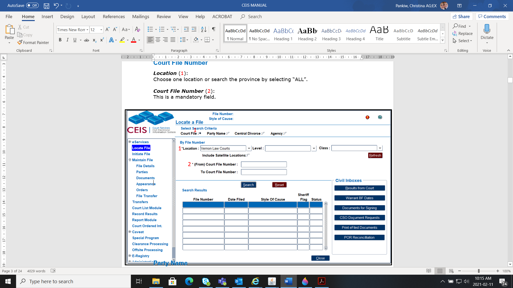
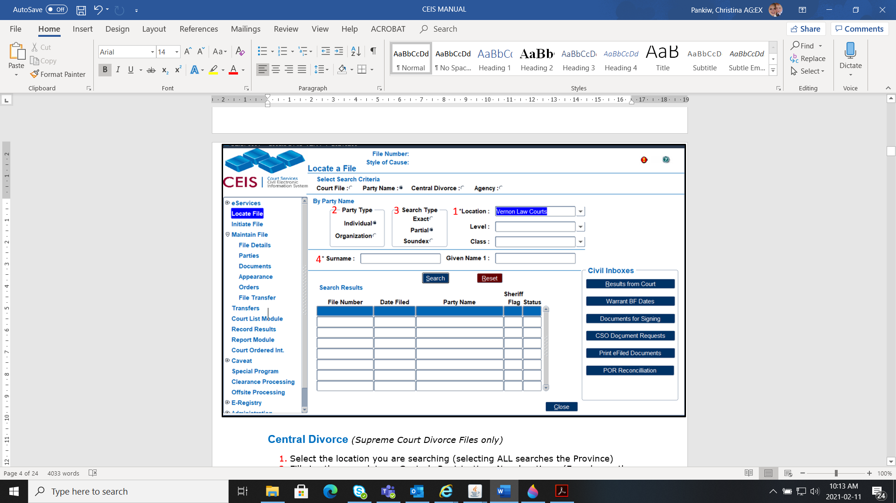
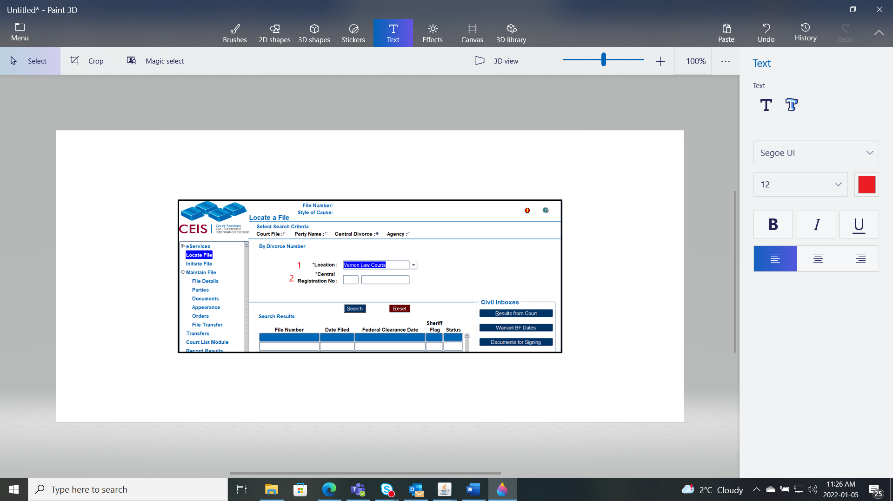
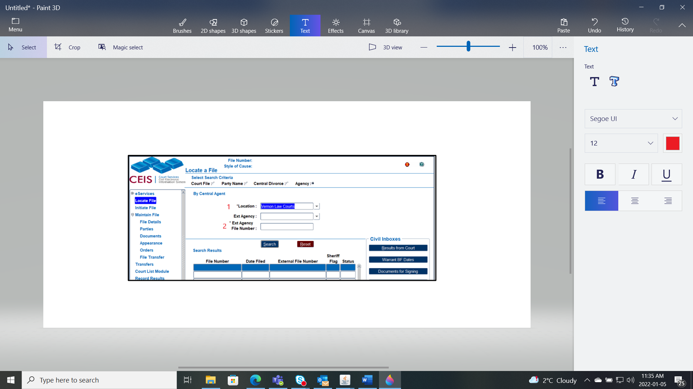
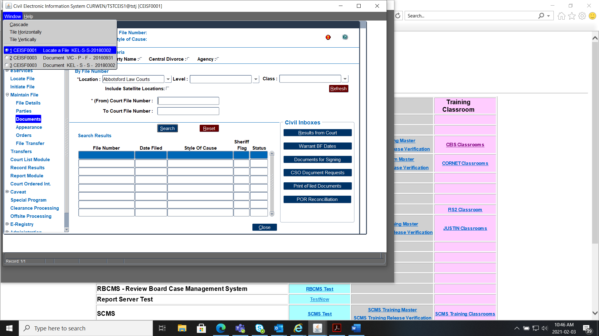
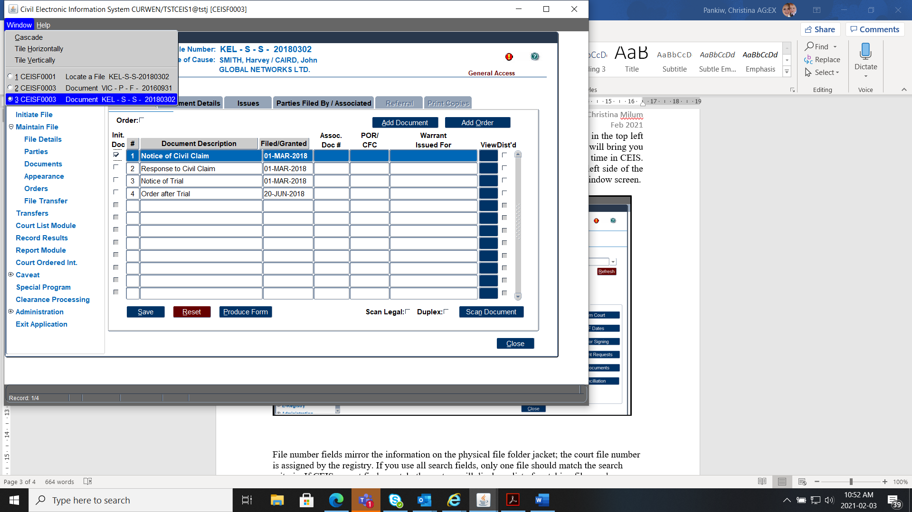
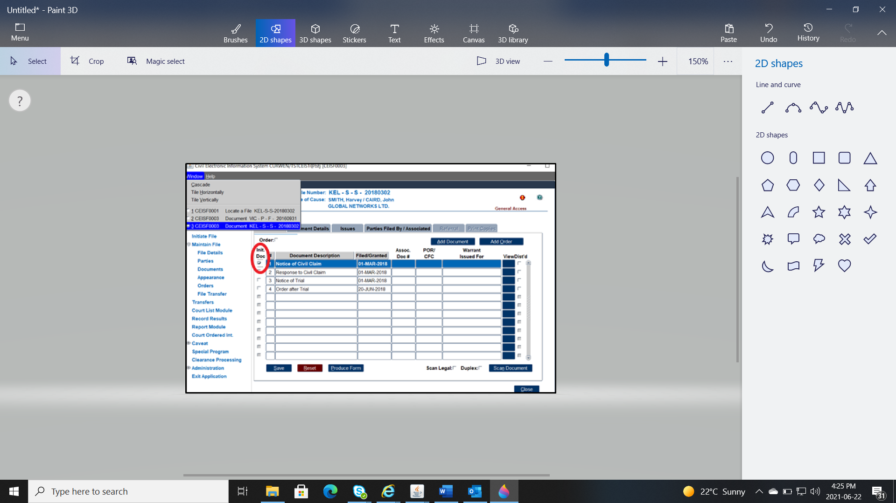

## LOCATE A FILE

There are **4** ways you can locate (or search) a file in CEIS.

### Court File Number

**Location** (1):

Choose one location or search the province by selecting "ALL".

**Court File Number** (2):

This is a mandatory field.

### Party Name

**Location** (1):

Choose one location or search the province by selecting "ALL".

**Individual or an Organization** (2):

You can search by party name or organization.

**Search Type** (3):

You can select to search the name partially or exact

**Surname (or Organization)** (4):

Fill in the party's information in the and optional Given Name field.

### **Central Divorce** (Supreme Court Divorce Files only*)*

**Location** (1):

Choose one location or search the province by selecting "ALL".

**Central Registration No*.*** (2):

Fill in the mandatory location. (Found on the Registration of Divorce proceeding document or Clearance Certificate)

### **Agency** *(BCFMA or ISO Files)*

**Location** (1):

Choose one location or search the province by selecting "ALL".

**Ext. Agency File Number** (2):

This number provided by the agency. This will only locate files that this agency number data entered in the [**FILE DETAILS**](#file-details).[**General File Details**](#general-file-details)

### After Locating a File

Highlight the file with the blue line and double-click a menu item from the Left Sidebar Menu to access further details.

To work on multiple files or keep a file open in the background, click on **Window** in the top left side of the title bar, and click on **1 CEIS F0001 Locate a File**. This will hold the other files and will bring you to the Location File Screen in CEIS so you can search a new file.

A maximum of **six** windows can be open at a time in CEIS. To check how many windows you have open, click again on **Window** in the top left side of the title bar and review your list.

To navigate to the other files, select the files in the Window screen.

### Style of Cause

If the style of cause does not appear in the header or print on the court lists, the party roles entered do not match the initiating document. Review the initiating document and change the roles accordingly.

For a list of initiating documents and their corresponding roles see the [**Party Roles**](#party-roles).

The other cause is the Initiating Document box is not ticked.

