## PARTIES

In CEIS, the fields for data entry of names will change depending on whether you are entering an individual or an organization. For individuals, there is a separate Surname field, followed by three Given Name fields. For organizations, there is one long data entry field only.

NOTE -- We understand that there may be situations where the named parties are impossible to duplicate in the system.

In these circumstances where best practice cannot be followed, registry staff must use their discretion and still maintain the integrity of the data.

If the CEIS Style of Cause does not match the document, it can be edited before the Order or document, check out how [here](#how-to-produce-adobe-forms-in-ceis).

### Name Format

**Individuals**

Enter the party's SURNAME (uppercase) and Given Name (first letter uppercase).

*NOTE --* Documents do not include the name title (such as Mr., Mrs., or Dr.) since it does not form part of the legal name.

Therefore, do not enter name titles in CEIS.

**Change of Individual's Name Pursuant to Court Order**

If an order is made granting a change of name, the best practice to follow is:

1.  In the *Parties* screen, highlight the party against whom the order applies.

2.  In the *Party Details* screen, deactivate that party by clicking the \"Active\" button, and save.

3.  In the *Party Roles* screen, highlight the appropriate role of the party to be deactivated and double-click. Deactivate that party role by clicking the \"Active\" button and save.

4.  In the *Parties* screen, click the \"Add Party & Roles\" button.

5.  In the *Party Details* screen, add the details of the new party name, and assign the appropriate role in the *Party Roles* screen.

6.  Click the *Also Known As* tab and enter the previous name, using the code \"PKA\" for previously known as, unless the name change is for a divorce file. For a divorce file, click the *Also Known As* tab and enter the new name using the code \"NKA\" for \"now known as\", so the married name (former name) appears before the current name when a Certificate of Divorce is printed.

*NOTE --* Inactive parties do not display in the style of cause, header of CEIS screens, or on daily court lists, additions lists, completed court lists or attendance lists.

**Children's Names**

*NOTE -- Child, Family, Community and Services Act* files capture the Children's name and date of birth in the Party Details screen as an Individual party, **not** in this Children on File Screen.

**Counsel Name**

Proper format to add Counsel's name is SURNAME, Given Name as seen below.

**Do Not** add in Law Firm Name, Articling Student etc next to their name as it will create an error within CEIS.

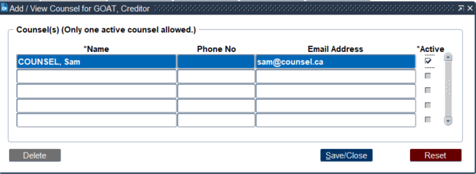

**Organizations**

There is a list of values to choose from for common organization names.

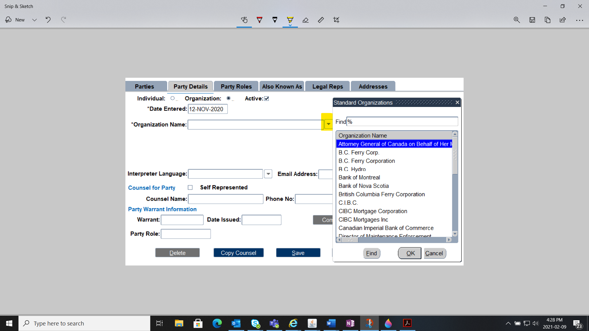

If the organization is not located in this list, you must manually enter the name in CEIS. Organization names will appear as all uppercase in the database.

*NOTE --* Include all punctuation as it appears on the document for example, "LTD."

### Party Details

To add party information when initiating a file click **Add Parties** at the bottom of the **File Details** screen.

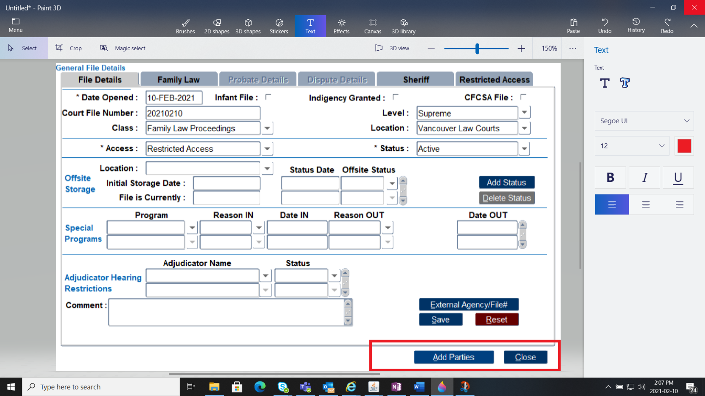

Of the six tabs in this Party Details section, only two are mandatory - **Party Details** and [**Party Roles**](#party-roles).

This Party Details tab must be filled in before you can proceed to the next tab.

*NOTE --* All mandatory fields have and asterisk (\*) beside them

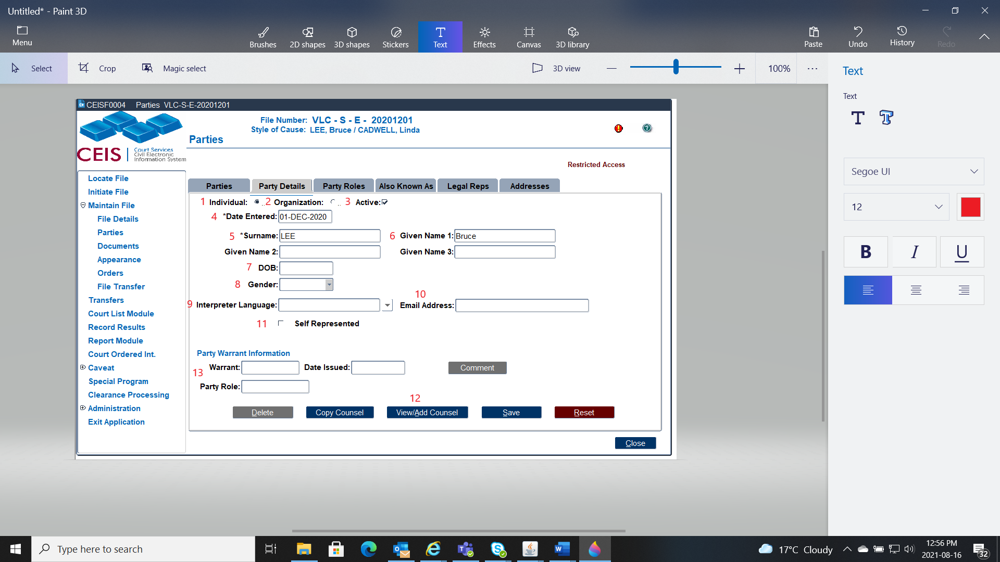

**Individual** (1):

Select this radio button if the party is an Individual

**Organization** (2)**:**

Select this radio button if the party is an Organization

**Active** (3):

This checkbox indicates whether the party is active or inactive.

**Date Entered** (4):

The date the party is entered into the file.

**Organization or Surname** (5) **and Given Name** (6):

If the party is an individual, enter the Surname and Given Name; if it\'s an organization, enter the organization name. Review the [Name Format](#name-format) section for best practices on data entry.

**Date of Birth (DOB) or Date of Death (DOD)** (7):

Records the party\'s date of birth or death.

**Gender** (8):

If identified, select from the drop-down list.

**Interpreter Language** (9):

If an interpreter is required, enter the language spoken.

**Email Address** (10):

If provided, enter the parties email address.

**Self Represented Checkbox** (11):

If the party is self-represented, tick this check box.

**Counsel for Party** (12):

If the party is represented by counsel capture the name of the lawyer or law firm, the telephone number and email address, if provided.

It is best if you use the format SURNAME, First Name.

**Party Warrant Information** (13):

If a [WARRANTS](#warrants) is entered into CEIS, information will be captured here.

*NOTE --* If the same counsel represents more than one party, you can copy their information by utilizing the \"Copy Counsel\" button at the bottom of the screen. Simply select the counsel you wish and click \"Copy.\"

The name and phone number of that counsel will then populate the \"Counsel Name\" and \"Phone No.\" fields.

### Party Roles

The Party Role entered must match the class of file and the initiating document. When documents are entered, CEIS will verify these roles. Not sure which role to choose?

[Check out this cheat sheet!](https://csb.jag.gov.bc.ca/Civil%20Documents/CEIS/ceis-initiating-file-cheat-sheet.pdf)

*NOTE --* If the role is entered incorrectly, the name will not appear in the Style of Cause at the top of the file.

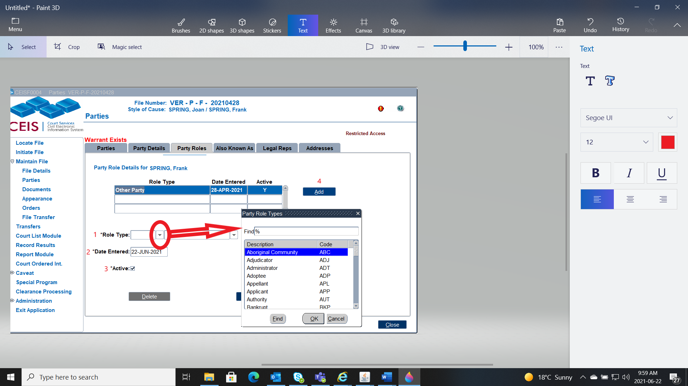

**Role Type** (1):

Select the party\'s role type from the drop-down list.

**Date Entered** (2):

The date the party role was entered.

**Active checkbox** (3):

If the party is inactive, untick this checkbox.

**Add** (4):

*NOTE --* If you have improperly assigned roles for the parties based on the initiating document, an error message will appear indicating that you\'ve chosen the incorrect party roles.

In this case, you must return to the Party Role tab to fix the error.

### Also Known As

It\'s important to note that an alias or AKA is NOT entered as a separate party.

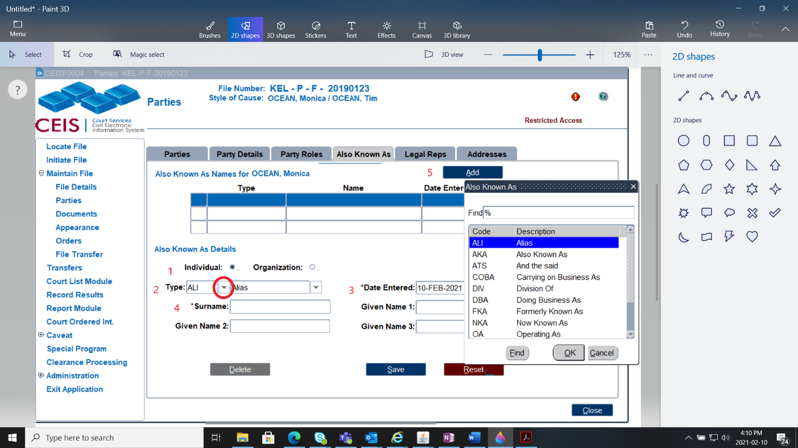

**Individual or Organization** (1):

Indicates whether the party is an individual or an organization.

**Type** (2):

Select the party\'s type of alias name from the drop-down list.

Choose from:

  -------------------------------------------------------------------------
  ALI     Alias                          FKA      Formerly Known As
  ------- ------------------------- ---- -------- -------------------------
  AKA     Also Known As                  NKA      Now Known As

  ATS     And the Said                   OA       Operating As

  COBA    Carrying on Business As        OKA      Otherwise Known As

  DBA     Doing Business As              PKA      Previously Known As

  DIV     Division of                    TRA      Trading As
  -------------------------------------------------------------------------

**Date Entered** (3):

The date the alias name was entered.

**Organization or Surname/Given Name** (4):

If the party is an individual, enter the Surname/Given Name; if it\'s an organization, enter the organization name.

**Add** (5):

Used if the party has a secondary role to the file.

### Legal Reps

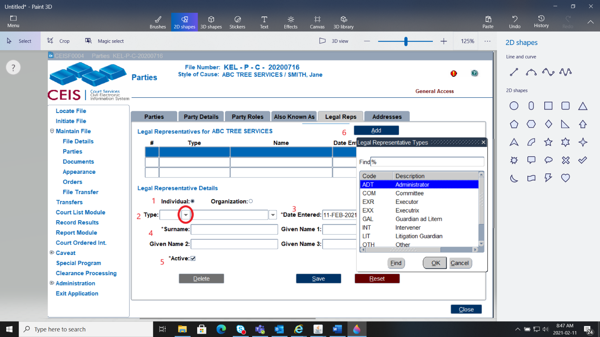A legal representative is best described as an individual who is not counsel for a party, yet they are acting on behalf of an individual or organization. If a legal representative is entered, all fields within this screen become mandatory.

**Individual** or **Organization** (1):

Indicates whether the party is an individual or an organization.

**Type** (2):

Select the type of representative from the drop-down list.

  ------------------------------------------------------------------------
  ADT     Administrator                 INT      Intervener
  ------- ------------------------ ---- -------- -------------------------
  COM     Committee                     LIT      Litigation Guardian

  EXR     Executor                      OTH      Other

  EXX     Executrix                     REC      Receiver Manager

  GAL     Guardian ad Litem             TRU      Trustee
  ------------------------------------------------------------------------

**Date Entered** (3):

The date the legal representative was added to the file.

**Organization or Surname/Given Name** (4):

If the rep is a specific person, enter the surname; if it\'s an organization, enter the company name.

**Active checkbox** (5):

If the legal representative is inactive, untick this checkbox.

**Add** (6):

Used if the Legal Representative has a secondary role to the file.

### Addresses

This is the final tab available when initiating a party.

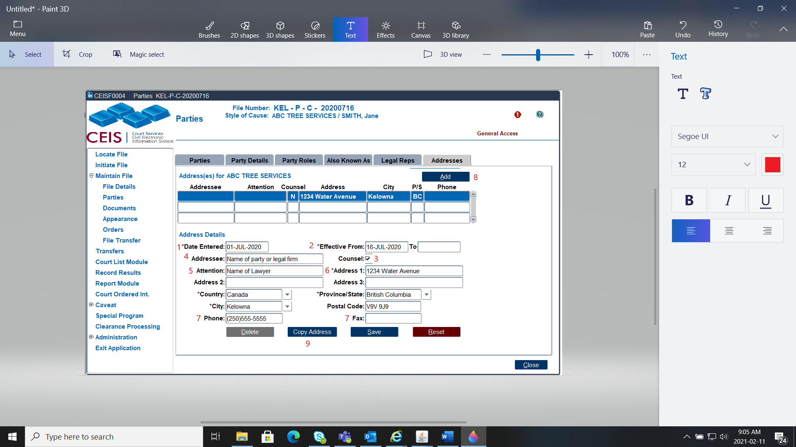

**Date Entered** (1):

The date the address was entered.

**Effective Date From and To** (2):

The date the address is effective from and to. When the party changes addresses, pace a date in the "To" field on the old address.

**Counsel checkbox** (3):

Tick this checkbox if the address entered is counsel\'s address.

**Addressee** (4):

The name of the addressee associated to the address.

**Attention** (5):

Attention line for the addressee, if required.

**Address 1,2, and 3, City, Province/State, Country, Postal Code** (6):

The city will default to the location listed in your user preferences. This field is editable.

**Phone and Fax** (7):

Include the area code for each.

**Add** (8):

To add a new address.

**Copy Address** (9):

If there is more than one party with the same address, you can copy the address using the Copy Address button. Simply select the address you wish to copy and click \"Copy.\" The address will then populate in the Addresses screen

### Party Summary

Now that you\'ve completed all the **Party Details** tabs, you can view the *Parties* \"summary\" screen. This screen shows the most important information about the party including their name, role, and any AKAs, warrants, or protection/firearms orders against them.

On this example you can see that:

The Petitioner, named One TESTING has an AKA and is an active party

The Respondent, names Two TESTING has a Legal Rep and is an active party.

There are no [WARRANTS](#warrants), [PROTECTION ORDERS](#protection-orders) or Firearm Orders.

NOTE -- You can view, enter or update details about the parties (Petitioner and Respondent) by selecting the individual party by clicking on the name and the blue line will indicate which party details will pull in the other tabs (party details, party roles, AKA, LR or Address).

### **Child on File** (Family Law Act Files)

Effective May 17, 2021 **any children on FLA files** who have a counsel representing them will have a field to data enter their counsel's name, email, telephone number and address. "Child on File" with their Counsel's name will appear in CCD and the Child's NAME and Counsel's name will appear on CEIS generated Orders.

**STEPS:**

1.  Enter children on FLA files in the "Children on File" Screen under the Parties tab.

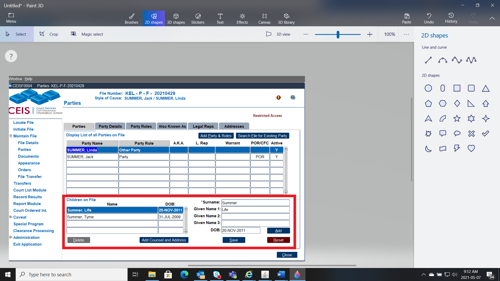

2. If a Notice of Lawyer for Child (NLC) is filed, click on this new button 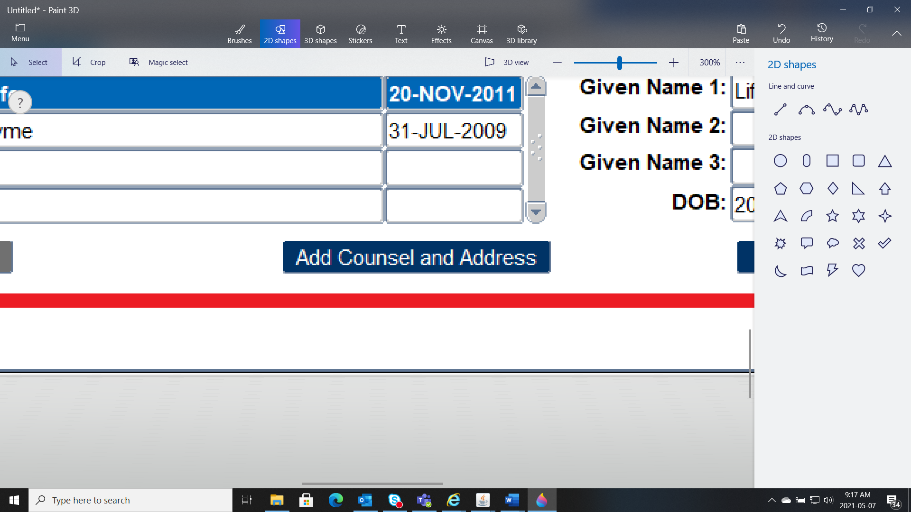 in the Children on File section, to enter in the counsel's information.

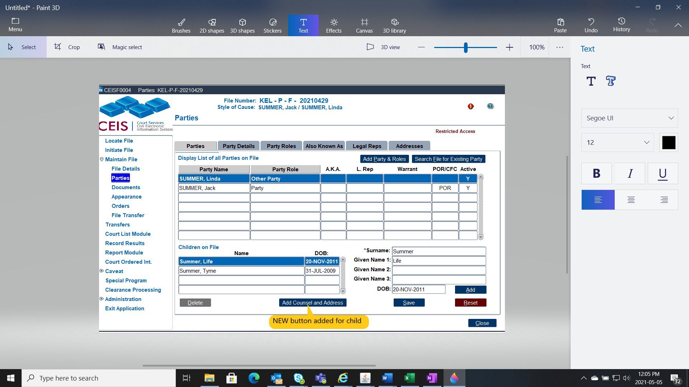

3.  The **Add Counsel and Address** will give you a pop up window. There are **2 sections** that need to be completed.

<!-- -->

1)  Add the counsel's name, phone number and email address. Note the active box is ticked. **There can only be one active counsel for a child***.* If the child change's counsel, the new counsel will be active and will be first on the list.

2)  Add the counsel's physical address.

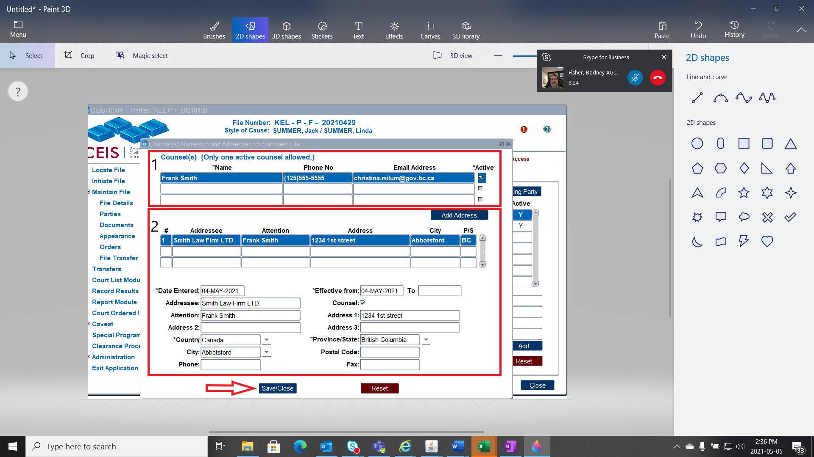Click Save/Close

Example with change of counsel for the child:

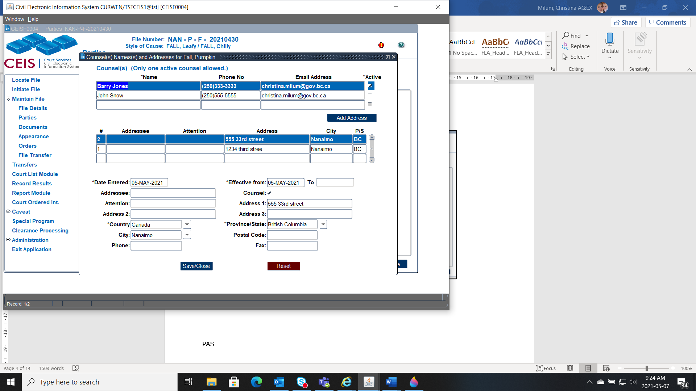

**NOTE -** The only time you will see the child's actual name is on a CEIS Generated Order/Document where counsel for the child is on the file. In CCD, the child's name is protected, and you will see "Child on File". The child's name or counsel will not show in Court or Attendance Lists.

### Changing Party Roles

Any **NEW** file created May 17, 2021 and onward will commence the file with the NEW Party Roles (Party and Other Party).

Any **EXISITING** File (opened before May 17, 2021) that **are** **not** active, we can leave be.

Any files that *are* still active, i.e. filing documents or setting appearances, should be updated to reflect the new party roles.

To do this we deactivate the existing party role (i.e. Applicant) and add a new party role (i.e. Party), we will also need to ensure that multiple roles are not tagged to any future scheduled appearances.

Here are the steps:

1. Go to Parties and take a look at the party roles. *(Party 1, 2, 3, 4, 5, Applicant and Respondent are no longer being used as of May 17, 2021 for Provincial Family Law Act Files.)*

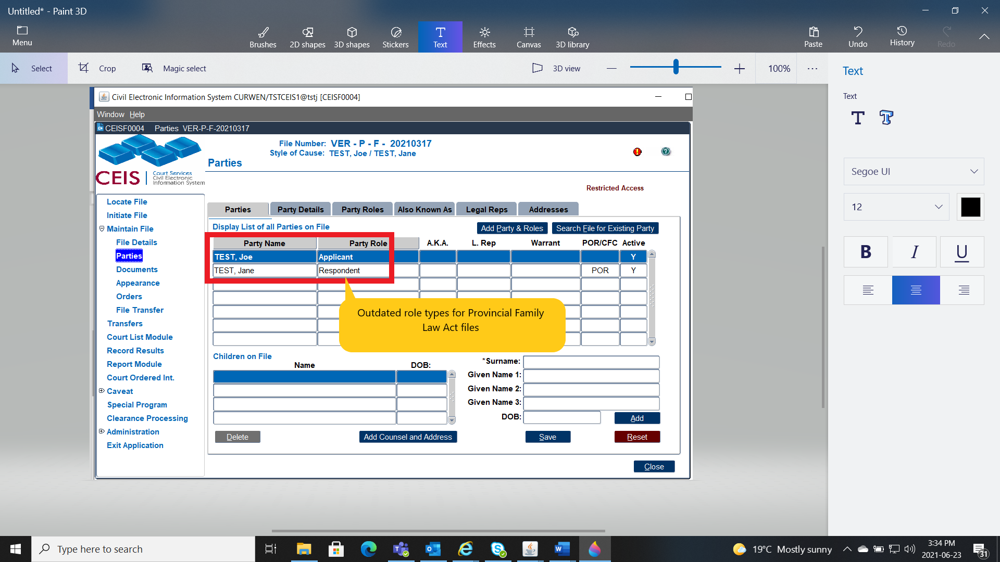

2.  Click on the Party Role Tab and Add the new Role. Then Click Save.

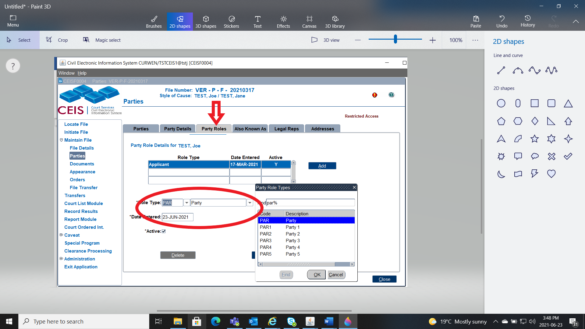

3. Then Double click on the "old" Party Role and deactivate the role by unticking the Active box.

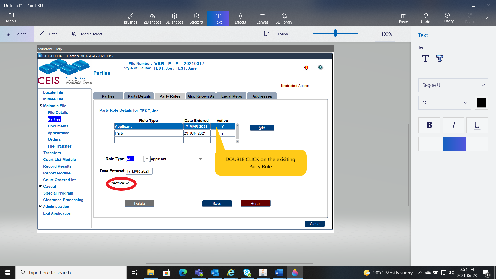

4. Once the Active button is unticked click SAVE. The Active Status will go from **Y** to **N**.

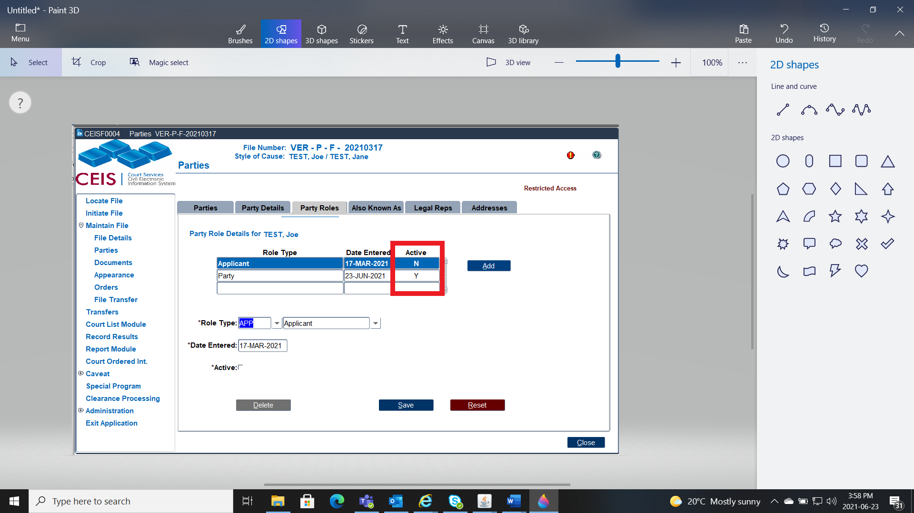

5. Do this same step to the other party, i.e changing Respondent to Other Party.

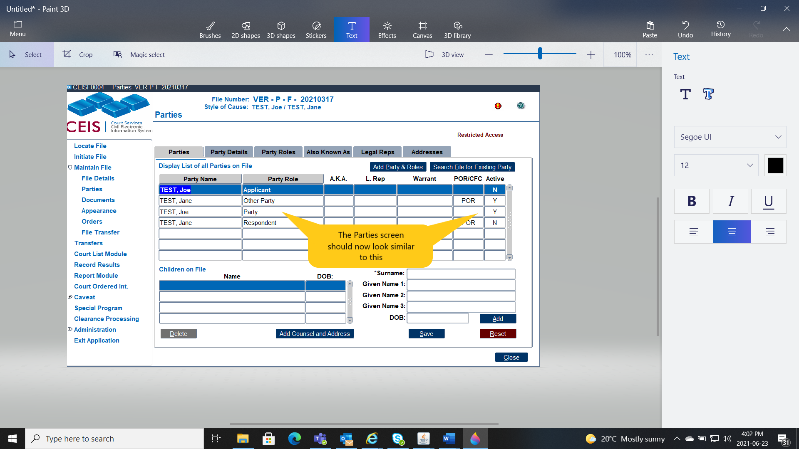

