## RECORD RESULTS

This is a manual process in resulting Appearances. You result individual files by starting in the Appearance Screen of a particular file or if you need to result a full list day of appearances you can get print a Report, named [[Session Exception Report](#session-exception-report).]

### How to manually update Individual Files

1.  Locate the file you need to update and double click on Appearance in the left column, click on the correct date (blue line) and click Record Result.

> 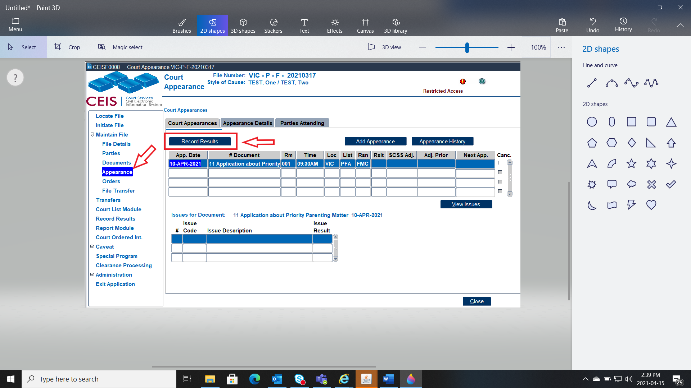

2.  The first step is to update how the parties attended. You can click on the arrow for your options.

> 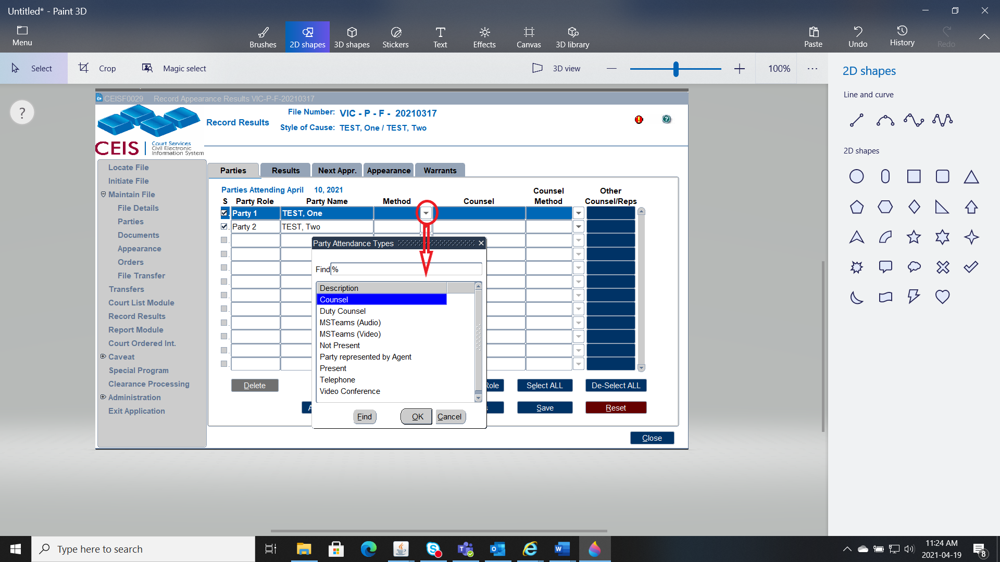

3. Then go to Results:

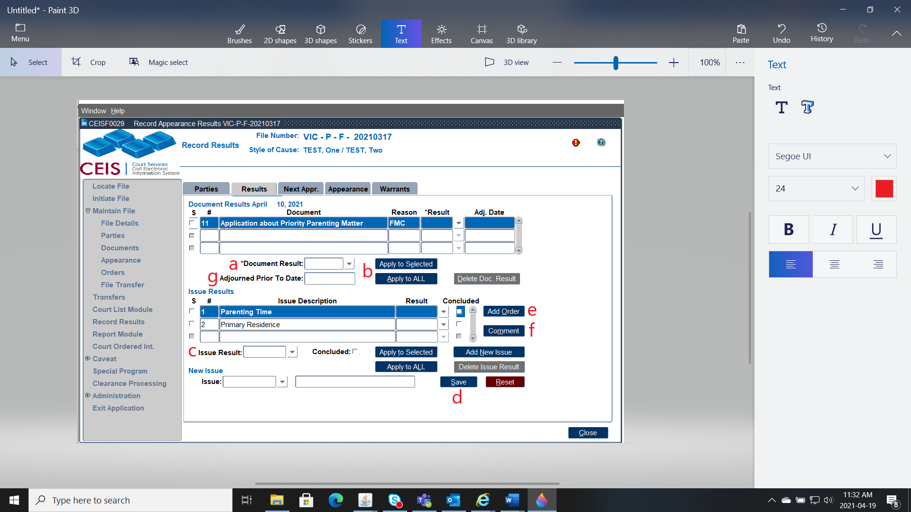

    a)  Add the result of the Application here, whether an Order was Made, if it was adjourned or ended.

    b)  Indicate whether the result is to go to all Applications (if multiple on the court appearance date, or just one).

    c)  Add the result of the individual issues. You can make them all the same or update the issues individually.

    d)  Ensure to click save on the updates.

    e)  If an Order was made please add the Order here.

    f)  If any comments were made that are to go on the Court Summary Sheet, add them here.

    g)  If this date was adjourned prior to the hearing, please enter the date it was Adjourned here -- this takes it off the court list.

> 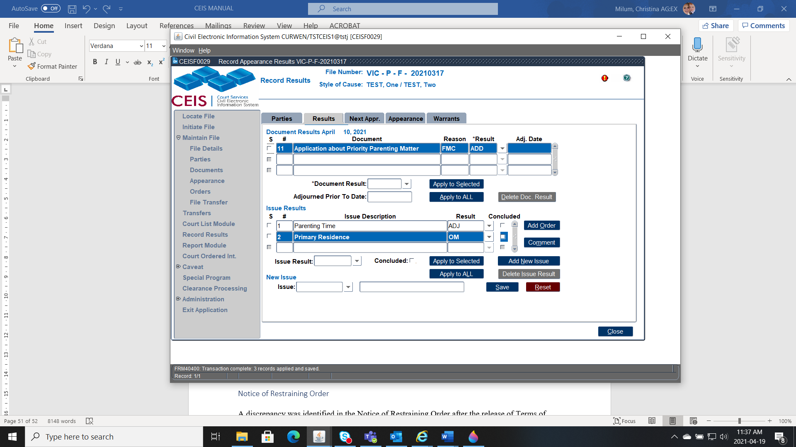*Example*:

4.  If there is an Order, click ADD ORDER and manually enter in the information. Once you "Save" it will take you to the "Order Terms" Screen where you would manually input the Terms of the Order. Then press "CLOSE".

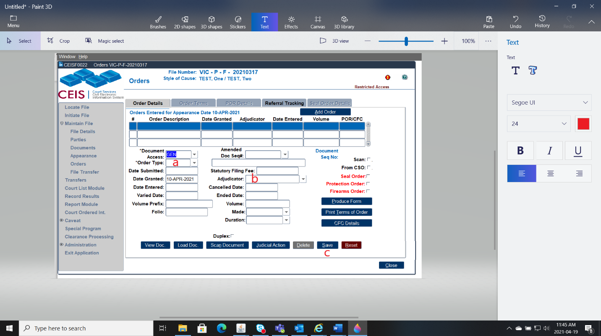

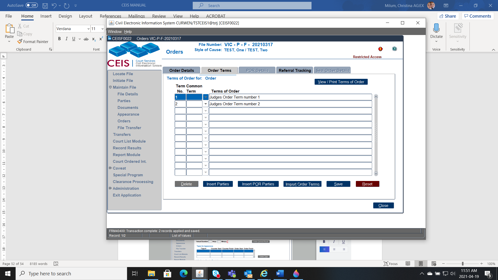

5. Next add the Appearance of the Adjudicator.

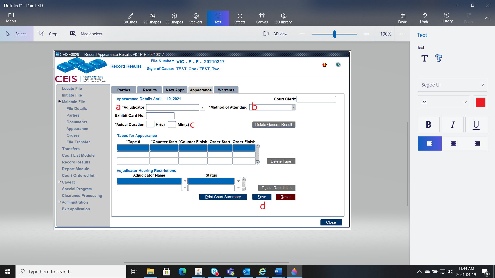

    a)  Indicate who the Adjudicator was on that appearance.

    b)  Indicate how the Adjudicator appeared.

    c)  Indicate how long the appearance took.

From this screen if you are complete, you can print the Court Summary Sheet. If this Application was Adjourned complete the final step.

6.  Next Appearance -- add court details as if you were scheduling the document per normal, you just do not need to indicate which document you are scheduling as it will default:

> 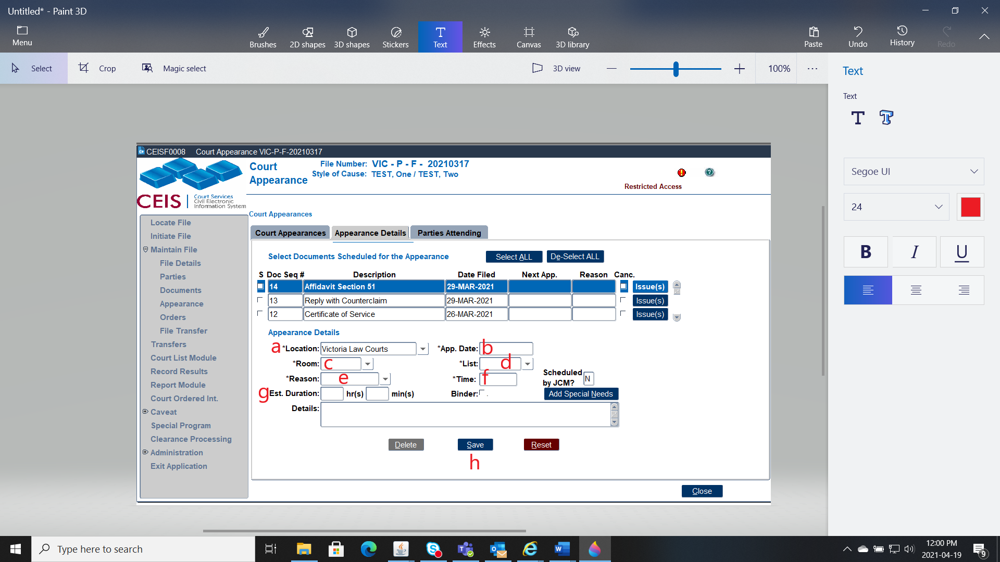

a)  Indicate the Location the Appearance will be heard.

b)  Indicate the Date of the new Appearance.

c)  Indicate the Room number of the new Appearance.

d)  Indicate the List the Application will be heard under.

e)  Indicate the Reason of the Appearance.

f)  Indicate what time the Appearance will be heard.

g)  If a time estimate is known, record that here.

h)  Save this information.

> *Example*:

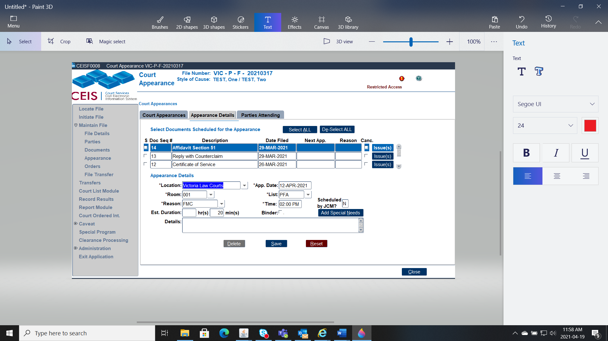

### Reserved Judgments

After an appearance a Judge reserves the right to provide their Judgment on record at a future appearance or in writing by way of Reasons for Judgment.

If the Judge will provide Judgment Orally, a further date will be scheduled in Court. The reason for the next appearance will be **DEC**.

If the Judge will provide Judgment in writing we follow these steps:

1)  The Appearance result will be RJ.

2)  When the Judge completes their Reasons for Judgment, the Original plus copies will be provided to the Registry.

3)  Data enter the Reasons for Judgment as a Document (Code RFJ)

4)  Go to the Appearance Tab, select the Appearance that has the result of RJ, and Record Result.

5)  Via Record Results, go to the Results Tab and add the Order and follow regular processes.

It is important that the Order is added this way, as the Judiciary run Reason for Judgment reports, and this process will remove this Judgment from their list.

### Adjournments Prior To Court Date

To adjourn a document prior to the scheduled date, you must first locate the file

Once you\'ve located the file:

1.  Double click **Appearance** on the left-hand sidebar menu. You\'ll see a table that lists all appearances and/or results for that file.

2.  Click the RECORD RESULTS button.

3.  Click the RESULTS tab.

4.  Enter the details of the adjournment. There are only two fields to complete:

> Document Result (\"END\" or \"ADG\")
>
> Adjourned Prior to Hearing Date (this is the date of adjournment)

5.  Click SAVE.

NOTE - Once these adjournment details have been filled in and saved, the appearance will no longer appear on future court lists.

### Supreme Court Scheduling (SCSS) Adjournments

A reason will accompany the tick in the checkbox under "Canc." If SCSS has cancelled an appearance.

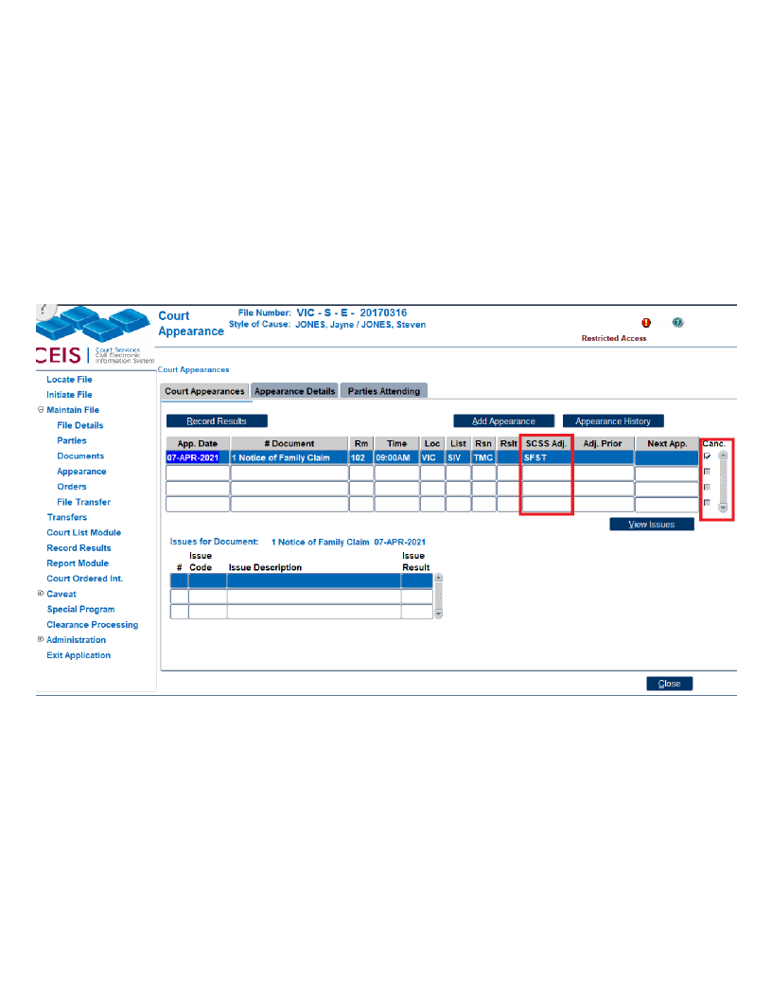

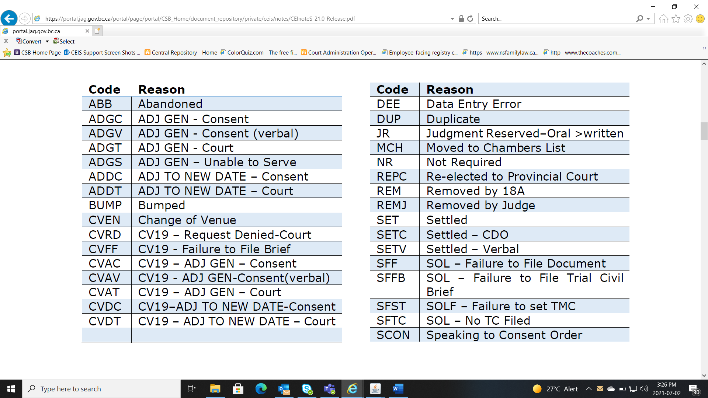**SCSS Codes** (also can be found on the [CEIS CODE TABLE](https://csb.jag.gov.bc.ca/Civil%20Documents/CEIS/ceis-code-table.pdf)):

