# REFERRAL TRACKING

There may be times when one user prepares a document and sends it to another user for signature. This ability is helpful to keep track of Orders, when they come in, if they are rejected, or when they are referred to a Judge or DDR for signature.

***To create a referral, the user preparing the document follows these steps:***

1)  When initially viewing the document, click the **Save Form** button to save an image of the prepared document to CEIS.

*NOTE* **--** A document must contain an image before it can be referred.

1)  A browser window will appear to confirm that the document has been saved as an image in CEIS.

2)  Click the link in the browser window to return to CEIS. The window will close and you will be back on the CEIS data capture screen

> 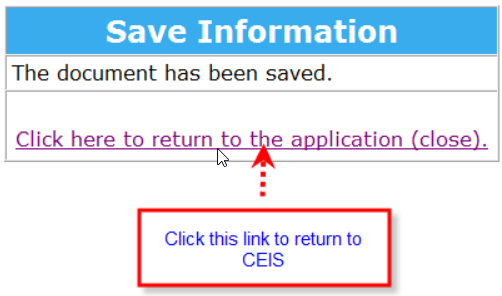

If you do not see the above browser window contact [AG CEIS Support](mailto:courts.ceis@gov.bc.ca).

3)  Click the Close button to return to the Document Details screen.

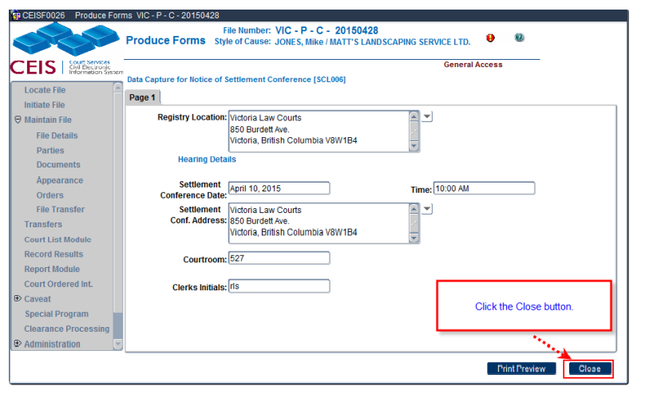

4)  Click the Documents Tab (if you are not already there).

The Referral tab is now active because the document contains an image. The Referral tab is inactive for documents that do not have an image

The Print Copies tab remains inactive at this stage because the document has not yet been printed.

5)  Click the **Referral** tab.

7\) Click the **Add Referral** Button. The **Referred By, Date Referred** and **Location Referred To** fields will automatically fill in.

8\) **Checked By** and **Date Checked** fields are optional but useful and we recommend you enter the data for those fields as well.

> 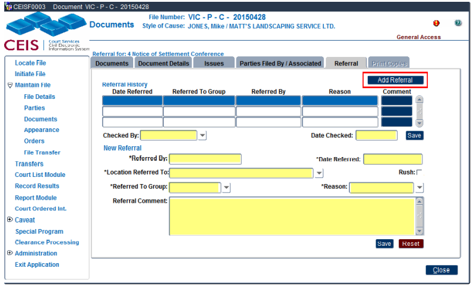

- **Date Referred**: The date the order is referred. (This is the date used when generating court lists.) This is a mandatory field.

- **Court List**: The court list type that the referral is to appear on. This is a mandatory field.

- **Reason**: The reason for the referral.

- **Assigned To/OR**: Select the appropriate Judge, Associate Judge, or Registrar name from the drop-down list; or use \"OR\" to indicate that it is assigned to a Duty Judge, Duty Associate Judge, or Duty Registrar.

- **File Attached?**: Check this box if the file has been sent with the referral; if the file has not been sent, leave it blank.

- **Date Rejected**: The date the referral was rejected (if applicable).

- **Date Signed**: The date the referral was signed (if applicable).

- **Referral Comment**: Enter any additional details or notes here.

9\) When referring a document for signature pick the **Signing/Review** Reason

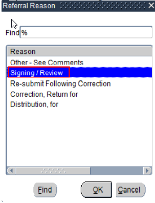

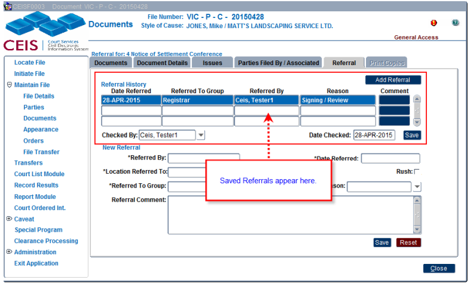10) Once all the data entry is complete click **SAVE** to save the referral and send the file to the [Documents for Signing Inbox](#documents-for-signing-inbox).

### Documents for Signing Inbox

1.  Navigate to the Locate File screen

2. 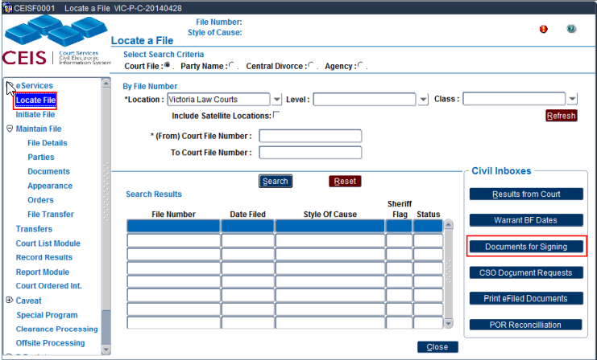Click the Documents for Signing Inbox

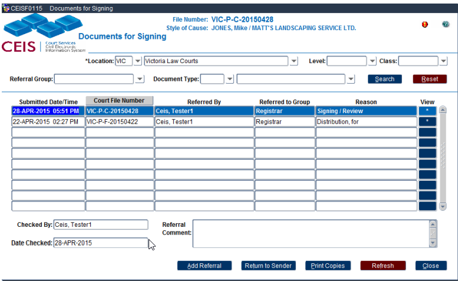

3.  Click \* the button for the document.

4.  The Adobe preview will appear.

5.  To sign follow the steps for [[Signing, Stamping, Printing and Saving. (Adobe toolbar)](#signing-stamping-printing-and-saving.-adobe-toolbar).]

Once a document is Signed you can choose depending on the workflow in your location to either Stamp or Save.

If you choose Stamp the user that is signing the document will be doing the distribution of the document.

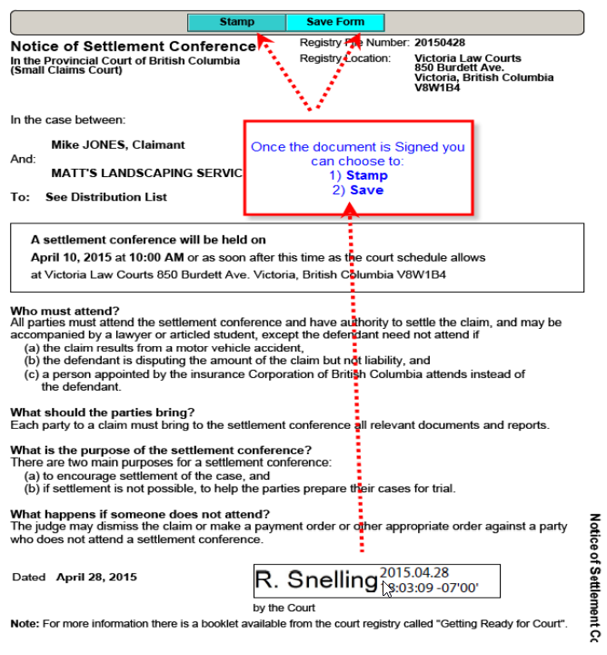If you choose Save, the user that is signing the document will be referring the document back to the user who sent it, for distribution.

### Returning a signed document

1) Click the **Save Form** button

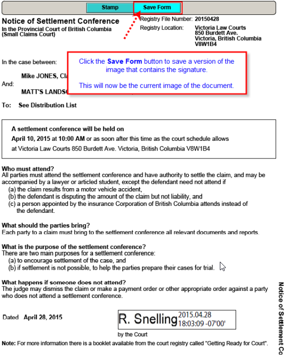

    1)  A browser window will appear confirming the image has been saved to CEIS.

    2)  Click the click to return to **Document for Signing** screen

    3)  Ensure that the blue highlight line is on the document you are working with and

    4)  Click the **Return to Sender** button.

    5)  The Return to Sender pop up appear

NOTE **--** Most fields are auto defaulted on this pop up.

6)  Click the drop down arrow on the **Reason** field.

7) When referring a document for distribution select the For Distribution reason

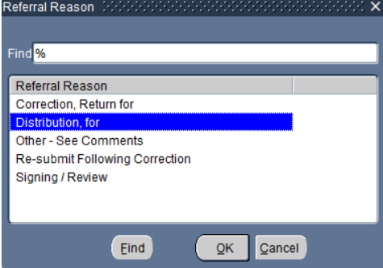

> 9\) Click OK
>
> 10\) Enter a Referral Comment if it is need. This is an optional field.
>
> 11\) Click **SAVE**
>
> 12\) The Reason now changes from Signing/Review to For Distribution

### Distributing a Signed Document

1)  Navigate to the Locate File screen

2) Click the Documents for Signing Inbox

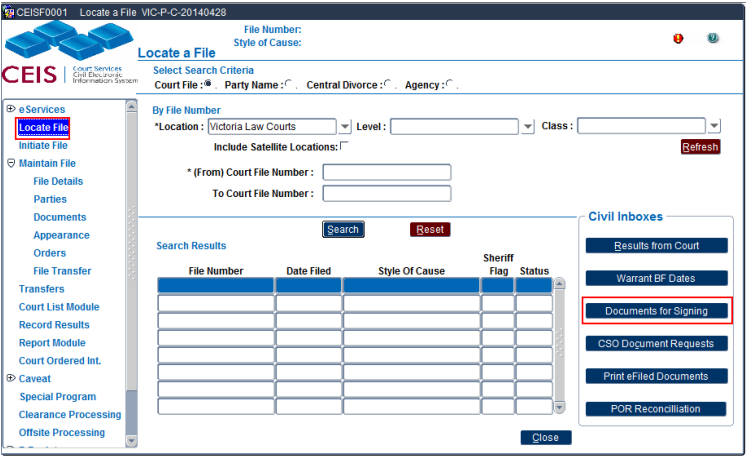

3)  Select the file with the blue line

4) Click the View button

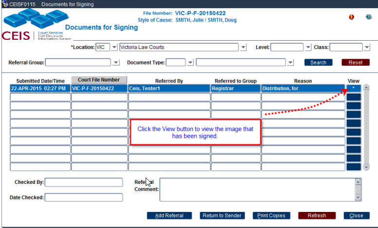

5) Click the Print Form button to Print the document.

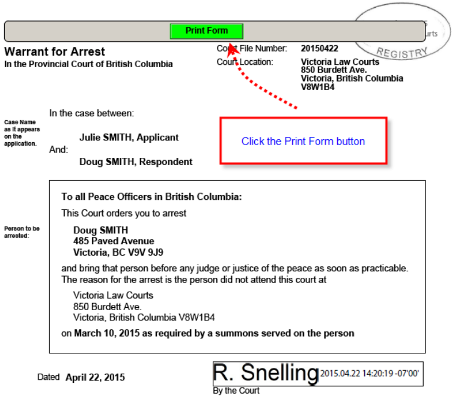

6)  Close the Adobe preview.

NOTE -- The confirmation browser window does not appear at this stage because you are not saving another copy of the document only printing it.

7)  On the Documents for Signing screen click the **Refresh** button and the file we be removed from the screen.

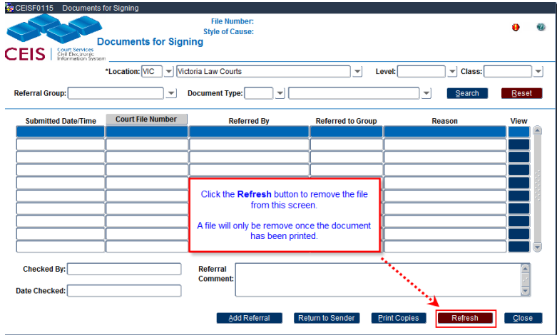

