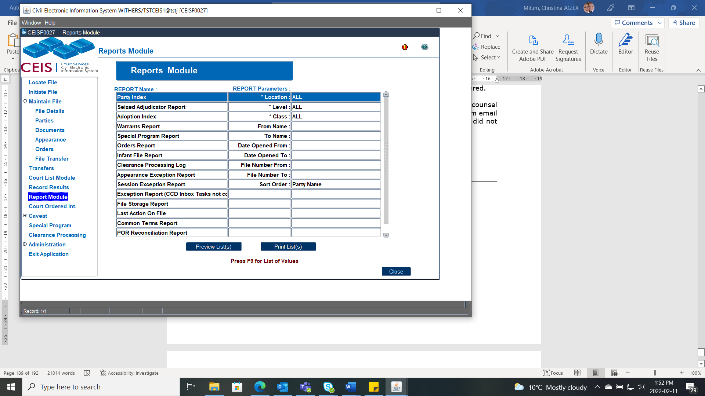

# REPORTS MODULE

The **Reports Module** contains a number of standard court reports. To generate a report:

1.  From the left-hand sidebar menu, click **Report Module**.

2.  Select the desired report from the list.

3.  Enter the report parameters. (Some parameters are mandatory.)

4.  Click PRINT (or click PREVIEW to view the report before printing).

### Party Index

Used as a backup index to locate a file if the system is down. All parties (except Adoption file parties), including AKA\'s and Legal Representatives, are shown in the report.

### Seized Adjudicator Report

Lists all files where an adjudicator has been seized of the file or a document on the file.

### Adoption Index

A restricted access report. The *Adoption Index* is a listing of parties for adoption files for a particular location (or all locations).

### Warrants Report

The *Warrants Report* is a listing of all files where the warrant flag is either issued or held against the party.

#### Special Program Report

Lists all files where a special program has been identified for the file in the File Details screen (such as Fax Filing). It includes optional parameters to display files based on a date range for \"Reason In\" and \"Reason Out\" dates.

### Orders Report

Contains all orders including restraining orders (POR/CFC) but should not be faxed to the Protection Order Registry or Firearms Registry. The report includes the \"varied\", \"ended\" and \"cancelled\" date data from the Order Details screen.

### Infant File Report

This report is a listing of all files in which the infant file indicator has been set. These files have a specific retention timeframe and must be pulled from groupings of other files that have different retention timeframes.

### Clearance Processing Log

Lists all the clearance certificates and their corresponding file numbers, for a given date or range of clearance dates.

### Appearance Exception Report

Lists all appearances for a daily court list where an appearance result has not been recorded. Foreign files that have not been resulted will also appear on this report. The parameters now include an \"ALL\" class and you can search by a date range. Use this report as a double-check system to ensure that all results were entered for the appearances heard that day.

### Session Exception Report

Lists all sessions for appearances set, for which no session results were entered. Use this report as a double-check system to ensure that all results were entered for the sessions heard that day. This step will need to be completed if CCD crashes, or is not used for the appearance.

### Exception Report (CCD Inbox Tasks)

This report shows all the tasks coming from CCD that have not yet been marked as "done".

### File Storage Report

The report indicates where files are stored that have been either placed offsite or brought back on site based on the information entered in the File Details offsite Storage section.

### Last Action on File

This report will provide the last document or appearance that was entered on any file.

### Common Terms Report

This report is a listing of all the Common Terms for the selected Court location and class. This report is used as a reference to view the common terms for a particular location that have been entered into CEIS by the system administrator.

### POR Reconciliation Report

This POR Reconciliation report is best to be generated via the POR Reconciliation Inbox via the Print button. This should be completed frequently to ensure that no POR are missed being sent to the Protection Order Registry or that none have been returned.

### Email Report

This report indicates what documents have been emailed to which party along with the email address via CEIS. This does not include the Automated emails or distributing to POR, only the documents selected via the email button in CEIS.

