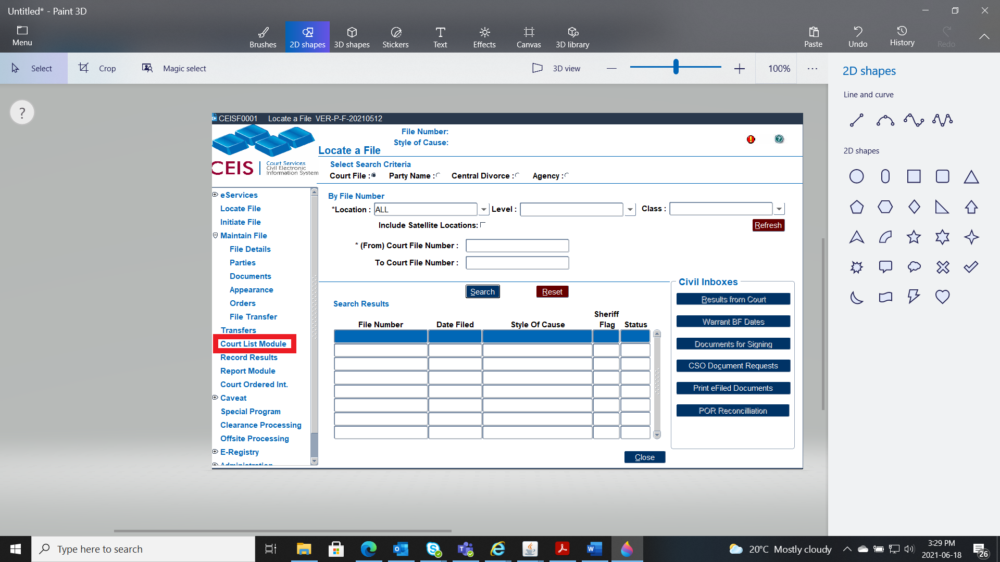
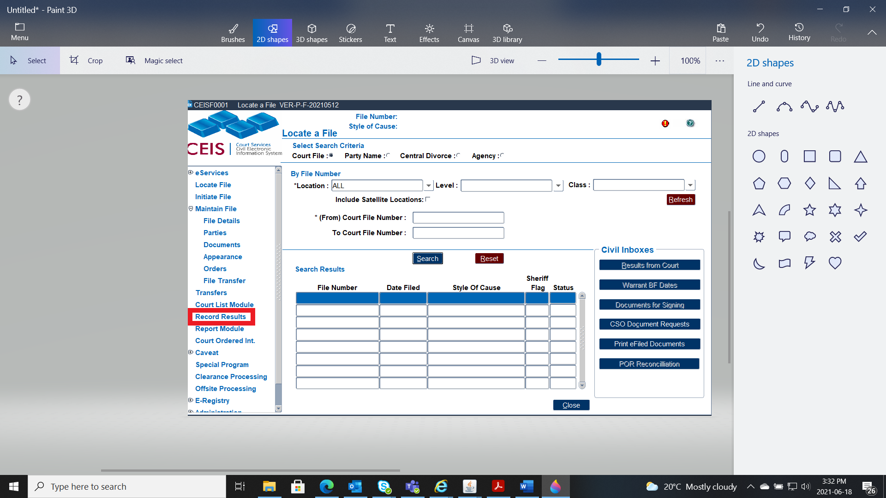
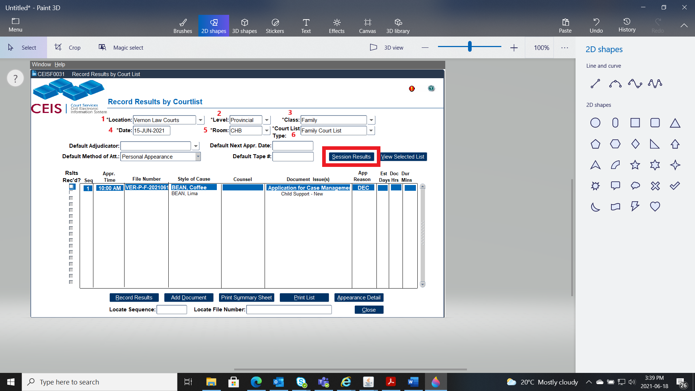
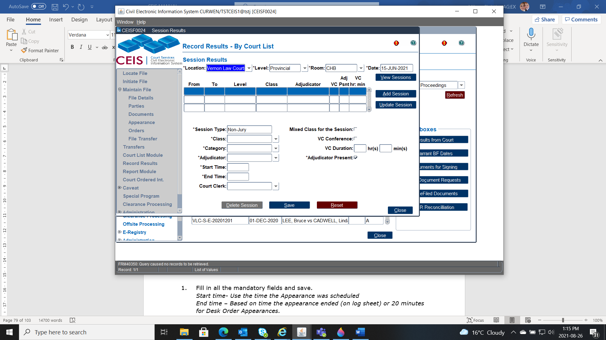

## SESSION RESULTS

CCD typically does this piece for us now automatically, but there are still times when we need to update out Session Results manually. The [Session Exception Report](#session-exception-report) will advise when these results are missing and manual entry is required.

### Record Session Results Manually

1.  Ensure that the court list has been prepared by clicking on the **Court List Module** and save.

2.  After to court list is prepared, then click on **Record Results**.

3.  Fill in all the applicable fields then click **Session Results**

**Location** (1)

**Level** (2)

**Class** (3)

**Date** (4)

**Room** (5)

**Court List Types** (6)

4.  Fill in all the mandatory fields and save.

> **Session Type** (1): Select the format of the session (such as Jury, Trial, Judge Alone, Chambers, or Videoconference) from the drop-down list.
>
> **Class** (2): This identifies the class of files being heard in the session. Select the appropriate class from the drop-down list. (Enable the \"Mixed Class for the Session\" radio button if applicable.)
>
> **Category** (3): Select a session category from the drop-down list.
>
> **Adjudicator** (4): Select the session adjudicator from the drop-down list.
>
> **Start Time** (5): The starting time for the session (expressed in hours and minutes)
>
> **End Time** (6): The ending time for the session (expressed in hours and minutes)
>
> **Court Clerk** (7): Enter the name of the court clerk who attended the session, either by selecting a name from the down-down list or typing it in.
>
> **VC Conference** (8): Enable this radio button if attendance was by videoconference. (You must also enter the *hours and minutes* in the \"Duration\" boxes.)
>
> **Adjudicator Present** (9): Enable this radio button if there was an adjudicator present at the session.

### Editing Session Details

To make changes to the session details, highlight the appropriate session. The details for that session will appear at the bottom of the screen, and you can make the necessary changes from there.

Click SAVE when you\'ve finished editing session details.

When editing a full list day:

Session results are generally entered in chronological order \-- that is, the morning\'s results first, and then the afternoon\'s.

To record session results for the afternoon, save the details from the morning session (by clicking the SAVE button after entering the details) and then click the ADD SESSION button. Enter the start time and end time for the afternoon; all other fields should carry over from the details you just entered for the morning session.

The ADD SESSION button is also used to record session results for any of the following events, if they occur:

- change of judge

- change of room

- change of court class

- if court is down for longer than 15 minutes (a new session is required in this case)

To erase the data you\'ve just entered, click the RESET button.

### Deleting Session Results

To delete session results:

1.  Select the session you wish to delete.

2.  Click the DELETE SESSION button.

